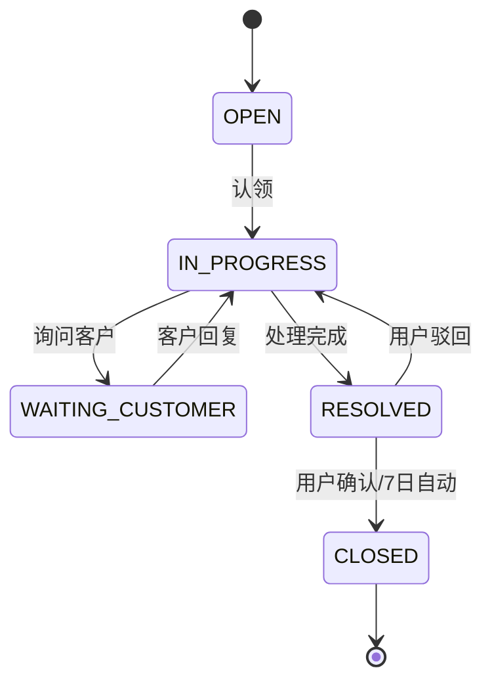

# 需求规格书 — 工单系统渐进式信息补充

> 本文件为 PRD 标杆范例，供 Product Analyst 参考输出格式与深度。

## 文档元信息

| 字段 | 值 |
|---|---|
| 需求名称 | 工单系统支持渐进式信息补充 |
| 需求编号 | REQ-2026-0612-001 |
| 需求来源 | 客户成功部 王某某 |
| 提出时间 | 2026-06-12 |
| 期望上线 | 2026-08-01 |
| 文档版本 | v1.0 |
| 文档状态 | Draft |
| 主要起草人 | 张三 / 产品部 |
| 审批人 | 李四（产品总监） |

## 背景与目标

当前客服日均处理工单 200 单，平均处理时长 8 小时（来源：BI 报表 2026-05），其中 35% 的延误来自创建时信息不全（来源：抽样分析 INV-202605-018）。目标：上线 30 天内将平均处理时长从 8h 降至 4h，创建完成率从 78% 提升至 92%。

## 利益相关者矩阵

| 角色 | 具体主体 | 关心点 | 决策权 | 互斥点 |
|---|---|---|---|---|
| 主要使用者 | 工单创建客户 | 创建快、流程透明 | 推动 | 字段少 ↔ 信息全 |
| 次要使用者 | 客服处理人 | 信息够用、分配公平 | 评论 | 详细度 ↔ 创建负担 |
| 受影响者 | 财务/合规 | SLA 计费、审计留迹 | 否决权（合规） | 性能 ↔ 审计频次 |
| 决策者 | 产品负责人 | ROI、成本 | 最终拍板 | — |

## 范围

### 范围内事项
- 工单创建表单支持"必填项+可选项"两段式提交
- 工单详情页支持处理人补全可选字段
- 工单列表新增"信息完整度"筛选项

### 范围外事项
- 工单审批流改造（另立项 EP-04）
- 移动端创建（Q4 联动）
- 工单导出 Excel（Phase 2）

## 功能需求

### FR-001：用户创建工单
- **描述**：登录用户提交标题与分类即可创建工单，其他字段可后续补全
- **触发者**：已登录用户（ROLE_USER）
- **前置条件**：当日未达每日上限（BR-005）
- **输入要素**：title(必填,2-50字)、category(必填,枚举)、priority(可选,默认MEDIUM)、description(可选,≤1000字)
- **Happy Path**：填 title+category → 生成工单 ID → 状态 OPEN → 通知值班客服
- **Error Path**：
  - E1：title 缺失或超长 → 400 + `TITLE_INVALID`
  - E2：当日工单 ≥ 50 → 429 + `DAILY_LIMIT_EXCEEDED`
  - E3：5min 内同标题重复 → 200 + 返回原工单 ID（幂等）
- **MoSCoW**：Must
- **阶段**：MVP
- **dependsOn**：[]

### FR-002：用户查询自己的工单列表
- **描述**：分页查询自己创建或被分配的工单
- **触发者**：已登录用户
- **输入要素**：page、size(≤100)、status、createdRange
- **Happy Path**：返回工单列表 + 分页元数据
- **Error Path**：error-path-NA：纯查询，无业务异常
- **MoSCoW**：Must
- **阶段**：MVP
- **dependsOn**：[FR-001]

### FR-003：处理人转交工单
- **描述**：当前处理人将工单转交同组其他客服
- **触发者**：当前 Assignee
- **前置条件**：工单状态 IN_PROGRESS
- **输入要素**：ticketId(必填)、newAssigneeId(必填,同组)、reason(必填,10-200字)
- **Happy Path**：校验同组 → 更新 Assignee → 记录转交 → 通知双方
- **Error Path**：
  - E1：新处理人不在同组 → 403 + `ASSIGNEE_NOT_IN_GROUP`
  - E2：乐观锁冲突 → 409 + `VERSION_CONFLICT`
  - E3：工单已关闭 → 409 + `TICKET_CLOSED`
- **MoSCoW**：Must
- **阶段**：MVP
- **dependsOn**：[FR-001]

## 非功能需求

### NFR-001：工单创建接口性能
- **类别**：性能
- **指标**：POST /api/tickets P95 ≤ 200ms，P99 ≤ 500ms
- **负载条件**：500 QPS 持续 10 分钟
- **测量方法**：APM 7 日滑动窗口 P95
- **当前基准**：P95 实测 380ms（2026-06-01）

### NFR-002：月度可用性
- **类别**：可用性
- **指标**：月度 SLA ≥ 99.9%（停机 ≤ 43min/月）
- **测量方法**：拨测 + 接口成功率，按月汇总
- **当前基准**：99.85%（2026-Q2）

### NFR-003：审计留存
- **类别**：安全/合规
- **指标**：写操作 100% 审计；日志留存 ≥ 180 天；篡改告警 ≤ 5min
- **测量方法**：合规月度抽查 + SIEM

## 业务规则

### BR-005：每日创建上限
- **规则**：同一用户每自然日最多创建 50 个工单
- **触发场景**：FR-001
- **例外**：VIP 等级 ≥ 3 不受限
- **变更责任方**：客户成功部

### BR-008：状态变更权限
- **规则**：仅当前 Assignee 或组长可变更状态
- **触发场景**：FR-003、FR-004
- **例外**：ROLE_ADMIN 可强制接管

## 状态与流程

| 转移 ID | 前置状态 | 事件 | 后置状态 | 前置条件 | 异常处理 |
|---|---|---|---|---|---|
| ST-001 | OPEN | 认领 | IN_PROGRESS | 工单可见 | 已被认领→拒绝 |
| ST-002 | IN_PROGRESS | 询问客户 | WAITING_CUSTOMER | 已发出询问 | — |
| ST-003 | WAITING_CUSTOMER | 客户回复 | IN_PROGRESS | — | — |
| ST-004 | IN_PROGRESS | 处理完成 | RESOLVED | 必填解决方案 | 为空→拒绝 |
| ST-005 | RESOLVED | 确认/7日自动 | CLOSED | — | — |
| ST-006 | RESOLVED | 用户驳回 | IN_PROGRESS | 7日内+填驳回原因 | 超期→重创建 |

## 验收标准

### AC-001：已认证用户创建工单
- **Given**：用户已登录且持有 ROLE_USER
- **When**：POST /api/tickets，body 含合法 title 与 category
- **Then**：返回 200，工单 ID + 状态 OPEN + 触发分配通知
- **优先级**：P0
- **覆盖**：FR-001
- **示例测试数据**：
  - ✅ 正例：`{"title":"VPN无法连接","category":"NETWORK","priority":"HIGH"}`
  - ❌ 反例：`{"category":"NETWORK"}` → 400 + `TITLE_INVALID`

### AC-002：每日上限拦截
- **Given**：用户当日已创建 50 个工单
- **When**：再次 POST /api/tickets
- **Then**：429 + `DAILY_LIMIT_EXCEEDED` + retryAfter 秒数
- **优先级**：P0
- **覆盖**：FR-001、BR-005

### AC-005：转交时乐观锁冲突
- **Given**：工单 version=3，客服 A 与 B 同时打开
- **When**：A 转交成功(version→4)，B 用 version=3 转交
- **Then**：B 收到 409 + `VERSION_CONFLICT`
- **优先级**：P0
- **覆盖**：FR-003

## 成功度量指标

| 层级 | 指标 | 基准 | 目标 | 窗口 | 工具 |
|---|---|---|---|---|---|
| North Star | 工单平均处理时长 | 8h | 4h | 30天 | BI |
| 输入 | 创建完成率 | 78% | 92% | 周 | 埋点 |
| 输入 | 字段填写完整度 | 60% | 85% | 周 | 服务端 |
| 结果 | NPS | 32 | 45 | 月 | 调研 |
| 护栏 | 接口错误率 | 0.05% | ≤0.1% | 实时 | APM |

## 业务术语 Glossary

| 术语 | 英文 | 定义 | 别名 | 禁用 |
|---|---|---|---|---|
| 工单 | Ticket | 客户问题的标准化记录 | 单子 | 投诉单 |
| 处理人 | Assignee | 工单当前负责客服 | 受理人 | 接单员 |
| 服务时效 | SLA | 处理时长承诺 | — | 时限 |

## 业务时间敏感性

| 类型 | 适用 | 描述 | 最晚上线 | 过期后果 |
|---|---|---|---|---|
| 合规截止 | N | — | — | — |
| 业务窗口 | N | — | — | — |
| 无明显约束 | Y | — | 下一迭代 | — |

## 风险与待确认项

| 风险 ID | 描述 | 概率 | 影响 | 缓解 |
|---|---|---|---|---|
| RSK-01 | 渐进补全后字段填写率仍低 | M | H | 灰度10%先看数据 |

| 编号 | 待确认 | 推断值 | 阻塞 | 确认人 |
|---|---|---|---|---|
| Q-01 | VIP 用户上限是否真不限 | 推断不限 | 测试 | 合规 |

## 下游交接说明

- **Architect**：关注 BR-005 并发控制策略、NFR-001 性能达标方案、状态机实现
- **Quality Gate**：每条 FR 对应 AC 已覆盖，重点验证并发冲突场景
- **DevOps**：NFR-002 可用性要求，建议蓝绿部署
# 需求规格书

## 文档信息
- **项目名称**: 工单管理系统
- **版本**: v1.0
- **编写日期**: 2026-05-19
- **编写人**: Product Analyst Agent

## 业务目标

为 IT 支持部门建设一套工单管理系统，支持工单的创建、分配、处理、关闭和统计分析，提升问题解决效率和可追溯性。

## 用户角色

| 角色 | 描述 | 权限范围 |
|------|------|---------|
| 普通用户 | 提交和追踪工单 | 创建/查看/关闭自己的工单 |
| 处理人 | 处理分配的工单 | 处理/转交/提交结果 |
| 管理员 | 全局管理 | 分配/强制关闭/统计/用户管理 |

## 功能需求

### P0 — 核心功能（必须实现）

| AC 编号 | 功能 | 验收标准 |
|---------|------|---------|
| AC-P0-1 | 用户登录 | 用户输入正确用户名密码后跳转到首页，错误时显示提示 |
| AC-P0-2 | 创建工单 | 用户填写标题、描述、优先级后提交，系统分配唯一编号 |
| AC-P0-3 | 分配工单 | 管理员选择处理人分配工单，处理人收到工单状态变更 |
| AC-P0-4 | 关闭工单 | 工单创建者确认处理结果后关闭工单 |
| AC-P0-5 | 统计面板 | 管理员查看工单总数、各状态分布、处理时效统计 |

### P1 — 增强功能

| AC 编号 | 功能 | 验收标准 |
|---------|------|---------|
| AC-P1-1 | 评论系统 | 工单参与者可以添加文字评论 |
| AC-P1-2 | 附件上传 | 工单支持上传图片和文件附件 |
| AC-P1-3 | 工单转交 | 处理人可将工单转交给其他处理人 |

## 非功能需求

| 类别 | 要求 |
|------|------|
| 性能 | 页面加载 ≤ 3s，API 响应 ≤ 500ms |
| 安全 | JWT 认证，密码 BCrypt 加密，SQL 注入防护 |
| 兼容 | Chrome/Firefox/Edge 最新版 |
| 部署 | 支持 Docker 容器化部署 |

## 约束与依赖

- 技术栈：Vue 3 + Spring Boot 3 + PostgreSQL 16
- 前端组件库：Element Plus
- 构建工具：Vite + Maven
- 无外部 SSO 依赖

## 风险与待确认

| # | 风险 | 影响 | 缓解措施 |
|---|------|------|---------|
| 1 | 工单量大时统计接口慢 | 首页卡顿 | 引入缓存 + 分页 |
| 2 | 文件上传无大小限制 | 存储爆满 | 限制单文件 10MB |

## 范围排除

- 不包含邮件通知功能
- 不包含移动端适配
- 不包含多语言支持
