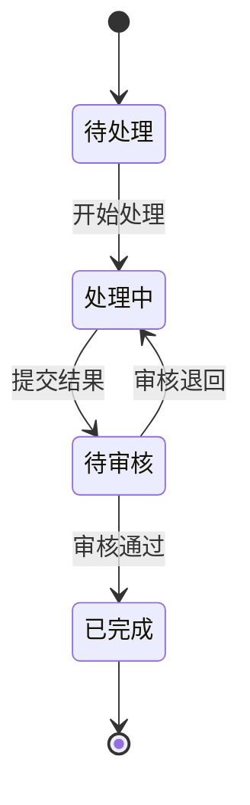

# 状态机

（每个有状态的实体复制以下模板填写）

## ENT-XXX-001 实体名称

### 状态清单

| 状态值 | 状态名称 | 说明 | 是否终态 | evidence_id |
|--------|---------|------|---------|---|
| pending | 待处理 | 初始状态 | 否 | EV-xxx |
| in_progress | 处理中 | | 否 | |
| completed | 已完成 | | 是 | |

### 状态转换表

| state_id | entity_id | 当前状态 | 目标状态 | 触发事件 | 触发节点 node_id | 触发角色/系统 | 前置条件 | 关联 rule_id | 关联 exception_id | 可回退 | 回退状态 | 审计追踪 | evidence_id | question_id |
|---|---|---|---|---|---|---|---|---|---|---|---|---|---|---|
| ST-XXX-001 | ENT-XXX-001 | 待处理 | 处理中 | 开始处理 | ND-xxx | 处理人 | 已分配处理人 | RULE-xxx |  | 否 |  | 是 | EV-xxx | Q-xxx |
| ST-XXX-002 | ENT-XXX-001 | 处理中 | 待审核 | 提交结果 | ND-xxx | 处理人 | 必填项已完成 | RULE-xxx |  | 是 | 处理中 | 是 | EV-xxx | Q-xxx |
| ST-XXX-003 | ENT-XXX-001 | 待审核 | 已完成 | 审核通过 | ND-xxx | 审核人 |  | RULE-xxx |  | 否 |  | 是 | EV-xxx | Q-xxx |
| ST-XXX-004 | ENT-XXX-001 | 待审核 | 处理中 | 审核退回 | ND-xxx | 审核人 | 填写退回原因 | RULE-xxx | EX-xxx | 是 | 处理中 | 是 | EV-xxx | Q-xxx |

### 状态图（可选，mermaid）

### 补充说明

- 是否允许并发状态（同一实体同时处于多个状态）：否
- 超时规则（如有）：
- 自动状态变更（如有）：
- 高风险状态（如有）：
- 状态字段名：
- 状态变更是否必须留痕：

---

## ENT-XXX-002 实体名称

（同上格式）
