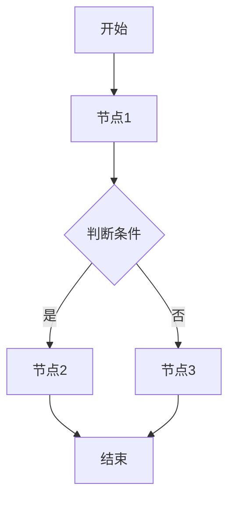

# 流程模型

## 流程清单

| process_id | 流程名称 | 触发条件 | 起点事件 | 终点结果 | 涉及角色 | 主要实体 | 主要外部系统 | evidence_id | question_id |
|---|---|---|---|---|---|---|---|---|---|
| PROC-XXX-001 | | | | | | ENT-xxx | IF-xxx | EV-xxx | Q-xxx |
| PROC-XXX-002 | | | | | | ENT-xxx | IF-xxx | EV-xxx | Q-xxx |

---

## PROC-XXX-001 流程名称

### 流程节点清单

| node_id | 序号 | 节点名称 | BPMN 元素类型 | Pool | Lane | 前置节点 | 后置节点 | 触发事件 | 执行角色 | 输入 | 输出 | 网关条件 | 状态变化 state_id | 关联能力 capability_id | 关联接口 interface_id | 关联规则 rule_id | 异常分支 exception_id | evidence_id | question_id |
|---|---|---|---|---|---|---|---|---|---|---|---|---|---|---|---|---|---|---|---|
| ND-XXX-001-01 | 1 | | Start Event/User Task/Service Task/Gateway | | | | ND-XXX-001-02 | | | | | | ST-xxx | CAP-xxx | IF-xxx | RULE-xxx | EX-xxx | EV-xxx | Q-xxx |
| ND-XXX-001-02 | 2 | | | | | ND-XXX-001-01 | | | | | | | | | | | | | |

> BPMN 元素类型：Start Event / End Event / User Task / Manual Task / Service Task / Business Rule Task / Exclusive Gateway / Parallel Gateway / Intermediate Message Event / Boundary Error Event / Sub-process

### 流程图（mermaid 或 BPMN 导出）

### 异常分支

| exception_id | 触发节点 node_id | 异常条件 | 处理方式 | 异常后状态 | 是否可恢复 | 是否审计追踪 | evidence_id | question_id |
|---|---|---|---|---|---|---|---|---|
| EX-XXX-001 | ND-xxx | | 退回/取消/挂起/人工介入 | | 是/否 | 是/否 | EV-xxx | Q-xxx |

### 外部接口（如有）

| interface_id | 接口名称 | 方向 | 外部系统/责任方 | 触发节点 node_id | 消息对象 | 关键字段 | 协议/格式 | 失败处理 | evidence_id | question_id |
|---|---|---|---|---|---|---|---|---|---|---|
| IF-XXX-001 | | 入站/出站 | | ND-xxx | | | HTTP/MQ/文件 | | EV-xxx | Q-xxx |

---

## PROC-XXX-002 流程名称

（同上格式）
