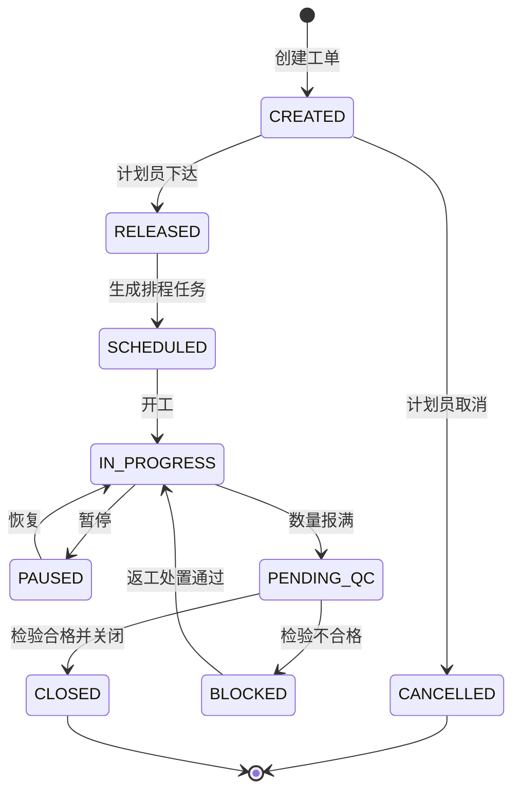
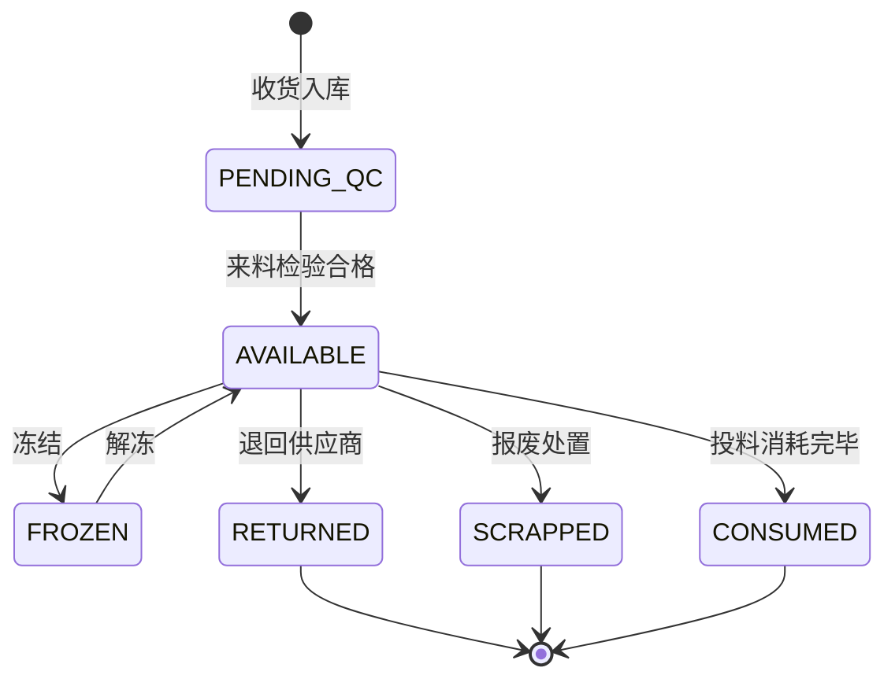
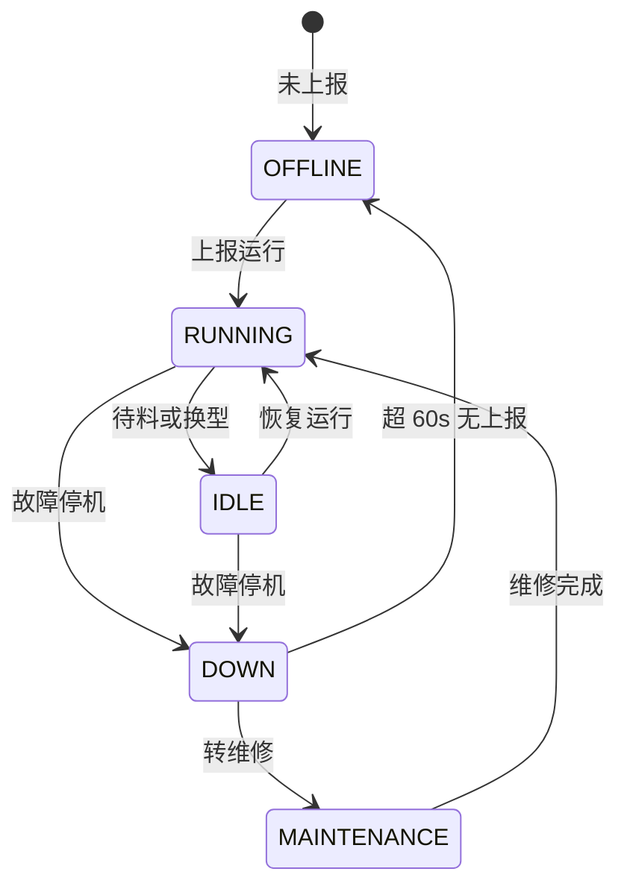
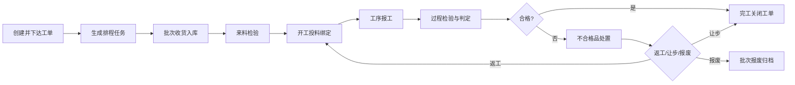

# 需求规格书 — MES Lite 离散制造执行系统

## 基本信息

| 项目 | 内容 |
| --- | --- |
| 需求名称 | MES Lite 轻量制造执行系统（工单、排程、设备、追溯、质检一体化） |
| 需求编号 | REQ-2026-0316-MES-001 |
| 需求来源 | 离散制造工厂 制造运营部（公开演示用例，非真实客户） |
| Workflow Domain | forward-development |
| Product Analyst | Product Analyst Agent |
| 日期 | 2026-03-16 |
| 文档版本 | v1.0（已冻结，作为下游设计与测试的唯一需求真理源） |
| 目标上线 | 2026-06-30 |

## 背景与目标

本演示项目为一条通用离散制造产线建设轻量化 MES。当前该产线依赖纸质流转卡与电子表格排产：计划员每日人工排产耗时约 3 小时；工单进度靠班组长口头汇报，计划员掌握实际进度平均滞后 1 个班次；设备停机靠操作工电话通知，维修响应时间无法度量；物料批次与成品的对应关系只在纸质流转卡上记录，一旦需要追溯须翻查纸质档案约 4 小时；质量检验记录分散在 3 套电子表格中，检验员重复录入。MES Lite 将上述环节收敛为一个统一系统。

| 业务目标 | 当前基准 | 目标值 | 度量方式 |
| --- | --- | --- | --- |
| 生产计划编制耗时 | 180 分钟/日 | ≤ 30 分钟/日 | 计划员工作日志 |
| 工单进度可见滞后 | 1 个班次 | ≤ 5 分钟 | 报工时间戳与看板刷新时间差 |
| 设备异常发现时延 | 平均 12 分钟 | ≤ 60 秒 | 告警时间与设备实际停机时间差 |
| 物料批次追溯耗时 | 平均 4 小时 | ≤ 30 秒 | 追溯查询接口 P95 |
| 质量检验记录完整率 | 82% | 100% | 完工工单中检验记录关联率 |

## 用户角色

| 角色 ID | 角色 | 具体主体 | 核心诉求 | 权限范围 |
| --- | --- | --- | --- | --- |
| ROLE-01 | 生产计划员 | 制造运营部计划岗 | 排程快、计划变更可控 | 工单创建/下达/关闭、排程生成与调整、全部工单只读 |
| ROLE-02 | 车间班组长 | 产线值班管理岗 | 任务清晰、异常可快速上报 | 工单开工/暂停/报工、本班组任务调整、设备状态上报 |
| ROLE-03 | 操作工 | 产线操作岗 | 操作步骤简单、报工少录入 | 本人工单看板只读、报工提交、投料登记 |
| ROLE-04 | 质检员 | 质量部检验岗 | 检验判定可留痕、不合格品处置闭环 | 检验单创建/判定、处置单发起、追溯查询 |
| ROLE-05 | 设备管理员 | 设备动力部 | 故障快速定位、维修记录可统计 | 设备台账与状态维护、告警确认与关闭、OEE 只读 |
| ROLE-06 | 系统管理员 | 信息岗 | 权限可控、操作可审计 | 用户与角色管理、基础数据维护、审计日志查询 |

角色互斥约束：同一用户不得同时具备 ROLE-01 与 ROLE-04（计划与检验判定职责分离）；ROLE-06 不得修改工单与检验业务数据，仅可管理用户、角色与基础数据。

## 范围

### 范围内

- CAP-001 工单管理：工单创建、下达、开工、暂停、报工、完工、关闭及全生命周期状态流转。
- CAP-002 生产排程：按工艺路线、设备能力与班次日历自动生成排程，支持冲突预警与人工调整。
- CAP-003 设备状态监控：设备状态实时采集、状态看板、异常告警与确认、OEE 统计。
- CAP-004 物料批次追溯：批次收货入库、开工投料绑定、正向/反向追溯查询、追溯报告导出。
- CAP-005 质量检验记录：检验单生成、检验项录入、判定、不合格品处置与检验记录归档。
- 支撑能力：角色权限控制（FR-015）与操作审计（NFR-006）。
- 部署范围：单工厂、单组织、中文界面、桌面浏览器（Chrome/Edge 最新两个大版本）。

### 范围外

| 范围外事项 | 说明 |
| --- | --- |
| ERP / 财务 / 采购系统对接 | 工单来源为 MES 内录入或 Excel 导入，不做在线接口集成 |
| 高级有限产能排程（APS） | 排程仅按设备能力与班次日历做规则化排序，不做全局最优求解 |
| 统计过程控制（SPC）图表 | 仅记录检验数据，不做过程能力指数与趋势分析 |
| 多工厂 / 多组织 / 多语言 | 单工厂、单时区、中文单语 |
| 设备 PLC 直连与协议改写 | 设备状态经网关以 REST/JSON 上报，MES 不直接读写 PLC |
| 移动端 App 与扫码枪硬件选型 | 仅提供浏览器界面，扫码录入使用键盘模拟输入 |
| 电子签名与法规符合性认证 | 审计日志仅用于内部管理留痕 |

## 功能需求

能力与功能需求映射（下游设计与测试按本表对齐）：

| 能力 ID | 能力名称 | 覆盖功能需求 |
| --- | --- | --- |
| CAP-001 | 工单管理 | FR-001、FR-002、FR-003 |
| CAP-002 | 生产排程 | FR-004、FR-005、FR-006 |
| CAP-003 | 设备状态监控 | FR-007、FR-008 |
| CAP-004 | 物料批次追溯 | FR-009、FR-010、FR-011 |
| CAP-005 | 质量检验记录 | FR-012、FR-013、FR-014 |
| 支撑能力 | 权限与审计 | FR-015 |

### FR-001：创建生产工单
- **描述**：计划员创建生产工单并下达，工单进入可排程状态
- **触发者**：ROLE-01 生产计划员
- **前置条件**：物料主数据与工艺路线已存在且为启用状态（BR-001）
- **输入要素**：productCode(必填,4-32 位大写字母/数字/连字符)、plannedQty(必填,整数 1-100000)、unit(必填,枚举)、plannedStartTime(必填,≥ 当前时间+2h)、plannedEndTime(必填,> plannedStartTime)、priority(可选,枚举 LOW/NORMAL/HIGH/URGENT,默认 NORMAL)、remark(可选,≤500 字)
- **Happy Path**：校验主数据与时间 → 生成工单号 WO+yyyyMMdd+4 位流水 → 状态 CREATED → 计划员点击下达 → 状态 RELEASED → 写入操作审计
- **Error Path**：E1 productCode 不存在或未启用 → 400 + `PRODUCT_NOT_FOUND`；E2 plannedEndTime ≤ plannedStartTime → 400 + `TIME_RANGE_INVALID`；E3 plannedStartTime < 当前时间+2h → 400 + `START_TOO_SOON`；E4 当日创建工单数 ≥ 200 → 429 + `DAILY_WO_LIMIT_EXCEEDED`
- **属性**：MoSCoW=Must；阶段=MVP；dependsOn=[]；关联规则=BR-001、BR-002

### FR-002：工单开工、暂停与报工
- **描述**：班组长或操作工执行开工、暂停、恢复与报工，系统校验投料与检验拦截条件
- **触发者**：ROLE-02 车间班组长、ROLE-03 操作工
- **前置条件**：工单状态为 SCHEDULED 或 RELEASED 且已完成投料登记（CAP-004）
- **输入要素**：workOrderId(必填)、action(必填,枚举 START/PAUSE/RESUME/REPORT)、goodQty(报工必填,整数 ≥ 0)、scrapQty(报工必填,整数 ≥ 0)、scrapReasonCode(报废数 > 0 时必填)、version(必填,乐观锁)
- **Happy Path**：开工 → 状态 IN_PROGRESS 并记录实际开始时间 → 报工累加合格/报废数（goodQty+scrapQty ≤ 剩余可报数量）→ 全部数量报满 → 状态 PENDING_QC
- **Error Path**：E1 未完成投料即开工 → 409 + `MATERIAL_NOT_FED`；E2 上一工序检验不合格且未处置 → 409 + `QC_BLOCKED`；E3 goodQty+scrapQty > 剩余可报数量 → 400 + `QTY_EXCEEDED`；E4 scrapQty > 0 但无 scrapReasonCode → 400 + `SCRAP_REASON_REQUIRED`；E5 version 不匹配 → 409 + `VERSION_CONFLICT`
- **属性**：MoSCoW=Must；阶段=MVP；dependsOn=[FR-001、FR-010]；关联规则=BR-002、BR-005、BR-011

### FR-003：工单完工与关闭
- **描述**：质检判定合格后关闭工单，记录实际工时并归档为只读
- **触发者**：ROLE-01 生产计划员
- **前置条件**：工单状态为 PENDING_QC
- **输入要素**：workOrderId(必填)、actualEndTime(必填,≥ 实际开始时间)、remark(可选,≤500 字)
- **Happy Path**：校验检验合格 → 状态 CLOSED → 记录 actualEndTime 与工时 → 工单及报工记录转为只读 → 释放设备占用
- **Error Path**：E1 检验单未判定或判定不合格 → 409 + `QC_NOT_PASSED`；E2 工单不存在、已关闭或状态非 PENDING_QC → 409 + `WORK_ORDER_STATE_INVALID`；E3 actualEndTime < 实际开始时间 → 400 + `TIME_RANGE_INVALID`
- **属性**：MoSCoW=Must；阶段=MVP；dependsOn=[FR-002、FR-013]；关联规则=BR-002、BR-005

### FR-004：自动生成排程任务
- **描述**：按工艺路线工序顺序、设备能力与班次日历自动生成排程任务
- **触发者**：ROLE-01 生产计划员
- **前置条件**：工单状态为 RELEASED（BR-003）
- **输入要素**：workOrderIds(必填,1-50 个)、scheduleStrategy(可选,枚举 EARLIEST_DUE/LEAST_LOAD,默认 EARLIEST_DUE)
- **Happy Path**：读取工艺路线工序 → 按设备能力匹配候选设备 → 依班次日历逐工序排入 → 生成排程任务（含设备与计划开始/结束时间）→ 工单状态 SCHEDULED
- **Error Path**：E1 工序未匹配到设备 → 400 + `NO_ELIGIBLE_EQUIPMENT`（返回工序清单）；E2 与既有任务时间重叠 → 409 + `SCHEDULE_CONFLICT`（返回冲突明细）；E3 设备处于停机或维修状态 → 400 + `EQUIPMENT_UNAVAILABLE`；E4 工单状态非 RELEASED → 409 + `WORK_ORDER_STATE_INVALID`
- **属性**：MoSCoW=Must；阶段=MVP；dependsOn=[FR-001]；关联规则=BR-003、BR-004、BR-013

### FR-005：排程冲突预警
- **描述**：排程或调整导致同设备任务时间重叠时给出冲突预警，不静默覆盖
- **触发者**：系统（排程保存时同步执行）
- **前置条件**：排程任务已生成
- **输入要素**：equipmentId、candidateTimeRange
- **Happy Path**：计算同设备时间区间交集 → 无交集则保存 → 有交集则拦截并返回冲突任务清单（含工单号与时间段）
- **Error Path**：E1 检测到重叠 → 409 + `SCHEDULE_CONFLICT`；E2 候选时段超出班次日历有效时段 → 400 + `OUTSIDE_SHIFT_CALENDAR`
- **属性**：MoSCoW=Must；阶段=MVP；dependsOn=[FR-004]；关联规则=BR-004、BR-013

### FR-006：排程任务人工调整
- **描述**：计划员对排程任务调整设备、顺序或时间，调整全程留痕
- **触发者**：ROLE-01 生产计划员
- **前置条件**：排程任务所属工单状态为 SCHEDULED 或 IN_PROGRESS
- **输入要素**：scheduleTaskId(必填)、newEquipmentId(可选)、newStartTime(可选)、newEndTime(可选)、reason(必填,10-200 字)
- **Happy Path**：校验权限与冲突 → 更新排程任务 → 记录调整前后快照与原因 → 通知班组长
- **Error Path**：E1 reason 缺失或不足 10 字 → 400 + `REASON_REQUIRED`；E2 调整后与其他任务重叠 → 409 + `SCHEDULE_CONFLICT`；E3 工单已 CLOSED → 409 + `WORK_ORDER_STATE_INVALID`
- **属性**：MoSCoW=Must；阶段=MVP；dependsOn=[FR-004、FR-005]；关联规则=BR-003、BR-004、BR-015

### FR-007：设备状态实时采集与看板
- **描述**：网关上报设备状态，看板展示最新状态与持续时间，超时未上报标为离线
- **触发者**：设备网关（REST/JSON 上报）、ROLE-02 车间班组长（手工上报）
- **前置条件**：设备已在台账登记且为启用状态
- **输入要素**：equipmentCode(必填)、status(必填,枚举 RUNNING/IDLE/DOWN/MAINTENANCE/OFFLINE)、occurredAt(必填)、source(必填,枚举 GATEWAY/MANUAL)
- **Happy Path**：校验设备存在 → 写入状态变更记录 → 更新当前状态与持续时间 → 看板刷新（≤ 10s）→ 人工上报时记录上报人
- **Error Path**：E1 equipmentCode 未登记 → 404 + `EQUIPMENT_NOT_FOUND`；E2 5s 内重复上报同一状态 → 200 幂等忽略且不重复计数；E3 超过 60s 未上报 → 状态自动置 OFFLINE 并生成提示
- **属性**：MoSCoW=Must；阶段=MVP；dependsOn=[]；关联规则=BR-006、BR-007；NFR=NFR-002（单条上报处理 ≤ 200ms）

### FR-008：设备异常告警与 OEE 统计
- **描述**：设备转 DOWN 或 MAINTENANCE 时生成告警，设备管理员确认并填写处理结果；按日/周统计 OEE
- **触发者**：系统（告警生成）、ROLE-05 设备管理员（确认与关闭）
- **前置条件**：设备状态变更已入库
- **输入要素**：alarmId(确认/关闭必填)、handleResult(关闭必填,枚举 REPAIRED/REPLACED/ADJUSTED/NO_FAULT)、downtimeReasonCode(必填)、statDate(可选,默认当日)
- **Happy Path**：状态转 DOWN → 生成告警（级别 P1，10 分钟未确认升 P0）→ 管理员确认 → 填写处理结果与原因 → 关闭告警并计算停机时长 → 按 availability × performance × quality 展示日/周 OEE
- **Error Path**：E1 重复确认已确认的告警 → 409 + `ALARM_ALREADY_ACKED`；E2 handleResult 为空即关闭 → 400 + `HANDLE_RESULT_REQUIRED`；E3 统计区间基础数据缺失 → 200 + partial 标记与缺失日期清单
- **属性**：MoSCoW=Must（告警）、Should（OEE 周维度对比）；阶段=MVP；dependsOn=[FR-007]；关联规则=BR-006、BR-007

### FR-009：物料批次收货入库
- **描述**：登记供应商来料批次并生成系统批次号，批次进入待检或合格状态
- **触发者**：ROLE-02 车间班组长（收货登记）、ROLE-04 质检员（判定）
- **前置条件**：物料主数据已启用（BR-001）
- **输入要素**：materialCode(必填)、supplierBatchNo(必填,≤50 字)、materialBatchNo(必填,4-32 位大写字母/数字/连字符)、quantity(必填,> 0,最多 3 位小数)、unit(必填,枚举)、receiveTime(必填,≤ 当前时间)、supplierName(必填,≤100 字)
- **Happy Path**：校验主数据与批次号唯一性 → 写入批次记录 → 状态 PENDING_QC → 检验合格后转 AVAILABLE
- **Error Path**：E1 materialBatchNo 已存在 → 409 + `BATCH_DUPLICATED`；E2 quantity ≤ 0 或小数位 > 3 → 400 + `QUANTITY_INVALID`；E3 materialCode 未启用 → 400 + `MATERIAL_NOT_FOUND`
- **属性**：MoSCoW=Must；阶段=MVP；dependsOn=[]；关联规则=BR-001、BR-008、BR-012

### FR-010：开工投料与批次绑定
- **描述**：开工时登记投入的物料批次与数量，系统绑定批次与工单并扣减库存
- **触发者**：ROLE-03 操作工
- **前置条件**：工单已下达且设备已就绪
- **输入要素**：workOrderId(必填)、materialBatchNo(必填)、feedQuantity(必填,> 0)、feedTime(必填)、operatorId(必填)
- **Happy Path**：校验批次状态为 AVAILABLE → 校验库存充足 → 写入投料记录并绑定工单 → 扣减批次库存 → 开工校验通过
- **Error Path**：E1 批次状态非 AVAILABLE（待检/冻结/退回）→ 409 + `BATCH_NOT_AVAILABLE`；E2 投料量超过批次剩余数量 → 400 + `INSUFFICIENT_STOCK`；E3 超领（投料量 > 工单需求量 × 1.05）→ 409 + `OVER_ISSUE_REQUIRES_APPROVAL`；E4 批次与工单物料不一致 → 400 + `MATERIAL_MISMATCH`
- **属性**：MoSCoW=Must；阶段=MVP；dependsOn=[FR-009、FR-001]；关联规则=BR-008、BR-009、BR-012

### FR-011：正向与反向追溯查询
- **描述**：按物料批次号查询流向的工单与成品，按工单号或成品序列号反查投入批次
- **触发者**：ROLE-04 质检员、ROLE-01 生产计划员
- **前置条件**：投料记录已入库
- **输入要素**：traceDirection(必填,枚举 FORWARD/BACKWARD)、materialBatchNo 或 workOrderId 或 productSerialNo(三者择一必填)、timeRange(可选,最长 365 天)、page、size(≤100)
- **Happy Path**：解析查询锚点 → 遍历投料绑定关系 → 返回批次、工单、成品、时间、数量链路 → 支持导出追溯报告（Excel）
- **Error Path**：E1 三个锚点均未提供 → 400 + `TRACE_KEY_REQUIRED`；E2 同时提供多个锚点 → 400 + `TRACE_KEY_AMBIGUOUS`；E3 timeRange 超过 365 天 → 400 + `TIME_RANGE_TOO_LARGE`；E4 链路节点缺失（历史数据未绑定）→ 200 + partial 标记与断链节点清单
- **属性**：MoSCoW=Must；阶段=MVP；dependsOn=[FR-010]；关联规则=BR-009；NFR=NFR-003（单层追溯 P95 ≤ 2s、P99 ≤ 5s）

### FR-012：检验单生成与检验项录入
- **描述**：按工艺路线定义的检验节点生成检验单，质检员逐项录入实测值
- **触发者**：系统（检验单生成）、ROLE-04 质检员（录入）
- **前置条件**：工单已到达工艺路线定义的检验节点；来料批次已入库
- **输入要素**：inspectionNo(系统生成)、inspectionType(必填,枚举 INCOMING/IN_PROCESS/FINAL)、items[].itemCode(必填)、items[].standardValue(必填)、items[].upperLimit(可选)、items[].lowerLimit(可选)、items[].measuredValue(必填)、items[].unit(必填)
- **Happy Path**：工序报工完成 → 自动生成检验单（状态 CREATED）→ 质检员录入实测值 → 状态 INSPECTING → 提交判定
- **Error Path**：E1 检验项未全部录入即提交 → 400 + `INSPECTION_ITEM_INCOMPLETE`；E2 measuredValue 非数值或超出量程 → 400 + `MEASURED_VALUE_INVALID`；E3 upperLimit ≤ lowerLimit → 400 + `LIMIT_RANGE_INVALID`；E4 检验单已判定后再次录入 → 409 + `INSPECTION_ALREADY_JUDGED`
- **属性**：MoSCoW=Must；阶段=MVP；dependsOn=[FR-002、FR-009]；关联规则=BR-010、BR-012

### FR-013：检验判定与不合格拦截
- **描述**：按检验项上下限自动判定合格与不合格，不合格时拦截下游流转并生成不合格记录
- **触发者**：ROLE-04 质检员
- **前置条件**：检验单状态为 INSPECTING 且检验项已全部录入
- **输入要素**：inspectionNo(必填)、judgeResult(必填,枚举 PASS/FAIL)、judgeRemark(FAIL 时必填,10-200 字)、version(必填,乐观锁)
- **Happy Path**：逐项比对上下限 → PASS 时状态 JUDGED_PASS 并放行下游 → FAIL 时状态 JUDGED_FAIL、生成不合格记录、下游工单状态置 BLOCKED
- **Error Path**：E1 存在超限项却提交 PASS → 409 + `JUDGE_CONFLICT_WITH_DATA`；E2 FAIL 未填写 judgeRemark → 400 + `JUDGE_REMARK_REQUIRED`；E3 version 不匹配 → 409 + `VERSION_CONFLICT`
- **属性**：MoSCoW=Must；阶段=MVP；dependsOn=[FR-012]；关联规则=BR-005、BR-010、BR-012

### FR-014：不合格品处置
- **描述**：对不合格批次发起返工、让步接收或报废处置，处置单经审批后闭环并联动批次与工单状态
- **触发者**：ROLE-04 质检员（发起）、ROLE-01 生产计划员与 ROLE-05 设备管理员（审批）
- **前置条件**：存在不合格记录且状态为 OPEN
- **输入要素**：nonconformityId(必填)、disposalType(必填,枚举 REWORK/CONCESSION/SCRAP)、quantity(必填,> 0 且 ≤ 不合格数量)、reason(必填,10-200 字)、approverId(必填)
- **Happy Path**：发起处置单 → 审批通过 → REWORK 生成返工工单并将批次转 AVAILABLE；CONCESSION 放行工单并标记让步接收；SCRAP 扣减库存并将批次转 SCRAPPED → 不合格记录状态 CLOSED
- **Error Path**：E1 SCRAP 未经 ROLE-01 与 ROLE-05 双方审批 → 409 + `SCRAP_APPROVAL_REQUIRED`；E2 处置数量 > 不合格数量 → 400 + `DISPOSAL_QTY_EXCEEDED`；E3 同一不合格记录重复发起未关闭处置单 → 409 + `DISPOSAL_ALREADY_OPEN`；E4 审批人无审批权限 → 403 + `APPROVAL_FORBIDDEN`
- **属性**：MoSCoW=Must；阶段=MVP；dependsOn=[FR-013]；关联规则=BR-005、BR-010、BR-011

### FR-015：角色权限与操作审计
- **描述**：按角色控制功能与数据范围，关键写操作全部留痕且可查询、可导出
- **触发者**：ROLE-06 系统管理员（配置）、全部角色（被审计）
- **前置条件**：用户与角色已初始化
- **输入要素**：userId(必填)、roleIds(必填,可多选)、dataScope(必填,枚举 ALL/SELF_TEAM/SELF)、auditQuery(可选,按操作人/操作类型/时间范围)
- **Happy Path**：分配角色与数据范围 → 关键写操作写入审计日志（操作人、时间、对象、变更前后摘要、操作来源）→ 管理员按条件查询并导出
- **Error Path**：E1 越权访问他人数据 → 403 + `DATA_SCOPE_FORBIDDEN`；E2 越权变更工单或检验数据 → 403 + `ROLE_NOT_ALLOWED`；E3 尝试修改或删除审计日志 → 403 + `AUDIT_LOG_IMMUTABLE`；E4 审计查询区间超过 365 天 → 400 + `AUDIT_RANGE_TOO_LARGE`
- **属性**：MoSCoW=Must；阶段=MVP；dependsOn=[]；关联规则=BR-014、BR-015；覆盖说明=本 FR 为 CAP-001..CAP-005 的横向支撑能力，全部验收标准均隐含「已认证且具备对应角色」的前置条件

## 非功能需求

### NFR-001：接口性能
- **类别**：性能
- **指标**：查询类接口 P95 ≤ 500ms、P99 ≤ 1500ms；写入类接口 P95 ≤ 800ms、P99 ≤ 2000ms；追溯查询按 FR-011 单独约束
- **负载条件**：500 并发用户、每秒 50 次请求，持续 30 分钟
- **测量方法**：接口埋点 + 压测报告 7 日滑动窗口
- **当前基准**：本系统为新建，基准在迭代 1 结束时的首次压测中建立

### NFR-002：设备状态采集吞吐与时延
- **类别**：性能/容量
- **指标**：单设备上报间隔 5s；单条上报处理 ≤ 200ms；设备状态看板刷新 ≤ 10s；支持 ≥ 200 台设备同时上报
- **负载条件**：200 台设备 × 每 5s 一次上报（平均 40 次/秒，峰值 120 次/秒）
- **测量方法**：网关上报日志与看板刷新埋点统计，连续 24 小时
- **当前基准**：首轮压测建立

### NFR-003：追溯查询性能
- **类别**：性能
- **指标**：单层追溯 P95 ≤ 2s、P99 ≤ 5s；3 层链路追溯 P95 ≤ 5s
- **负载条件**：单次查询结果集 ≤ 1000 条，数据量为 100 万条投料记录
- **测量方法**：追溯接口埋点与压测报告
- **当前基准**：首轮压测建立

### NFR-004：可用性与容错
- **类别**：可用性
- **指标**：月度可用率 ≥ 99.5%（月停机 ≤ 216 分钟）；计划内维护窗口每月 ≤ 1 次、≤ 60 分钟且提前 3 个工作日通知
- **测量方法**：网关健康检查 + 接口成功率按月汇总
- **降级策略**：设备状态上报通道不可用时，看板显示数据延迟标记并允许班组长手工上报

### NFR-005：数据保留与归档
- **类别**：数据
- **指标**：生产记录与追溯记录保留 ≥ 3 年；审计日志保留 ≥ 3 年；保留期内不可物理删除
- **测量方法**：归档任务执行报告 + 季度抽查
- **归档策略**：超过 1 年的工单与报工数据迁移至归档表，仍可通过追溯查询访问

### NFR-006：审计与可追溯
- **类别**：安全/合规
- **指标**：关键写操作 100% 写入审计日志；日志写入失败率 ≤ 0.01%；审计日志不可修改与删除
- **测量方法**：审计日志条数与业务写操作条数对账，按月执行
- **覆盖范围**：工单状态变更、报工、投料、批次状态变更、检验判定、处置审批、权限变更

### NFR-007：安全
- **类别**：安全
- **指标**：功能接口 100% 要求认证；密码使用 BCrypt（cost ≥ 10）存储；角色鉴权覆盖全部写接口；敏感配置不写入代码仓库
- **测量方法**：安全评审 + 自动化越权用例
- **会话策略**：空闲 30 分钟自动失效；连续 5 次登录失败锁定账号 10 分钟

### NFR-008：兼容性与可维护性
- **类别**：兼容性/可维护性
- **指标**：支持 Chrome 与 Edge 最新两个大版本、1920×1080 及以上分辨率；后端单元测试行覆盖率 ≥ 80%、分支 ≥ 70%；数据库变更全部通过版本化迁移脚本
- **测量方法**：覆盖率报告 + 迁移脚本与表结构对账
- **可读性约束**：关键业务规则以常量与枚举表达，不散落魔法值

## 业务规则

### BR-001：主数据启用校验
- **规则**：物料主数据与工艺路线必须为启用状态才可用于创建工单与收货入库
- **触发场景**：FR-001、FR-009；**例外**：无；**变更责任方**：制造运营部

### BR-002：工单状态流转约束
- **规则**：工单状态必须按 CREATED → RELEASED → SCHEDULED → IN_PROGRESS → PENDING_QC → CLOSED 顺序流转；PENDING_QC 可退回 IN_PROGRESS 返工；IN_PROGRESS 可转 PAUSED 并可恢复；CLOSED 为终态不可再变更
- **触发场景**：FR-001、FR-002、FR-003；**例外**：仅 ROLE-01 可执行关闭操作，其余角色不可跨状态跳转；**变更责任方**：制造运营部

### BR-003：排程前提条件
- **规则**：仅 RELEASED 状态的工单可参与排程；已进入 IN_PROGRESS 的工单允许调整设备但不允许取消工序
- **触发场景**：FR-004、FR-006；**例外**：紧急工单（priority=URGENT）可由 ROLE-01 强制插单，但必须填写原因并通知班组长；**变更责任方**：制造运营部

### BR-004：设备时间冲突约束
- **规则**：同一设备在同一时间段内最多存在 1 个排程任务，时间区间视为左闭右开 [start, end)；检测到重叠必须拦截并返回冲突明细
- **触发场景**：FR-004、FR-005、FR-006；**例外**：两次任务之间允许设置 ≥ 10 分钟换型间隔，间隔不计入冲突；**变更责任方**：制造运营部

### BR-005：检验合格放行
- **规则**：工单只有在关联检验单判定为 PASS，或不合格项已通过处置单完成 REWORK / CONCESSION 审批后，才允许进入完工关闭
- **触发场景**：FR-002、FR-003、FR-013、FR-014；**例外**：免检工序（工艺路线中标记 inspectionRequired=false）跳过检验；**变更责任方**：质量部

### BR-006：设备状态判定
- **规则**：设备状态取值为 RUNNING / IDLE / DOWN / MAINTENANCE / OFFLINE；连续 60s 未收到上报则判定 OFFLINE 并生成提示；DOWN 与 MAINTENANCE 计入停机时长，OFFLINE 不计入 OEE 分母
- **触发场景**：FR-007、FR-008；**例外**：计划内保养在班次日历中标记为 planned，不计入非计划停机；**变更责任方**：设备动力部

### BR-007：设备告警分级与响应
- **规则**：设备转 DOWN 生成 P1 告警，10 分钟内未确认升为 P0；MAINTENANCE 生成 P2 告警；告警必须由 ROLE-05 确认并填写处理结果后关闭，未关闭的告警不可删除
- **触发场景**：FR-008；**例外**：网关抖动导致的 5s 内重复状态上报不重复告警；**变更责任方**：设备动力部

### BR-008：批次可用性
- **规则**：物料批次状态取值为 PENDING_QC / AVAILABLE / FROZEN / CONSUMED / RETURNED / SCRAPPED；仅 AVAILABLE 状态可被投料引用；已投料的批次不得被删除
- **触发场景**：FR-009、FR-010；**例外**：FROZEN 批次可在质检员解冻后转 AVAILABLE；**变更责任方**：质量部、仓储岗

### BR-009：批次完整追溯
- **规则**：投料记录必须同时包含工单号、物料批次号、数量、时间与操作人；任一字段缺失则开工校验不通过；追溯链路必须支持正向与反向双向查询
- **触发场景**：FR-010、FR-011；**例外**：无；**变更责任方**：质量部

### BR-010：检验项判定
- **规则**：存在上下限时要求 lowerLimit ≤ measuredValue ≤ upperLimit；仅有上限时要求 measuredValue ≤ upperLimit；仅有下限时要求 measuredValue ≥ lowerLimit；全部检验项通过才判定 PASS
- **触发场景**：FR-012、FR-013、FR-014；**例外**：数值型检验项允许 ±0.01% 测量容差，容差内视为合格；**变更责任方**：质量部

### BR-011：检验超期拦截
- **规则**：检验单在工序报工完成后 2 小时内必须创建，创建后 24 小时内必须完成判定；超期未判定的工单不得进入 CLOSED 并在看板高亮提示
- **触发场景**：FR-002、FR-013、FR-014；**例外**：经 ROLE-01 批准可延长至 48 小时，延长记录写入审计日志；**变更责任方**：质量部

### BR-012：库存扣减
- **规则**：投料登记成功后立即扣减批次可用库存，扣减采用乐观锁保证并发一致性；库存不足时不允许扣减，不允许出现负库存
- **触发场景**：FR-009、FR-010；**例外**：无；**变更责任方**：仓储岗

### BR-013：排程时间窗口
- **规则**：排程任务必须落在班次日历有效时段内；单工序计划时长不得小于工艺路线标准工时 × 0.8，也不得大于 × 3
- **触发场景**：FR-004、FR-005、FR-006；**例外**：跨班次连续工序允许跨越相邻班次，但不得跨越非工作日；**变更责任方**：制造运营部

### BR-014：权限矩阵
- **规则**：操作工仅可访问本人任务；班组长可访问本班组数据；计划员可访问全部工单；质检员可访问全部检验与追溯数据但不可修改工单数量；系统管理员不可修改业务数据
- **触发场景**：FR-015 及全部业务 FR；**例外**：紧急情况下 ROLE-01 可临时授予只读越权，授权记录保留 90 天；**变更责任方**：信息岗

### BR-015：审计留痕
- **规则**：工单状态变更、报工、投料、批次状态变更、检验判定、处置审批、权限变更必须写入审计日志；日志包含操作人、时间、对象类型、对象 ID、变更前后摘要与操作来源；日志不可修改与删除
- **触发场景**：FR-001、FR-002、FR-003、FR-006、FR-010、FR-013、FR-014、FR-015；**例外**：纯查询操作不写入审计日志，仅记录访问日志；**变更责任方**：信息岗

## 状态与流程

### 工单状态机

| 转移 ID | 前置状态 | 事件 | 后置状态 | 前置条件 | 异常处理 |
| --- | --- | --- | --- | --- | --- |
| ST-001 | CREATED | 下达 | RELEASED | 主数据启用（BR-001） | 主数据缺失 → 400 |
| ST-002 | RELEASED | 生成排程 | SCHEDULED | 存在可用设备且无时间重叠 | 冲突 → 409 `SCHEDULE_CONFLICT` |
| ST-003 | SCHEDULED | 开工 | IN_PROGRESS | 投料完成（BR-009）、无检验拦截 | 未投料 → 409 `MATERIAL_NOT_FED` |
| ST-004 | IN_PROGRESS | 暂停 | PAUSED | 记录暂停原因 | 原因为空 → 400 |
| ST-005 | PAUSED | 恢复 | IN_PROGRESS | 工单仍属本班组 | 越权 → 403 |
| ST-006 | IN_PROGRESS | 数量报满 | PENDING_QC | goodQty+scrapQty = plannedQty | 数量不符 → 400 `QTY_EXCEEDED` |
| ST-007 | PENDING_QC | 判定不合格 | BLOCKED | FAIL 且填写判定说明 | 说明缺失 → 400 |
| ST-008 | BLOCKED | 返工处置通过 | IN_PROGRESS | 处置单审批通过 | 未审批 → 409 |
| ST-009 | PENDING_QC | 判定合格并关闭 | CLOSED | 检验 PASS（BR-005） | 未判定 → 409 `QC_NOT_PASSED` |
| ST-010 | CREATED | 取消 | CANCELLED | 未产生报工记录 | 已有报工 → 409 |

### 物料批次状态机

### 设备状态机

### 端到端主流程

## 约束与依赖

| 类别 | 内容 |
| --- | --- |
| 技术栈 | Java 17 / Spring Boot 3、PostgreSQL 16、MyBatis-Plus、Vue 3 + Element Plus、REST/JSON API |
| 部署形态 | 单实例应用 + 单主 PostgreSQL；容器化部署，支持滚动升级 |
| 外部依赖 | 设备网关按 REST/JSON 上报（契约由本项目定义）；无其他外部系统在线依赖 |
| 基础数据 | 物料主数据、工艺路线、设备台账、班次日历、检验项模板需在上线前完成初始化 |
| 数据规模 | 工单 5 万条/年；投料记录 100 万条/年；设备状态变更记录 200 万条/年 |
| 设备规模 | 产线设备 40 台，本期接入 40 台，设计余量至 200 台 |
| 时间约束 | 上线窗口 2026-06-30；上线前需完成 1 个完整班次的试运行 |
| 团队约束 | 需求冻结后不接受新增 FR，变更须走变更申请流程 |
| 术语约束 | 本系统统一使用离散制造术语，禁止引入其他行业词汇 |

## 验收标准

### AC-001：创建并下达工单成功
- **Given**：计划员已登录且具备 ROLE-01，物料主数据与工艺路线均启用
- **When**：POST /api/work-orders 提交含合法 productCode、plannedQty、plannedStartTime、plannedEndTime 的请求，随后调用下达接口
- **Then**：返回 200，工单号匹配 WO + 8 位日期 + 4 位流水，状态先为 CREATED 后为 RELEASED，审计日志新增 1 条创建记录与 1 条状态变更记录
- **优先级**：P0；**覆盖**：FR-001、BR-001、BR-002、BR-015
- **示例测试数据**：正例 `{"productCode":"MTR-A-1001","plannedQty":500,"unit":"PCS","plannedStartTime":"2026-04-01T08:00:00","plannedEndTime":"2026-04-01T16:00:00"}`；反例 plannedEndTime 早于 plannedStartTime → 400 + `TIME_RANGE_INVALID`

### AC-002：工单创建时间与数量边界拦截
- **Given**：计划员当日已创建 200 个工单
- **When**：再次提交工单创建请求
- **Then**：返回 429 + `DAILY_WO_LIMIT_EXCEEDED`；plannedStartTime 早于当前时间 2 小时时返回 400 + `START_TOO_SOON`
- **优先级**：P1；**覆盖**：FR-001

### AC-003：工单开工校验投料完成
- **Given**：工单状态为 SCHEDULED 且尚未登记任何投料记录
- **When**：调用开工接口
- **Then**：返回 409 + `MATERIAL_NOT_FED`，工单状态保持 SCHEDULED，设备无占用
- **优先级**：P0；**覆盖**：FR-002、BR-009

### AC-004：报工数量与报废原因校验
- **Given**：工单 plannedQty=500，已报工 goodQty=400，version=2
- **When**：提交 goodQty=150、scrapQty=0 的报工；再提交 scrapQty=10 且无 scrapReasonCode 的报工
- **Then**：前者返回 400 + `QTY_EXCEEDED`；后者返回 400 + `SCRAP_REASON_REQUIRED`
- **优先级**：P0；**覆盖**：FR-002、BR-002

### AC-005：报工数量报满流转至待检
- **Given**：工单 plannedQty=500，已报工 500
- **When**：提交最后一次报工
- **Then**：状态变为 PENDING_QC，检验单自动创建且状态为 CREATED，看板显示待检
- **优先级**：P0；**覆盖**：FR-002、FR-012、BR-011

### AC-006：并发报工乐观锁冲突
- **Given**：工单 version=2，两个班组长同时打开报工界面
- **When**：A 报工成功（version 变为 3），B 以 version=2 提交
- **Then**：B 返回 409 + `VERSION_CONFLICT`，合格数量不重复累加
- **优先级**：P0；**覆盖**：FR-002、BR-002

### AC-007：检验不合格拦截工单关闭
- **Given**：工单状态为 PENDING_QC，关联检验单判定为 FAIL 且处置单未关闭
- **When**：计划员调用工单关闭接口
- **Then**：返回 409 + `QC_NOT_PASSED`，状态保持 PENDING_QC 或 BLOCKED，看板高亮提示
- **优先级**：P0；**覆盖**：FR-003、FR-013、BR-005、BR-011

### AC-008：合格工单关闭并归档只读
- **Given**：工单状态为 PENDING_QC 且检验单判定 PASS
- **When**：计划员提交 actualEndTime 与备注
- **Then**：返回 200，状态 CLOSED，actualEndTime 与工时写入；后续报工或修改请求返回 409 + `WORK_ORDER_STATE_INVALID`
- **优先级**：P0；**覆盖**：FR-003、BR-002

### AC-009：自动排程生成任务
- **Given**：3 个 RELEASED 工单，工艺路线各含 2 道工序，设备台账中有匹配设备且班次日历有效
- **When**：调用自动排程接口
- **Then**：返回 200，生成 6 个排程任务，工单状态转 SCHEDULED，任务时间落在班次日历有效时段内
- **优先级**：P0；**覆盖**：FR-004、BR-003、BR-013

### AC-010：排程无可用设备
- **Given**：工单含一道工序在设备台账中无匹配设备
- **When**：调用自动排程接口
- **Then**：返回 400 + `NO_ELIGIBLE_EQUIPMENT`，响应体列出无法排程的工序清单，工单状态保持 RELEASED
- **优先级**：P0；**覆盖**：FR-004、BR-001

### AC-011：同设备排程冲突拦截
- **Given**：设备 EQ-07 已存在 09:00-11:00 的排程任务
- **When**：为另一工单排入 EQ-07 的 10:00-12:00 时段
- **Then**：返回 409 + `SCHEDULE_CONFLICT`，响应体给出冲突任务工单号与时间段，原任务不变
- **优先级**：P0；**覆盖**：FR-004、FR-005、BR-004、BR-013

### AC-012：排程调整必须留痕
- **Given**：计划员具备 ROLE-01，排程任务属于 SCHEDULED 工单
- **When**：提交新设备与新时间且 reason 为 10-200 字；随后提交 reason 为 5 字的调整
- **Then**：前者返回 200，调整前后快照与原因写入审计日志；后者返回 400 + `REASON_REQUIRED`
- **优先级**：P1；**覆盖**：FR-006、BR-004、BR-015

### AC-013：设备状态上报与看板刷新
- **Given**：设备 EQ-07 已在台账登记
- **When**：网关上报 status=DOWN、occurredAt 为当前时间、source=GATEWAY
- **Then**：返回 200，看板在 10 秒内显示 DOWN，当前状态持续时间从 occurredAt 起累计
- **优先级**：P0；**覆盖**：FR-007、BR-006

### AC-014：设备离线判定与幂等上报
- **Given**：设备 EQ-07 已持续 61 秒未上报
- **When**：刷新看板，并在 5 秒内重复上报同一 RUNNING 状态
- **Then**：状态显示 OFFLINE 并带数据延迟标记；重复上报仅记录 1 次状态变更
- **优先级**：P1；**覆盖**：FR-007、BR-006

### AC-015：设备告警生成、升级与关闭
- **Given**：设备 EQ-07 状态由 RUNNING 转 DOWN
- **When**：生成告警后 10 分钟内无人确认，随后设备管理员确认并填写 handleResult=REPAIRED 与停机原因，之后再次确认同一告警
- **Then**：告警级别由 P1 升为 P0；关闭返回 200 并记录停机时长；重复确认返回 409 + `ALARM_ALREADY_ACKED`
- **优先级**：P0；**覆盖**：FR-008、BR-007

### AC-016：OEE 统计与缺数标记
- **Given**：某设备当日存在运行、待料与故障停机记录
- **When**：查询当日 OEE
- **Then**：返回 availability × performance × quality 三项与合计值，OFFLINE 时长不计入分母；基础数据缺失日期返回 partial 标记与缺失清单
- **优先级**：P1；**覆盖**：FR-008、BR-006

### AC-017：批次收货入库与重复拦截
- **Given**：物料主数据 MTR-B-2002 已启用
- **When**：提交 supplierBatchNo、materialBatchNo、quantity=120.500、receiveTime 早于当前时间的收货；再提交相同 materialBatchNo，以及小数位为 4 位的 quantity
- **Then**：首次返回 200，批次状态 PENDING_QC；重复批次返回 409 + `BATCH_DUPLICATED`；非法数量返回 400 + `QUANTITY_INVALID`
- **优先级**：P0；**覆盖**：FR-009、BR-001、BR-008

### AC-018：来料检验合格后批次可用
- **Given**：批次状态为 PENDING_QC，来料检验单已录入全部检验项
- **When**：质检员提交判定 PASS
- **Then**：批次状态转 AVAILABLE，检验单状态为 JUDGED_PASS，该批次可被投料引用
- **优先级**：P0；**覆盖**：FR-009、FR-012、FR-013、BR-005、BR-008

### AC-019：投料绑定与库存扣减
- **Given**：批次 materialBatchNo=LOT-20260401-001 状态为 AVAILABLE，剩余数量 1000
- **When**：为工单提交 feedQuantity=200 的投料登记
- **Then**：返回 200，投料记录含工单号、批次号、数量、时间与操作人，批次剩余数量变为 800，审计日志新增投料记录
- **优先级**：P0；**覆盖**：FR-010、BR-009、BR-012、BR-015

### AC-020：不可用批次与超领拦截
- **Given**：批次状态为 FROZEN，剩余数量 1000，工单需求量 1000
- **When**：分别提交使用该批次的投料，以及投料量 1100 的投料
- **Then**：前者返回 409 + `BATCH_NOT_AVAILABLE`；后者返回 409 + `OVER_ISSUE_REQUIRES_APPROVAL`，两者库存均不变化
- **优先级**：P0；**覆盖**：FR-010、BR-008、BR-012

### AC-021：正向与反向追溯查询
- **Given**：批次 LOT-20260401-001 已投料至 2 个工单并产出 2 个成品
- **When**：以该批次号执行正向查询，再以其中一个工单号执行反向查询
- **Then**：正向返回 2 个工单与对应成品链路；反向返回全部投入批次与数量；单层查询 P95 ≤ 2s
- **优先级**：P0；**覆盖**：FR-011、BR-009、NFR-003

### AC-022：追溯查询参数校验与断链提示
- **Given**：追溯查询接口可用
- **When**：未提供任何锚点；同时提供 2 个锚点；timeRange 传 400 天
- **Then**：分别返回 400 + `TRACE_KEY_REQUIRED`、400 + `TRACE_KEY_AMBIGUOUS`、400 + `TIME_RANGE_TOO_LARGE`；历史未绑定数据返回 200 + partial 标记与断链节点清单
- **优先级**：P1；**覆盖**：FR-011

### AC-023：检验项完整性与超限判定
- **Given**：过程检验单含 5 个检验项，其中 1 项 measuredValue 高于 upperLimit
- **When**：先提交缺少 1 项实测值的判定，再提交 judgeResult=PASS，最后提交 judgeResult=FAIL 且填写 judgeRemark
- **Then**：依次返回 400 + `INSPECTION_ITEM_INCOMPLETE`、409 + `JUDGE_CONFLICT_WITH_DATA`、200 且状态转 JUDGED_FAIL 并生成不合格记录
- **优先级**：P0；**覆盖**：FR-012、FR-013、BR-010

### AC-024：检验项上下限边界判定
- **Given**：某检验项 lowerLimit=10.00、upperLimit=20.00
- **When**：依次提交 measuredValue=10.00、20.00、20.50
- **Then**：前两次判定为合格（含边界值），第三次判定为不合格并按 BR-010 容差规则复核
- **优先级**：P1；**覆盖**：FR-012、FR-013、BR-010

### AC-025：不合格拦截下游工单流转
- **Given**：工序检验单判定为 JUDGED_FAIL 且无已关闭处置单
- **When**：调用下游工序报工与工单关闭接口
- **Then**：两者均返回 409 + `QC_BLOCKED`，工单状态为 BLOCKED，看板高亮提示
- **优先级**：P0；**覆盖**：FR-002、FR-013、BR-005、BR-011

### AC-026：不合格品处置闭环
- **Given**：存在 status=OPEN 的不合格记录，数量 100
- **When**：依次发起 disposalType=REWORK、CONCESSION、SCRAP 三种处置并完成审批
- **Then**：REWORK 生成返工工单且批次转 AVAILABLE；CONCESSION 放行工单并标记让步接收；SCRAP 扣减库存、批次转 SCRAPPED，缺少 ROLE-01 与 ROLE-05 双方审批时返回 409 + `SCRAP_APPROVAL_REQUIRED`；三种处置完成后不合格记录状态均为 CLOSED
- **优先级**：P0；**覆盖**：FR-014、BR-005、BR-010、BR-011

### AC-027：处置单数量与重复发起校验
- **Given**：不合格数量为 100，已存在 1 张未关闭的处置单
- **When**：提交 quantity=120 的处置单，随后再次发起处置单
- **Then**：分别返回 400 + `DISPOSAL_QTY_EXCEEDED` 与 409 + `DISPOSAL_ALREADY_OPEN`
- **优先级**：P1；**覆盖**：FR-014

### AC-028：角色权限与数据范围隔离
- **Given**：操作工（ROLE-03，dataScope=SELF）与质检员（ROLE-04）分别登录
- **When**：操作工请求查看其他班组的工单列表，质检员请求修改工单计划数量
- **Then**：分别返回 403 + `DATA_SCOPE_FORBIDDEN` 与 403 + `ROLE_NOT_ALLOWED`；操作工仅能查询到本人任务
- **优先级**：P0；**覆盖**：FR-015、BR-014

### AC-029：审计日志不可变与可查询
- **Given**：已产生工单状态变更、报工、投料、检验判定各 1 条记录
- **When**：按操作人与时间范围查询审计日志，并尝试修改与删除任一日志记录
- **Then**：查询返回 4 类记录且字段包含操作人、时间、对象类型、对象 ID、变更前后摘要；修改与删除请求返回 403 + `AUDIT_LOG_IMMUTABLE`
- **优先级**：P0；**覆盖**：FR-015、BR-015、NFR-006

### AC-030：接口性能与设备上报吞吐
- **Given**：压测环境注入 200 台设备每 5 秒上报一次状态，同时 500 并发用户执行查询
- **When**：持续 30 分钟压测
- **Then**：查询接口 P95 ≤ 500ms、写入接口 P95 ≤ 800ms、单条上报处理 ≤ 200ms、看板刷新 ≤ 10s，错误率 ≤ 0.1%
- **优先级**：P1；**覆盖**：NFR-001、NFR-002、FR-007

## 风险与待确认项

| 风险 ID | 描述 | 概率 | 影响 | 缓解措施 |
| --- | --- | --- | --- | --- |
| RSK-01 | 设备网关上报协议与频率在开发期变更 | M | H | 先按本规格定义契约并以模拟网关做集成测试，契约变更走变更流程 |
| RSK-02 | 历史纸质流转卡数据未电子化，追溯链路存在断点 | H | M | 上线前补录近 3 个月数据；追溯查询对断链返回 partial 标记 |
| RSK-03 | 排程规则简化导致计划员仍需大量人工调整 | M | H | 迭代 2 起收集调整原因分布，按实际换型与能力数据迭代排程参数 |
| RSK-04 | 操作工录入负担偏高导致报工不及时 | M | M | 工单看板按设备维度聚合，报工表单字段不超过 6 个，支持键盘扫码录入 |
| RSK-05 | 检验超期拦截影响交付节奏 | L | M | 提供超期看板提醒与 48 小时延长审批通道，延长记录留痕 |
| RSK-06 | 审计日志与业务写入同库造成写入放大 | M | M | 审计写入异步化并监控失败率，失败率超过 0.01% 触发告警 |

| 编号 | 未决问题 | 推断值 | 阻塞级别 | 确认人 |
| --- | --- | --- | --- | --- |
| Q-01 | 排程是否需要考虑换型时间矩阵 | 推断按固定 10 分钟换型间隔处理 | 阻塞排程设计 | 制造运营部 |
| Q-02 | 来料检验是否全部检验项必检 | 推断按检验项模板标记的必检项执行 | 不阻塞 | 质量部 |
| Q-03 | OEE 时间开动率分母是否含计划保养 | 推断含计划保养但单独展示 | 阻塞 OEE 口径 | 设备动力部 |
| Q-04 | 追溯报告导出格式 | 推断 Excel（xlsx） | 不阻塞 | 质量部 |
| Q-05 | 工单日均 200 上限按全厂还是按计划员统计 | 推断按全厂统计 | 不阻塞 | 制造运营部 |

## 下游交接

- **Architect**：重点设计 BR-004 设备时间冲突检测（左闭右开区间）、BR-012 乐观锁库存扣减、BR-015 审计日志异步写入与失败告警、FR-011 追溯查询的索引与分页策略；NFR-002 上报吞吐需给出容量规划。
- **Data Contract Designer**：定义工单、排程任务、设备状态、物料批次、投料记录、检验单、不合格记录、处置单、审计日志共 9 类核心实体的字段、枚举与错误码；枚举取值以本文档 FR 章节为准。
- **Quality Gate**：30 条 AC 中 P0 共 22 条须全部覆盖；重点验证 AC-006 并发乐观锁、AC-011 排程冲突、AC-020 库存拦截、AC-023 与 AC-024 检验边界值、AC-025 拦截链路。
- **UI Designer**：产出工单看板、排程甘特视图、设备状态看板、追溯查询、检验录入与处置审批 6 个页面说明；报工表单字段不超过 6 个（RSK-04）。
- **DevOps**：单实例 + 单主 PostgreSQL 部署；需提供数据库迁移、审计日志归档任务与设备网关健康检查方案。

<!-- END-OF-DOC -->
