# 详细设计说明书

> **所属项目**：MES Lite — 轻量级离散制造执行系统
> **文档版本**：v1.0
> **创建时间**：2026-03-17
> **设计角色**：Architect
> **上游依赖**：`docs/01-需求规格书.md`（需求真理源，已冻结）、`docs/02-开发计划.md`、`docs/03-任务清单.md`
> **下游消费**：`docs/05-数据设计说明书.md`、`docs/06-性能优化说明.md`、`docs/07-接口数据契约.md`、`docs/08-UI设计说明.md`、`docs/17-E2E测试报告.md`
> **演示说明**：本文档是 MES Lite 通用离散制造演示交付的一部分；系统名、编码、示例数据与地址均为虚构，不对应任何真实企业或生产环境。

---

## 1. 设计范围

### 1.1 任务名称与背景

| 项目 | 内容 |
| --- | --- |
| 任务名称 | MES Lite 轻量级制造执行系统设计与实现 |
| 业务领域 | 离散制造（机加工 / 装配产线） |
| 交付形态 | 模块化单体后端服务 + 单页前端应用 + PostgreSQL 主库 |
| 需求来源 | `docs/01-需求规格书.md`（REQ-2026-0316-MES-001，v1.0 已冻结） |
| 现场规模 | 单工厂单组织；产线设备 40 台（设计余量 200 台）；5 条能力域 |
| 目标上线 | 2026-06-30 |

MES Lite 针对需求规格书背景章节描述的五项现状：计划员每日人工排产约 180 分钟、工单进度滞后 1 个班次、设备异常平均 12 分钟才发现、批次追溯平均耗时 4 小时、检验记录完整率 82%。设计目标是把五项指标分别压到 30 分钟、5 分钟、60 秒、30 秒与 100%。

### 1.2 范围内事项

- CAP-001 工单管理（FR-001 创建与下达、FR-002 开工暂停与报工、FR-003 完工与关闭）。
- CAP-002 生产排程（FR-004 自动生成排程、FR-005 冲突预警、FR-006 人工调整留痕）。
- CAP-003 设备状态监控（FR-007 状态采集与看板、FR-008 异常告警与 OEE 统计）。
- CAP-004 物料批次追溯（FR-009 批次收货入库、FR-010 开工投料与批次绑定、FR-011 正反向追溯查询）。
- CAP-005 质量检验记录（FR-012 检验单生成与检验项录入、FR-013 检验判定与不合格拦截、FR-014 不合格品处置）。
- 支撑能力：FR-015 角色权限与操作审计。
- 横切设计：统一返回封装、统一错误码、事务边界、乐观锁与幂等、审计留痕、可观测性。
- 前端 6 个页面：工单看板、排程甘特、设备看板、追溯查询、检验录入、处置审批。

### 1.3 范围外事项

| 范围外事项 | 需求依据 | 设计取舍 |
| --- | --- | --- |
| ERP / 财务 / 采购在线接口对接 | 需求范围外 | 工单来源为界面录入或 Excel 导入；不设计集成适配层 |
| 高级有限产能排程（APS） | 需求范围外 | 排程为规则化排序（EARLIEST_DUE / LEAST_LOAD），不做全局最优求解 |
| 统计过程控制（SPC）与过程能力指数 | 需求范围外 | 只落检验数据与判定结果，不落控制图模型 |
| 多工厂 / 多组织 / 多语言 | 需求范围外 | 表结构不预留 `factory_id`，隔离方案见 14.4 扩展路径 |
| PLC 直连与协议改写 | 需求范围外 | 设备状态由网关 REST/JSON 上报，MES 不直接读写 PLC |
| 移动端 App 与扫码枪硬件选型 | 需求范围外 | 仅浏览器界面；扫码按键盘输入处理 |
| 电子签名与法规符合性认证 | 需求范围外 | 审计日志仅用于内部管理留痕 |
| 数据仓库与 BI 报表 | 设计补充判断 | OEE 与负荷统计在应用内计算，不做离线数仓 |

### 1.4 设计约束与假设

| 编号 | 约束 / 假设 | 来源 | 设计影响 |
| --- | --- | --- | --- |
| C-01 | 技术栈固定 Java 17 / Spring Boot 3、PostgreSQL 16、MyBatis-Plus、Vue 3 + Element Plus、REST/JSON | 需求规格书 约束与依赖 | 不引入第二 ORM、第二 Web 框架、消息中间件 |
| C-02 | 单实例应用 + 单主 PostgreSQL，容器化部署，支持滚动升级 | 需求规格书 约束与依赖 | 定时任务需可重入；设计上不依赖进程内会话 |
| C-03 | 设备网关按本项目定义的 REST/JSON 契约上报，单设备上报间隔 5s | FR-007、NFR-002 | 上报接口必须幂等，且单条处理 ≤ 200ms |
| C-04 | 设备状态 5s 内重复上报视为抖动，不重复计数、不重复告警 | FR-007 E2、BR-007 例外 | 幂等键设计为 `equipmentCode + occurredAt 归一化窗口` |
| C-05 | 超 60s 无上报自动判定 OFFLINE，OFFLINE 不计入 OEE 分母 | BR-006 | 需要离线判定定时任务与看板降级提示 |
| C-06 | 数据规模：工单 5 万条/年、投料记录 100 万条/年、设备状态变更 200 万条/年 | 需求规格书 约束与依赖 | 无分库分表需求；设备状态历史按年归档 |
| C-07 | 需求冻结后不接受新增 FR，变更走变更申请流程 | 需求规格书 约束与依赖 | 设计不预留未提出能力的字段与端点 |
| C-08 | 术语统一使用离散制造行业词汇 | 需求规格书 约束与依赖 | 领域命名、字典项、文案均按此约束 |

---

## 2. 架构总览

### 2.1 C4 Context（系统全景）

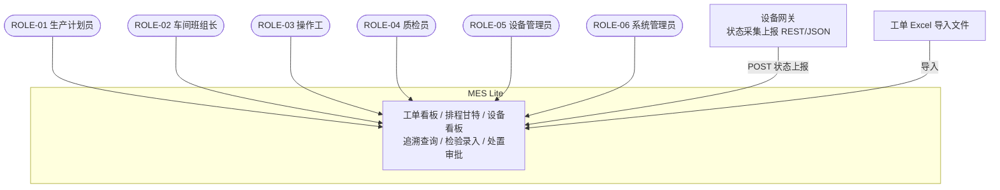

### 2.2 C4 Container（容器边界）

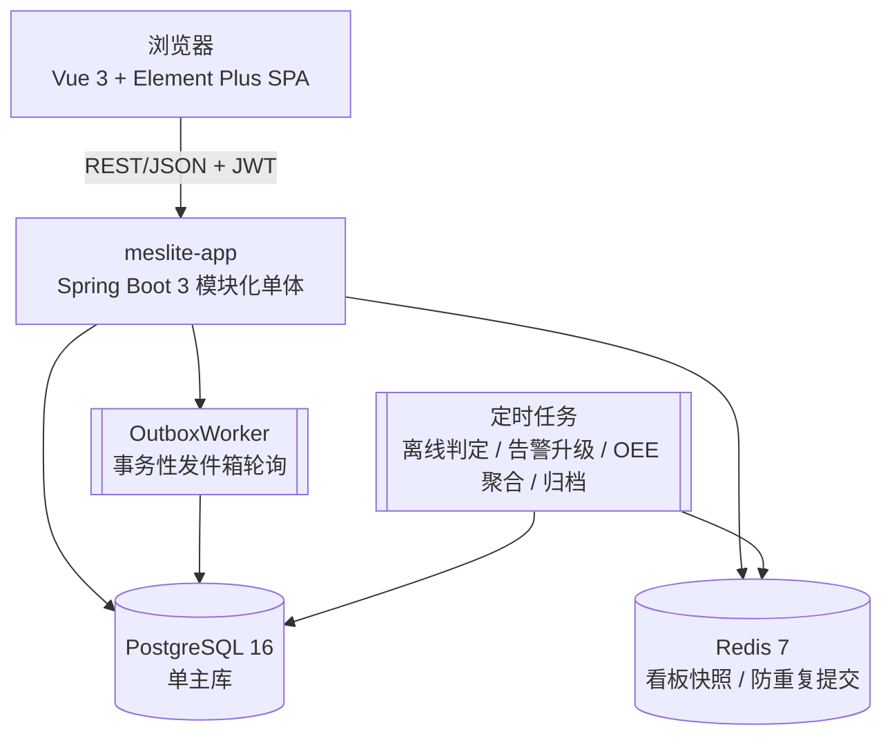

### 2.3 C4 Component（meslite-app 内部组件分解）

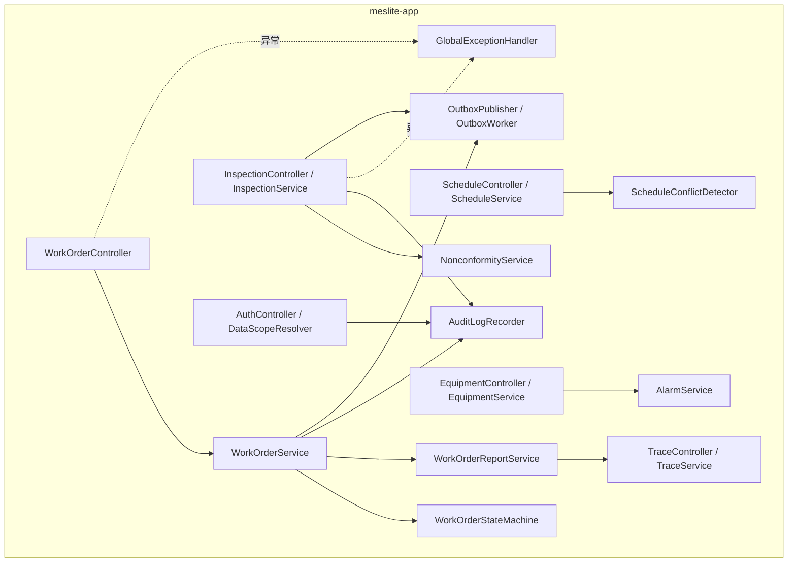

### 2.4 运行时边界与分层职责

| 层 | 包 | 职责 | 禁止事项 |
| --- | --- | --- | --- |
| Controller | `*.controller` | 参数绑定与校验、角色注解、调用 Service、返回 `Result<T>` | 禁止调用 Mapper；禁止写业务分支 |
| Service | `*.service` | 业务规则、状态机迁移、事务边界、幂等与并发控制、审计写入 | 禁止拼接 SQL；禁止返回 Entity |
| Domain | `*.domain` | Entity、枚举、状态迁移表、判定规则（如 BR-010 上下限比对） | 禁止依赖 Spring Web |
| Mapper | `*.mapper` + XML | 单表 CRUD（MyBatis-Plus）与复杂查询（追溯、OEE、负荷） | 禁止业务判断 |
| DTO / VO | `*.dto` / `*.vo` | 入参校验与出参裁剪，隔离 Entity 与 API | VO 禁止携带 `isDeleted`、`version` 之外的内部字段 |

调用方向固定为 Controller → Service → Mapper；跨能力域只允许调用对方的 `QueryService` 只读方法或通过 `outbox_event` 异步协作，禁止跨能力域直接访问 Mapper（见 ADR-001）。

### 2.5 关键依赖

| 依赖 | 版本 | 用途 | 引入方式 |
| --- | --- | --- | --- |
| Spring Boot | 3.2.x | Web、事务、校验、定时任务 | 既有 |
| MyBatis-Plus | 3.5.x | ORM、分页插件、批量写入、乐观锁插件 | 既有 |
| PostgreSQL JDBC | 42.7.x | `org.postgresql.Driver` | 既有 |
| Flyway | 10.x | 版本化数据库迁移（NFR-008 要求） | 既有 |
| Caffeine | 3.x | 进程内一级缓存（字典、台账） | 既有 |
| Spring Data Redis / Lettuce | 3.x | 看板快照与防重复提交 | 既有 |
| Apache POI | 5.x | 追溯报告与审计日志 Excel 导出（FR-011、FR-015） | 既有 |
| springdoc-openapi | 2.x | 契约文档导出，供契约测试对账 | 新增（ADR-008） |
| Vue 3 + Element Plus | 3.4.x / 2.6.x | 前端框架与组件库 | 既有 |
| Pinia / Axios / ECharts | 2.x / 1.x / 5.x | 前端状态、请求封装、OEE 与负荷图表 | 既有 |
| Playwright | 1.4x | E2E 自动化（测试域依赖，不进生产包） | 新增（ADR-008） |

### 2.6 技术栈对账结论

设计选型与需求规格书「约束与依赖」一致，未新增数据库、未新增消息中间件、未更换 ORM。新增 `springdoc-openapi`、`Playwright`、`Apache POI` 三项依赖：前两项记录在 ADR-008，`Apache POI` 用于 FR-011 与 FR-015 的 Excel 导出，属必要且不改变运行时架构。`detect_stack` 输出与本节一致，无技术栈漂移。

---

## 3. 需求到组件映射

### 3.1 能力到模块映射

| 能力 | Maven 模块 / 包 | 覆盖 FR | 主要页面 |
| --- | --- | --- | --- |
| CAP-001 工单管理 | `meslite-workorder` | FR-001、FR-002、FR-003 | 工单看板、工单详情 |
| CAP-002 生产排程 | `meslite-scheduling` | FR-004、FR-005、FR-006 | 排程甘特、排程调整弹窗 |
| CAP-003 设备状态监控 | `meslite-equipment` | FR-007、FR-008 | 设备看板、告警处理、OEE 面板 |
| CAP-004 物料批次追溯 | `meslite-traceability` | FR-009、FR-010、FR-011 | 批次收货、投料登记、追溯查询 |
| CAP-005 质量检验记录 | `meslite-quality` | FR-012、FR-013、FR-014 | 检验录入、处置审批 |
| 支撑能力 | `meslite-security`、`meslite-common` | FR-015 | 用户角色、审计日志查询 |

### 3.2 需求-架构追溯矩阵（EA1）

> 分组列使用需求规格书的 CAP 能力目录（等价于 Epic 列）。任务编号为设计侧锚点，最终以 `docs/03-任务清单.md` 为准。

| 能力 | 需求 ID | 需求摘要 | MoSCoW | 阶段 | 任务 | 模块 | 数据实体 | API endpoint | 备注 |
| --- | --- | --- | --- | --- | --- | --- | --- | --- | --- |
| CAP-001 | FR-001 | 创建生产工单并下达 | Must | MVP | T-004 | WorkOrderService | work_order、work_order_operation | POST /api/work-orders、POST /api/work-orders/{id}/release | AC-001、AC-002、ST-001 |
| CAP-001 | FR-002 | 开工、暂停、恢复与报工 | Must | MVP | T-005 | WorkOrderService、WorkOrderReportService、WorkOrderStateMachine | work_order、work_order_report | POST /api/work-orders/{id}/actions | AC-003 ~ AC-006、ST-003 ~ ST-006 |
| CAP-001 | FR-003 | 完工与关闭（检验合格放行） | Must | MVP | T-006 | WorkOrderService、WorkOrderStateMachine | work_order、work_order_report | POST /api/work-orders/{id}/close | AC-007、AC-008、ST-009 |
| CAP-002 | FR-004 | 自动生成排程任务 | Must | MVP | T-007 | ScheduleService、ScheduleConflictDetector | production_schedule、work_center、shift_calendar | POST /api/schedules/generate | AC-009、AC-010、ST-002 |
| CAP-002 | FR-005 | 排程冲突预警 | Must | MVP | T-007 | ScheduleConflictDetector | production_schedule | POST /api/schedules/conflict-check | AC-011、BR-004 |
| CAP-002 | FR-006 | 排程任务人工调整并留痕 | Must | MVP | T-008 | ScheduleService | production_schedule、audit_log | PATCH /api/schedules/{scheduleTaskId} | AC-012、BR-015 |
| CAP-003 | FR-007 | 设备状态采集与看板 | Must | MVP | T-009 | EquipmentService、EquipmentQueryService | equipment、equipment_status_log | POST /api/equipments/{code}/status-reports、GET /api/equipments/board | AC-013、AC-014、NFR-002 |
| CAP-003 | FR-008 | 异常告警与 OEE 统计 | Must | MVP | T-010 | AlarmService、OeeService | equipment_alarm、equipment_downtime | POST /api/equipments/alarms/{id}/ack、POST /api/equipments/alarms/{id}/close、GET /api/equipments/{code}/oee | AC-015、AC-016、BR-007 |
| CAP-004 | FR-009 | 批次收货入库 | Must | MVP | T-011 | BatchService | material、material_batch | POST /api/material-batches | AC-017、AC-018、BR-008 |
| CAP-004 | FR-010 | 开工投料与批次绑定 | Must | MVP | T-012 | FeedingService | batch_feeding、material_batch | POST /api/work-orders/{id}/feedings | AC-019、AC-020、BR-012 |
| CAP-004 | FR-011 | 正向与反向追溯查询 | Must | MVP | T-013 | TraceService、TraceExportService | batch_feeding（递归查询） | GET /api/traces、GET /api/traces/export | AC-021、AC-022、NFR-003 |
| CAP-005 | FR-012 | 检验单生成与检验项录入 | Must | MVP | T-014 | InspectionService | inspection_order、inspection_item | GET /api/inspections、PUT /api/inspections/{no}/items | AC-023、AC-024 |
| CAP-005 | FR-013 | 检验判定与不合格拦截 | Must | MVP | T-015 | InspectionService、NonconformityService | inspection_order、nonconformity | POST /api/inspections/{no}/judge | AC-023、AC-025、ST-007 |
| CAP-005 | FR-014 | 不合格品处置与审批 | Must | MVP | T-016 | DisposalService | disposal_order、nonconformity | POST /api/nonconformities/{id}/disposals、POST /api/disposals/{id}/approve | AC-026、AC-027、ST-008 |
| 支撑 | FR-015 | 角色权限与操作审计 | Must | MVP | T-017 | DataScopeResolver、AuditLogRecorder | sys_user、sys_role、user_role、audit_log | POST /api/users/{id}/roles、GET /api/audit-logs | AC-028、AC-029、BR-014、BR-015 |

### 3.3 非功能需求映射

| NFR ID | 指标 | 设计承载 | 验证方式 |
| --- | --- | --- | --- |
| NFR-001 | 查询 P95 ≤ 500ms / P99 ≤ 1500ms；写入 P95 ≤ 800ms / P99 ≤ 2000ms；500 并发、50 RPS、30 分钟 | 覆盖索引 + 分页 + 看板缓存 + 批量写入；见 13.3 | `docs/06-性能优化说明.md` PERF-001 ~ PERF-006 + 压测报告 |
| NFR-002 | 单条上报处理 ≤ 200ms；看板刷新 ≤ 10s；支持 ≥ 200 台设备（40/s，峰值 120/s） | 幂等键短路 + 分区表插入 + Redis 看板快照（TTL 5s） | PERF-004 + 网关上报日志统计 |
| NFR-003 | 单层追溯 P95 ≤ 2s / P99 ≤ 5s；3 层链路 P95 ≤ 5s；结果集 ≤ 1000 条 | `batch_feeding` 复合索引 + 递归 CTE + 结果集上限裁剪 | PERF-005 + `EXPLAIN (ANALYZE, BUFFERS)` |
| NFR-004 | 月度可用率 ≥ 99.5%（停机 ≤ 216 分钟） | 无状态应用、健康检查、降级动作（见 14.1） | 拨测 + 接口成功率月汇总 |
| NFR-005 | 生产与追溯记录保留 ≥ 3 年；审计日志保留 ≥ 3 年；保留期内不可物理删除 | 归档表 + 分区滚动；逻辑删除 | 归档任务报告 + 季度抽查 |
| NFR-006 | 关键写操作 100% 审计；写入失败率 ≤ 0.01%；不可改删 | `audit_log` 独立表 + 应用账号仅 INSERT/SELECT + 异步失败告警 | 审计条数与业务写操作条数按月对账 |
| NFR-007 | 全接口认证；BCrypt（cost ≥ 10）；全员写接口鉴权；敏感配置不入库 | Spring Security + JWT + 方法级角色注解 + 环境变量注入密钥 | 安全评审 + 越权自动化用例 |
| NFR-008 | Chrome / Edge 最新两个大版本、1920×1080；单元测试行覆盖率 ≥ 80%、分支 ≥ 70%；数据库变更全部走迁移脚本 | Element Plus 栅格与兼容目标；Flyway 版本化迁移；JaCoCo 门槛 | 覆盖率报告 + 迁移脚本与表结构对账 |

### 3.4 业务规则与状态迁移映射

| 规则 ID | 规则摘要 | 落点组件 | 强制层级 |
| --- | --- | --- | --- |
| BR-001 | 物料主数据与工艺路线必须启用 | `MasterDataValidator` | 服务校验 |
| BR-002 | 工单必须按 CREATED → RELEASED → SCHEDULED → IN_PROGRESS → PENDING_QC → CLOSED 顺序流转；CLOSED 为终态 | `WorkOrderStateMachine` | 迁移表 + `CHECK` 约束 |
| BR-003 | 仅 RELEASED 工单可排程；URGENT 可强制插单但需原因 | `ScheduleService` | 服务校验 + 审计 |
| BR-004 | 同设备时段最多 1 个任务，区间左闭右开，换型间隔 ≥ 10 分钟 | `ScheduleConflictDetector` | 服务预检 + GiST 排他约束 |
| BR-005 | 检验 PASS 或不合格已处置闭环才允许关闭 | `WorkOrderService.close` | 跨模块只读校验 |
| BR-006 | 60s 无上报判定 OFFLINE；DOWN / MAINTENANCE 计入停机，OFFLINE 不计入 OEE 分母 | `OfflineDetectJob`、`OeeService` | 定时任务 + 聚合 SQL |
| BR-007 | DOWN → P1 告警，10 分钟未确认升 P0；MAINTENANCE → P2；5s 内重复上报不重复告警 | `AlarmService`、`AlarmEscalateJob` | 状态去抖 + 定时升级 |
| BR-008 | 仅 AVAILABLE 批次可投料；已投料批次不可删除 | `FeedingService`、`BatchStateMachine` | 状态校验 + 迁移表 |
| BR-009 | 投料记录必须含工单号、批次号、数量、时间、操作人 | `FeedingService` | DTO 必填校验 + 非空约束 |
| BR-010 | 上下限判定规则与 ±0.01% 测量容差 | `InspectionJudgeRule` | 领域规则（纯函数，可单测） |
| BR-011 | 报工后 2h 内创建检验单、24h 内判定；超期不得 CLOSED 且看板高亮 | `InspectionTimeoutJob`、`WorkOrderService.close` | 定时任务 + 关闭校验 |
| BR-012 | 投料后立即扣减库存，乐观锁保证不超发、不出负库存 | `FeedingService` | 乐观锁 + `CHECK (qty_available >= 0)` |
| BR-013 | 排程须落在班次日历内；单工序时长在标准工时 0.8 ~ 3 倍之间 | `ScheduleService` | 服务校验 |
| BR-014 | 数据范围 ALL / SELF_TEAM / SELF；角色互斥 | `DataScopeResolver` | MyBatis 拦截器注入数据范围条件 |
| BR-015 | 关键写操作必须写审计日志（操作人、时间、对象、前后摘要、来源）；不可改删 | `AuditLogRecorder` | AOP 切面 + 权限收紧 |

| 迁移 ID | 前置状态 | 事件 | 后置状态 | 前置条件 | 异常处理 |
| --- | --- | --- | --- | --- | --- |
| ST-001 | CREATED | 下达 | RELEASED | BR-001 通过 | 主数据缺失 → 400 `PRODUCT_NOT_FOUND` |
| ST-002 | RELEASED | 生成排程 | SCHEDULED | 存在可用设备且无时间重叠 | 冲突 → 409 `SCHEDULE_CONFLICT` |
| ST-003 | SCHEDULED | 开工 | IN_PROGRESS | 投料完成、无检验拦截 | 未投料 → 409 `MATERIAL_NOT_FED`；拦截 → 409 `QC_BLOCKED` |
| ST-004 | IN_PROGRESS | 暂停 | PAUSED | 记录暂停原因 | 原因为空 → 400 `PARAM_INVALID` |
| ST-005 | PAUSED | 恢复 | IN_PROGRESS | 工单属于本班组 | 越权 → 403 `DATA_SCOPE_FORBIDDEN` |
| ST-006 | IN_PROGRESS | 数量报满 | PENDING_QC | goodQty + scrapQty = plannedQty | 数量不符 → 400 `QTY_EXCEEDED` |
| ST-007 | PENDING_QC | 判定不合格 | BLOCKED | FAIL 且填写判定说明 | 说明缺失 → 400 `JUDGE_REMARK_REQUIRED` |
| ST-008 | BLOCKED | 返工处置通过 | IN_PROGRESS | 处置单审批通过 | 未审批 → 409 `DISPOSAL_ALREADY_OPEN` |
| ST-009 | PENDING_QC | 判定合格并关闭 | CLOSED | 检验 PASS（BR-005） | 未判定 → 409 `QC_NOT_PASSED` |
| ST-010 | CREATED | 取消 | CANCELLED | 未产生报工记录 | 已有报工 → 409 `WORK_ORDER_STATE_INVALID` |

---

## 4. 模块设计

### 4.1 模块边界契约

| 模块 | 对外公开能力 | 依赖 | 禁止 |
| --- | --- | --- | --- |
| `meslite-common` | `Result<T>`、`PageResult<T>`、`BusinessException`、`ErrorCode`、`BaseEntity`、`GlobalExceptionHandler`、`IdempotencyGuard`、`ExcelExporter` | 无 | 禁止依赖任何业务模块 |
| `meslite-security` | `DataScopeResolver`、`RoleGuard`、`AuditLogRecorder`、`JwtTokenProvider` | common | 禁止承载业务规则 |
| `meslite-workorder` | `WorkOrderService`、`WorkOrderQueryService`、`WorkOrderStateMachine` | common、security、traceability（只读）、quality（只读） | 禁止被 traceability / quality 反向依赖 |
| `meslite-scheduling` | `ScheduleService`、`ScheduleQueryService`、`ScheduleConflictDetector` | common、workorder（只读） | 禁止直接改工单状态（SCHEDULED 由 workorder 提供内部方法） |
| `meslite-equipment` | `EquipmentService`、`AlarmService`、`OeeService` | common | 禁止依赖 workorder 写路径 |
| `meslite-traceability` | `BatchService`、`FeedingService`、`TraceService` | common | 禁止依赖 quality 写路径 |
| `meslite-quality` | `InspectionService`、`NonconformityService`、`DisposalService` | common、workorder（只读） | 禁止直接关闭工单 |

### 4.2 CAP-001 工单管理模块

**职责**：工单创建与下达、开工 / 暂停 / 恢复 / 报工、数量报满转待检、检验合格后关闭与归档只读。

| 类 | 类型 | 关键方法 | 说明 |
| --- | --- | --- | --- |
| `WorkOrderController` | Controller | `create`、`release`、`act`、`close`、`cancel`、`page`、`detail` | 动作端点统一入参 `action`（START / PAUSE / RESUME / REPORT），与 FR-002 输入要素一致 |
| `WorkOrderService` | Service | `createWorkOrder`、`release`、`close`、`cancel` | 事务边界在此；`@Transactional(rollbackFor = Exception.class)` |
| `WorkOrderStateMachine` | Domain | `fire(current, event) -> next` | 迁移表驱动 10 条迁移（ST-001 ~ ST-010），非法迁移抛 `WORK_ORDER_STATE_INVALID` |
| `WorkOrderReportService` | Service | `act`、`report`、`sumQuantity` | 校验 `goodQty + scrapQty ≤ 剩余可报数量`、报废原因必填、乐观锁 |
| `MasterDataValidator` | Domain | `validateProduct`、`validateRoute` | BR-001 主数据启用校验 |
| `WorkOrderQueryService` | Service | `page`、`detail`、`board` | 只读事务；列表走覆盖索引；详情一次性批量装配（避免 N+1） |
| `WorkOrderNoGenerator` | Domain | `next()` | 生成 `WO + yyyyMMdd + 4 位流水`，按日重置，数据库唯一索引兜底 |

**报工校验顺序**（保证错误码与 FR-002 的 E1 ~ E5 一一对应）：① 数据范围与角色校验 → ② 状态机前置校验（`SCHEDULED` / `IN_PROGRESS` / `PAUSED`）→ ③ 投料完成校验（`MATERIAL_NOT_FED`）→ ④ 检验拦截校验（`QC_BLOCKED`）→ ⑤ 数量校验（`QTY_EXCEEDED`）→ ⑥ 报废原因校验（`SCRAP_REASON_REQUIRED`）→ ⑦ 乐观锁更新（`VERSION_CONFLICT`）→ ⑧ 报满则迁移 `PENDING_QC` 并写发件箱（触发检验单生成，ST-006）。

**工单聚合结构**：`work_order`（根）× `work_order_operation`（1:N 工序）× `work_order_report`（1:N 报工）× `batch_feeding`（1:N 投料，属 CAP-004）。写操作以工单为聚合根，单事务内完成状态与明细的一致性变更。

### 4.3 CAP-002 生产排程模块

**职责**：按工艺路线、设备能力与班次日历生成排程任务；冲突预警；人工调整并留痕。

| 类 | 关键职责 | 要点 |
| --- | --- | --- |
| `ScheduleService` | `generate`、`reschedule` | 策略枚举 `EARLIEST_DUE`（按计划结束时间升序）/ `LEAST_LOAD`（按设备已排工时升序）；URGENT 可插单但需 `reason` |
| `ScheduleConflictDetector` | `detect(equipmentId, candidateRange)` | 左闭右开 `[start, end)` 交集判定；返回冲突任务清单（工单号 + 时间段）；允许 ≥ 10 分钟换型间隔（BR-004 例外） |
| `ShiftCalendarService` | `isWithinShift`、`nextAvailableSlot` | BR-013：排程必须落在班次日历有效时段，跨班次允许但不跨非工作日 |
| `ScheduleQueryService` | `gantt`、`byWorkOrder` | 甘特视图按 `equipmentId + 日期` 维度返回，单次区间 ≤ 31 天 |

数据库层使用 `btree_gist` 扩展的排他约束 `EXCLUDE USING gist (equipment_id WITH =, slot WITH &&)` 作为最终防线；服务层预检负责给出可读冲突明细（`SCHEDULE_CONFLICT` + 冲突清单），AC-011 依赖两者一致。

### 4.4 CAP-003 设备状态监控模块

**职责**：状态上报与幂等去抖、当前状态与持续时间维护、看板、离线判定、告警生成升级关闭、OEE 日 / 周统计。

| 类 | 关键职责 | 要点 |
| --- | --- | --- |
| `EquipmentService` | `reportStatus` | 幂等键 = `equipmentCode + occurredAt 归一化到 5s 窗口`；命中则返回 200 且不重复计数（AC-014） |
| `EquipmentQueryService` | `board`、`statusHistory` | 看板读 Redis 快照（TTL 5s）+ Caffeine 一级缓存；历史按 `equipment_status_log` 时间范围查询 |
| `OfflineDetectJob` | 每 10s 扫描 | `last_report_at` 超 60s → 置 `OFFLINE` 并写状态变更记录（BR-006、AC-014） |
| `AlarmService` | `openOnDown`、`ack`、`close` | DOWN → P1；MAINTENANCE → P2；重复确认返回 `ALARM_ALREADY_ACKED`；关闭必须填 `handleResult`（`HANDLE_RESULT_REQUIRED`） |
| `AlarmEscalateJob` | 每 60s 扫描 | P1 告警 10 分钟未确认升 P0（BR-007、AC-015） |
| `OeeService` | `daily`、`weekly` | availability × performance × quality；区间基础数据缺失返回 `partial` 与缺失日期清单（AC-016） |

状态与停机联动：进入 `DOWN` 时创建停机记录（`equipment_downtime`），转 `MAINTENANCE` 后停机类型标记为计划内（BR-006 例外，不计入非计划停机），恢复运行 / 待机时闭环停机记录并累计时长。

### 4.5 CAP-004 物料批次追溯模块

**职责**：批次收货入库与来料检验联动、开工投料与批次绑定、库存扣减、正向与反向追溯、追溯报告导出。

| 类 | 关键职责 | 要点 |
| --- | --- | --- |
| `BatchService` | `receive`、`freeze`、`unfreeze` | 批次号唯一（`BATCH_DUPLICATED`）；数量最多 3 位小数（`QUANTITY_INVALID`）；初始状态 `PENDING_QC` |
| `BatchStateMachine` | `fire(current, event)` | 状态 `PENDING_QC / AVAILABLE / FROZEN / CONSUMED / RETURNED / SCRAPPED`；仅 `AVAILABLE` 可投料（BR-008） |
| `FeedingService` | `feed` | 校验批次可用、库存充足、物料一致、超领（> 需求 × 1.05 需审批）；乐观锁扣减库存（BR-012）；写入 `batch_feeding` 五要素 |
| `TraceService` | `traceForward`、`traceBackward` | 递归 CTE 遍历 `batch_feeding`；单次结果集上限 1000 条；断链返回 `partial` 与断链节点清单（AC-022） |
| `TraceExportService` | `export` | Excel（xlsx）导出，异步生成 + 下载令牌，导出行为写审计 |

追溯模型：`batch_feeding(work_order_id, material_batch_no, feed_quantity, feed_time, operator_id)` 同时承担投料记录与追溯边；反向（成品 → 原料）与正向（原料 → 成品）在同一张表上以不同方向遍历，避免维护第二套关系表（ADR-006）。

### 4.6 CAP-005 质量检验记录模块

**职责**：检验节点触发检验单生成、检验项录入、上下限判定、不合格拦截、不合格品处置与审批闭环。

| 类 | 关键职责 | 要点 |
| --- | --- | --- |
| `InspectionTriggerListener` | 监听发件箱事件 | 报工报满或工序完成 → 自动生成检验单（状态 `CREATED`，AC-005、AC-018）；2h 内必须创建（BR-011） |
| `InspectionService` | `saveItems`、`judge` | 检验项未录全 → `INSPECTION_ITEM_INCOMPLETE`；已判定再录入 → `INSPECTION_ALREADY_JUDGED`；判定与数据冲突 → `JUDGE_CONFLICT_WITH_DATA` |
| `InspectionJudgeRule` | `judge(items) -> PASS/FAIL` | 上下限比对 + ±0.01% 容差（BR-010），纯函数便于穷举单测（AC-024） |
| `NonconformityService` | `openOnFail` | FAIL 时生成不合格记录，下游工单置 `BLOCKED`（ST-007），下游报工与关闭返回 `QC_BLOCKED`（AC-025） |
| `DisposalService` | `create`、`approve` | `REWORK / CONCESSION / SCRAP`；SCRAP 需 ROLE-01 与 ROLE-05 双方审批（`SCRAP_APPROVAL_REQUIRED`）；数量上限校验（`DISPOSAL_QTY_EXCEEDED`）；重复发起（`DISPOSAL_ALREADY_OPEN`） |
| `InspectionTimeoutJob` | 每小时扫描 | 24h 未判定 → 看板高亮 + 阻止 CLOSED（BR-011）；48h 延长需 ROLE-01 审批并写审计 |

处置联动：`REWORK` 生成返工工单并把批次转 `AVAILABLE`（ST-008 允许 `BLOCKED → IN_PROGRESS`）；`CONCESSION` 放行工单并标记让步接收；`SCRAP` 扣减库存并把批次转 `SCRAPPED`。

### 4.7 支撑模块与前端模块

| 组件 | 位置 | 说明 |
| --- | --- | --- |
| `DataScopeResolver` | `meslite-security` | 解析 `ALL / SELF_TEAM / SELF`，经 MyBatis 拦截器向查询追加数据范围条件（BR-014、AC-028） |
| `RoleGuard` | `meslite-security` | 方法级角色校验；角色互斥（ROLE-01 与 ROLE-04 不可兼任）在用户角色分配时校验 |
| `AuditLogRecorder` | `meslite-security` | 注解 + AOP 记录操作人、时间、对象类型、对象 ID、变更前后摘要、操作来源（BR-015、AC-029） |
| `IdempotencyGuard` | `meslite-common` | 基于 `idempotency_record` 唯一索引，用于状态变更与设备上报 |
| `src/api/` | 前端 | 按能力域拆分请求函数，组件禁止硬编码路径 |
| `src/stores/` | 前端 | `workOrderStore`、`equipmentStore`、`userStore`、`dictStore` |
| `src/views/` | 前端 | 工单看板、工单详情、排程甘特、设备看板、追溯查询、检验录入、处置审批、审计日志 |
| `src/utils/errorCode.ts` | 前端 | 错误码 → 中文文案映射（与 11.2 表逐项对应） |

---

## 5. 数据架构

### 5.1 概念实体与关系（ER 概要）

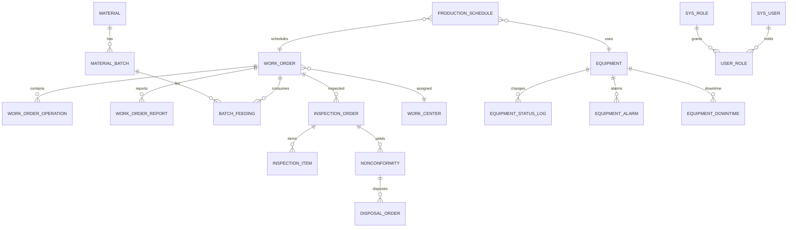

### 5.2 持久化策略

| 决策点 | 选择 | 理由 |
| --- | --- | --- |
| 数据库 | PostgreSQL 16 单主库 | 需求规格书固定技术栈；递归 CTE（追溯）、`btree_gist`（排程排他约束）、部分索引与 `CHECK` 约束原生支持，可省去额外组件 |
| 读写分离 | 首版不做 | 数据量 5 万工单 / 100 万投料 / 200 万状态记录，单主库余量充足；OEE 与负荷聚合已有独立只读事务 |
| 分库分表 | 不做 | 无单表超过 1000 万行的 3 年预期（见 5.5），分片收益低于运维成本 |
| 分区 | 仅 `equipment_status_log` 与 `audit_log` 按年分区 | 唯一的纯追加表；归档即 `DETACH`，满足 NFR-005 的 3 年保留与不可物理删除要求 |
| 主键 | `BIGINT` + 雪花算法 | 避免 UUID 索引膨胀；对外业务键（工单号、批次号、检验单号）另设唯一索引 |
| 时间 | `TIMESTAMP`（无时区），统一 `Asia/Shanghai` | 与班次日历、OEE 统计口径一致 |
| 布尔 | `SMALLINT`（0/1） | 与既有适配器约定一致，避免与 `is_deleted` 语义混淆 |
| 数值 | 数量 `NUMERIC(18,3)` | 需求要求 quantity 最多 3 位小数（FR-009） |

### 5.3 表清单与关键字段

| 表 | 说明 | 关键字段 | 约束 |
| --- | --- | --- | --- |
| `work_order` | 工单主表 | `wo_no`、`product_code`、`planned_qty`、`good_qty`、`scrap_qty`、`unit`、`status`、`priority`、`work_center_id`、`planned_start_time`、`planned_end_time`、`actual_start_time`、`actual_end_time`、`version` | 唯一 `uk_wo_no`（`is_deleted = 0` 部分索引）；`CHECK status IN (...)` |
| `work_order_operation` | 工序清单（来自工艺路线快照） | `work_order_id`、`seq_no`、`operation_code`、`standard_hours`、`inspection_required` | 唯一 `uk_wo_op_seq` |
| `work_order_report` | 报工记录 | `work_order_id`、`good_qty`、`scrap_qty`、`scrap_reason_code`、`reported_by`、`reported_at`、`shift_code` | 索引 `idx_wor_wo_time` |
| `production_schedule` | 排程任务 | `work_order_id`、`operation_code`、`equipment_id`、`start_time`、`end_time`、`slot`、`status`、`reason` | 排他约束 `excl_eq_slot`；唯一 `uk_ps_wo_op` |
| `work_center` | 工作中心 | `wc_code`、`wc_name`、`daily_capacity_hours` | 唯一 `uk_wc_code` |
| `shift_calendar` | 班次日历 | `calendar_date`、`shift_code`、`start_time`、`end_time`、`planned_maintenance` | 唯一 `uk_sc_date_shift` |
| `equipment` | 设备台账与当前状态 | `equipment_code`、`equipment_name`、`work_center_id`、`current_status`、`status_since`、`last_report_at`、`enabled`、`version` | 唯一 `uk_eq_code`；`CHECK status IN (...)` |
| `equipment_status_log` | 状态变更历史（按年分区） | `equipment_id`、`from_status`、`to_status`、`source`、`occurred_at`、`report_key`、`reported_by` | 唯一 `uk_esl_report_key`（幂等）；分区内 `idx_esl_eq_time` |
| `equipment_alarm` | 告警 | `equipment_id`、`level`、`status`、`downtime_reason_code`、`handle_result`、`acked_by`、`acked_at`、`closed_at` | 索引 `idx_ea_status_level` |
| `equipment_downtime` | 停机记录 | `equipment_id`、`started_at`、`closed_at`、`downtime_reason_code`、`planned` | 索引 `idx_ed_eq_start` |
| `material` | 物料主数据 | `material_code`、`material_name`、`spec`、`unit`、`enabled` | 唯一 `uk_material_code` |
| `material_batch` | 物料批次 | `material_batch_no`、`material_code`、`supplier_batch_no`、`supplier_name`、`quantity`、`qty_available`、`status`、`receive_time`、`version` | 唯一 `uk_mbn`；`CHECK qty_available >= 0` |
| `batch_feeding` | 投料记录（追溯边） | `work_order_id`、`material_batch_no`、`feed_quantity`、`feed_time`、`operator_id` | 唯一 `uk_bf_wo_batch_time` |
| `inspection_order` | 检验单 | `inspection_no`、`inspection_type`、`work_order_id`、`material_batch_no`、`status`、`judge_result`、`judge_remark`、`judged_by`、`judged_at`、`version` | 唯一 `uk_io_no` |
| `inspection_item` | 检验项 | `inspection_id`、`item_code`、`standard_value`、`upper_limit`、`lower_limit`、`measured_value`、`unit`、`item_result` | 唯一 `uk_ii_insp_item`；`CHECK upper_limit IS NULL OR lower_limit IS NULL OR upper_limit > lower_limit` |
| `nonconformity` | 不合格记录 | `inspection_id`、`work_order_id`、`quantity`、`status`、`opened_at` | 索引 `idx_nc_status` |
| `disposal_order` | 处置单 | `nonconformity_id`、`disposal_type`、`quantity`、`reason`、`approver_id`、`approval_status`、`closed_at` | 索引 `idx_do_nc_status` |
| `audit_log` | 审计日志（按年分区） | `operator_id`、`action`、`target_type`、`target_id`、`before_summary`、`after_summary`、`source_ip`、`occurred_at` | 分区；应用账号仅 INSERT / SELECT（NFR-006） |
| `idempotency_record` | 幂等记录 | `idem_key`、`biz_type`、`result_ref`、`expire_at` | 唯一 `uk_idem_key` |
| `outbox_event` | 事务性发件箱 | `event_type`、`payload_json`、`status`、`retry_count`、`next_retry_at` | 索引 `idx_oe_status_retry` |
| `sys_user` / `sys_role` / `user_role` | 用户、角色、关联 | `username`、`password_hash`、`enabled`、`role_code`、`data_scope` | 唯一 `uk_username`、`uk_role_code`；角色互斥在服务层校验 |
| `dict_item` | 字典（报废原因、停机原因、单位等） | `dict_type`、`item_code`、`item_name`、`sort_no`、`enabled` | 唯一 `uk_dict_item` |

### 5.4 索引与约束策略

| 索引 / 约束 | 目标场景 | 类型 |
| --- | --- | --- |
| `idx_wo_status_plan_start (status, planned_start_time DESC)` | 工单看板按状态 + 计划时间排序（FR-001、FR-003） | B-tree 复合 |
| `idx_wo_center_status (work_center_id, status)` | 按工作中心查在制工单 | B-tree 复合 |
| `idx_wo_created (created_at DESC) WHERE is_deleted = 0` | 最新工单首屏与当日创建数统计（FR-001 E4） | 部分索引 |
| `uk_wo_no (wo_no) WHERE is_deleted = 0` | 工单号唯一（软删除友好） | 部分唯一索引 |
| `idx_ps_eq_start (equipment_id, start_time)` | 甘特与冲突预检（FR-005） | B-tree 复合 |
| `excl_eq_slot EXCLUDE USING gist (equipment_id WITH =, slot WITH &&)` | 同设备时段不重叠（BR-004 最终防线） | GiST 排他约束 |
| `uk_esl_report_key (equipment_id, report_key)` | 5s 内重复上报幂等（AC-014） | 唯一索引（分区内） |
| `idx_esl_eq_time (equipment_id, occurred_at DESC)` | 单设备状态历史（FR-007） | B-tree 复合（分区内） |
| `idx_ea_status_level (status, level, created_at)` | P1 告警 10 分钟升级扫描（BR-007） | B-tree 复合 |
| `idx_mbn_status (status, receive_time)` | 可用批次列表与待检批次 | B-tree 复合 |
| `uk_bf_wo_batch_time`、`idx_bf_batch (material_batch_no, work_order_id)` | 反向追溯（批次 → 工单）、正向追溯（工单 → 批次） | B-tree 复合 |
| `idx_io_work_order (work_order_id, inspection_type)` | 工单检验单装配与关闭前校验（BR-005） | B-tree 复合 |
| `idx_al_operator_time (operator_id, occurred_at DESC)` | 审计查询（FR-015、AC-029） | B-tree 复合（分区内） |

约束原则：软删除唯一性一律使用 `WHERE is_deleted = 0` 部分索引；库存不得为负由 `CHECK (qty_available >= 0)` 保证；除 `work_order_operation` / `work_order_report` / `inspection_item` 外不使用外键级联删除，完整性由业务逻辑负责。

### 5.5 数据量级与增长速度

| 表 | 首年行数 | 增长 | 单行估算 | 首年存储 | 依据 |
| --- | --- | --- | --- | --- | --- |
| `work_order` | 5 万 | 约 140/日 | 0.4 KB | 约 20 MB | 需求规格书 数据规模 |
| `work_order_report` | 20 万 | 约 550/日 | 0.2 KB | 约 40 MB | 单工单平均 4 次报工 |
| `production_schedule` | 10 万 | 约 280/日 | 0.2 KB | 约 20 MB | 单工单平均 2 道工序 |
| `equipment_status_log` | 200 万 | 约 5500/日 | 0.15 KB | 约 300 MB | 需求规格书 数据规模（40 台 × 5s 上报上限） |
| `batch_feeding` | 100 万 | 约 2700/日 | 0.2 KB | 约 200 MB | 需求规格书 数据规模 |
| `inspection_order` + `inspection_item` | 6 万 + 30 万 | 约 1000/日 | 0.3 KB | 约 110 MB | 单检验单平均 5 个检验项 |
| `audit_log` | 150 万 | 约 4100/日 | 0.5 KB | 约 750 MB | 8 类关键写操作（BR-015） |

三年后最大单表为 `equipment_status_log`（约 600 万行、0.9 GB）与 `audit_log`（约 450 万行、2.2 GB），远低于需要分片的量级；两者均按年分区并在满 1 年后 `DETACH` 归档（NFR-005）。

### 5.6 审计字段、软删除与乐观锁

- 统一审计字段：`created_at`、`updated_at`、`created_by`、`updated_by`、`is_deleted` 由 `BaseEntity` + MyBatis-Plus 自动填充。
- 软删除：删除即置 `is_deleted = 1`；查询默认追加 `is_deleted = 0`。业务上禁止物理删除生产记录与审计日志（NFR-005、NFR-006）。
- 乐观锁：`work_order.version`、`material_batch.version`、`inspection_order.version` 由 `OptimisticLockerInnerInterceptor` 维护；更新影响行数为 0 时统一抛 `VERSION_CONFLICT`（HTTP 409），对应 AC-006。
- 审计留痕：`audit_log` 记录前后摘要（`before_summary` / `after_summary` 为 JSON 文本，字段值做长度截断），不含口令、令牌等敏感值（NFR-007）。

### 5.7 数据一致性总体策略与事务边界

| 场景 | 一致性要求 | 策略 | 事务边界 |
| --- | --- | --- | --- |
| 工单创建 + 下达 | 强一致 | 单库本地事务：工单 + 工序快照 + 审计 | `WorkOrderService.release` |
| 报工（含报满转待检） | 强一致 | 单库本地事务：累计数量 + 报工记录 + 状态迁移 + 发件箱 + 审计 | `WorkOrderReportService.act` |
| 投料与库存扣减 | 强一致 | 单库本地事务 + 批次行锁 / 乐观锁（BR-012） | `FeedingService.feed` |
| 报满触发检验单生成 | 最终一致（≤ 5s） | 事务性发件箱 + `OutboxWorker` 轮询 | `outbox_event` → `InspectionTriggerListener` |
| 检验判定 → 工单 BLOCKED | 强一致（判定自身）+ 事件（下游拦截） | 判定事务内更新检验单与不合格记录；工单状态由事件驱动同步 | `InspectionService.judge` + 事件 |
| 处置审批 → 批次 / 工单状态 | 强一致 | 审批事务内联动批次状态与工单状态 | `DisposalService.approve` |
| 设备看板快照 | 最终一致（≤ 5s） | 定时任务聚合写 Redis + 状态变更时失效 | `BoardSnapshotJob` |
| OEE 与工作中心负荷 | 最终一致（小时级） | 定时任务重算并落 `oee_daily` / 负荷表 | `OeeAggregateJob`、`CapacityRecalcJob` |

明确不采用：首版为单库，不引入分布式事务；除「检验单生成」「看板快照」「OEE 聚合」外，其余场景必须强一致。

### 5.8 数据生命周期与归档

| 数据 | 在线保留 | 归档策略 | 依据 |
| --- | --- | --- | --- |
| 工单与报工 | 1 年在主表 | 超过 1 年迁移至 `work_order_archive`，仍可被追溯查询访问 | NFR-005、需求规格书 归档策略 |
| `batch_feeding`（追溯记录） | 3 年 | 分区 / 归档表保留，禁止物理删除 | NFR-005、BR-009 |
| `equipment_status_log` | 1 年 | 按年分区 `DETACH` 后转储至归档表空间 | NFR-005 |
| `audit_log` | 3 年 | 按年分区，超期转储但保留可检索索引 | NFR-005、NFR-006 |
| `idempotency_record` | 7 天 | 定时任务物理删除（非生产记录，不受保留约束） | 设计补充 |
| `outbox_event` | 30 天（`DONE`） | 定时任务物理删除 | 设计补充 |

### 5.9 交接说明

- **给 Data Engineer**：产出 `docs/05-数据设计说明书.md` 与迁移脚本 `V1__baseline.sql`（基线 24 张表 + 注释 + 基础索引）、`V2__index_and_partition.sql`（覆盖索引、部分唯一索引、年分区、BRIN）、`V3__extensions.sql`（`btree_gist` 与排他约束）。大表索引使用 `CREATE INDEX CONCURRENTLY`；脚本必须注明前后兼容性与回滚方式（NFR-008）。
- **给 Data Contract Designer**：字段可空性、枚举取值、分页与排序入参、错误码符号以本文件 5.3、6.2、11.2 与需求规格书 FR 章节为准。
- **给 Performance Engineer**：需压测工单看板列表、设备上报吞吐、追溯查询三类路径（见 13.6）。

---

## 6. API 与集成架构

### 6.1 API 族与资源边界

| API 族 | 前缀 | 覆盖 FR | 端点数量 |
| --- | --- | --- | --- |
| 工单族 | `/api/work-orders` | FR-001、FR-002、FR-003 | 7 |
| 排程族 | `/api/schedules` | FR-004、FR-005、FR-006 | 4 |
| 设备族 | `/api/equipments` | FR-007、FR-008 | 6 |
| 追溯族 | `/api/material-batches`、`/api/traces` | FR-009、FR-010、FR-011 | 4 |
| 检验族 | `/api/inspections`、`/api/nonconformities`、`/api/disposals` | FR-012、FR-013、FR-014 | 6 |
| 权限与审计族 | `/api/users`、`/api/audit-logs` | FR-015 | 4 |

路径约定：资源用复数 + kebab-case；状态变更使用动作子资源（`/release`、`/close`、`/actions`、`/judge`、`/approve`），保留需求规格书 AC-001 中给出的 `/api/work-orders` 形式。版本策略：主版本通过 `/api` 前缀承载，兼容性变更（新增可选字段、新增端点、枚举增项）不升版；破坏性变更（删字段、改类型、可选改必填、枚举减项、改错误码语义）必须保留 `deprecated` 过渡期或升为 `/api/v2`。

### 6.2 统一契约预期

| 契约点 | 约定 |
| --- | --- |
| 成功响应 | HTTP 200/201 + `Result<T>`，`code = "OK"` |
| 失败响应 | HTTP 400 / 403 / 404 / 409 / 429 / 500 + `Result<null>`，`code` 为错误码符号（如 `QTY_EXCEEDED`） |
| 分页响应 | `data` 为 `PageResult<T>`：`list` / `page` / `size` / `total` / `pages` |
| 分页入参 | `page`（1 起，默认 1）、`size`（默认 20，上限 100）、`sort`（`field,asc|desc`，字段白名单） |
| 空集合 | 返回 `[]`，禁止 `null` |
| 时间格式 | ISO-8601 无时区偏移，如 `2026-04-01T08:00:00` |
| 枚举 | 大写下划线；取值以需求规格书 FR 章节为准，禁止服务端自定义近义值 |
| 部分成功 | 返回 200 + `partial = true` 与缺失/断链清单（AC-016、AC-022） |

### 6.3 幂等与并发控制

| 端点类型 | 幂等手段 | 冲突返回 |
| --- | --- | --- |
| 状态变更（release / actions / close / cancel / judge / approve） | 请求体 `version` 乐观锁 + 状态机前置校验 | 409 `VERSION_CONFLICT` / `WORK_ORDER_STATE_INVALID` |
| 报工 | `version` + 数量规则校验 | 409 `VERSION_CONFLICT`（AC-006） |
| 设备状态上报 | `equipmentCode + occurredAt` 归一化 5s 窗口作为 `report_key`，唯一索引去重 | 重复上报返回 200 且不重复计数（AC-014） |
| 投料登记 | 唯一键 `(work_order_id, material_batch_no, feed_time)` + 批次乐观锁 | 409 `BATCH_NOT_AVAILABLE` / 400 `INSUFFICIENT_STOCK` |
| 处置单审批 | `version` + 审批状态校验 | 409 `ALARM_ALREADY_ACKED` 同族语义（`DISPOSAL_ALREADY_OPEN`） |
| 列表 `total` | 超过 10 万行时返回估算值并置 `totalIsEstimate = true` | 不阻断；前端提示收窄条件 |

### 6.4 集成点

| 集成方向 | 方式 | 频率 | 失败处理 |
| --- | --- | --- | --- |
| 设备网关 → MES Lite | `POST /api/equipments/{equipmentCode}/status-reports` | 每设备 5s，正常 40/s，峰值 120/s | 网关本地缓存补传；服务端按 `report_key` 幂等去重 |
| 工单 Excel 导入 | 页面导入 xlsx（`POST /api/work-orders/import`，范围外能力的轻量实现） | 按需 | 逐行校验，返回失败行号与原因，不做整体回滚 |
| 追溯报告导出 | 应用内生成 xlsx，返回下载令牌 | 按需 | 失败可重试；导出行为写审计 |
| 标签打印 | 首版不做（需求范围外） | — | — |

未采用的技术形式说明：首版不采用 Kafka / RabbitMQ / Pulsar（无消息中间件许可，异步由 `outbox_event` 承载）；不采用 GraphQL（契约以 REST 为主，前端无需字段裁剪）；不采用 WebSocket / SSE（看板以 5s 轮询满足 NFR-002 的 10s 刷新要求）；不采用 gRPC（无跨语言内部调用）。

### 6.5 交接说明

**给 Data Contract Designer**：按 6.1 的 6 个 API 族共 31 个端点产出字段级契约（类型、必填、默认值、边界、枚举、错误码、正反例），错误码只允许取自需求规格书 FR 章节与 11.2 表，并完成错误码冲突检测与破坏性变更检测（首版作为基线，标记 `breakingChanges: []`）。

---

## 7. UI 架构

### 7.1 页面或视图边界

| 页面 | 路由 | 覆盖 FR | 关键交互 |
| --- | --- | --- | --- |
| 工单看板 | `/work-orders` | FR-001、FR-003 | 条件筛选、分页表格、批量下达、状态标签、待检高亮（BR-011） |
| 工单详情 | `/work-orders/:id` | FR-002、FR-010 | 状态时间线、报工表单（≤ 6 字段）、投料登记、关闭动作 |
| 排程甘特 | `/schedules` | FR-004 ~ FR-006 | 设备 × 时间矩阵、拖拽调整、冲突提示、调整原因必填 |
| 设备看板 | `/equipments` | FR-007、FR-008 | 状态卡片墙（10s 内刷新）、数据延迟标记、告警确认与关闭、OEE 面板 |
| 追溯查询 | `/traces` | FR-011 | 批次号 / 工单号 / 成品序列号三选一锚点、正反向切换、断链标记、导出 |
| 检验录入 | `/inspections` | FR-012、FR-013 | 检验项表格、上下限即时校验、判定提交、不合格记录生成 |
| 处置审批 | `/disposals` | FR-014 | 处置单列表、SCRAP 双人审批、审批意见必填 |
| 审计日志 | `/audit-logs` | FR-015 | 按操作人 / 类型 / 时间查询、导出、只读 |

### 7.2 状态归属

| 状态 | 归属 | 说明 |
| --- | --- | --- |
| 服务端业务数据 | Pinia store + 组件局部刷新 | store 只保留最近一次查询条件与结果，不做长期缓存 |
| 设备看板实时状态 | `equipmentStore`，10s 轮询 `GET /api/equipments/board` | 页面隐藏时暂停轮询；展示 `snapshotAt` 数据时刻 |
| 表单草稿（报工、检验录入、处置） | 组件内 `reactive` + `sessionStorage` 备份 | 防止现场误刷新丢失录入（RSK-04 缓解） |
| 用户与数据范围 | `userStore` | 登录后获取角色与 `dataScope`；路由守卫 + `v-permission` 指令 |
| 字典（报废原因、停机原因、单位） | `dictStore` | 应用启动加载一次，配合后端字典缓存 |
| 全局错误提示 | `request.ts` 拦截器 | 401 跳登录、403 提示无权限、409 提示并刷新、5xx 提示重试；文案来自 `errorCode.ts` |

### 7.3 交互流程（工单下达）

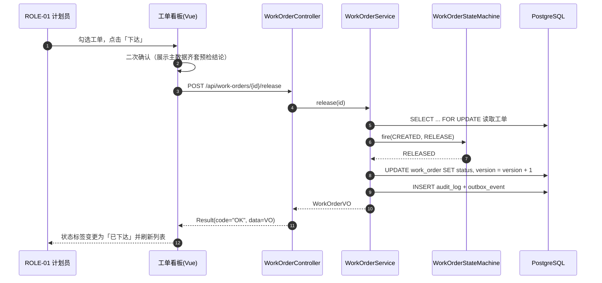

### 7.4 交接说明

- **给 UI Designer**：需产出 6 个页面说明（需求规格书 下游交接 已明确），定义状态色板（工单 9 状态、设备 5 状态、批次 6 状态）、看板信息密度、扫码输入焦点规范、报工表单字段不超过 6 个（RSK-04）。
- **给 Frontend Engineer**：接口路径与错误码只允许来自 `src/api/` 与 `src/utils/errorCode.ts`；分页与状态标签必须复用公共组件；Excel 导入失败必须展示行号与原因。

---

## 8. 安全与治理考虑

### 8.1 认证与授权假设

- 认证：Spring Security + JWT；访问令牌有效期 2 小时，刷新令牌 8 小时（对齐一个班次）；签名密钥经环境变量注入，禁止写入仓库（NFR-007）。
- 会话：空闲 30 分钟失效；连续 5 次登录失败锁定账号 10 分钟（NFR-007）。
- 授权：RBAC，角色 = ROLE-01 ~ ROLE-06；方法级注解校验；角色互斥（ROLE-01 与 ROLE-04 不可兼任）在角色分配时强制（BR-014）。
- 数据范围：`ALL / SELF_TEAM / SELF`，由 `DataScopeResolver` + MyBatis 拦截器在查询层注入条件，禁止在 Controller 手工拼接（AC-028）。
- 审计主体：F 人操作与网关上报使用不同主体，网关主体仅可访问上报端点（FR-007）。

### 8.2 输入校验

| 层级 | 手段 | 覆盖 |
| --- | --- | --- |
| 前端 | Element Plus 表单规则 + 提交前校验 | 必填、长度、数值范围、枚举、时间先后（FR-001 E2 / E3） |
| 后端 DTO | Jakarta Validation（`@NotNull`、`@Size`、`@Min`、`@DecimalMin`、`@Pattern`） | 产品编码 4-32 位、数量 1-100000、备注 ≤ 500 字等 |
| 服务层 | 状态前置、业务规则（BR-001 ~ BR-015） | 错误码与需求规格书 Error Path 一一对应 |
| 数据库 | 唯一索引、`CHECK`、排他约束、非空 | 最终防线（如 `qty_available >= 0`、`upper_limit > lower_limit`） |

SQL 注入防护：全部使用 MyBatis `#{}` 预编译参数；`sort` 与动态列名走白名单枚举映射（`SortWhitelist`），禁止 `${}` 拼接。

### 8.3 数据保护

| 数据 | 分类 | 保护措施 |
| --- | --- | --- |
| 用户口令 | 敏感 | BCrypt（cost ≥ 10）单向存储；日志与审计摘要中脱敏（NFR-007） |
| JWT / 刷新令牌 | 敏感 | 仅内存与 `httpOnly` Cookie；不写入 URL、日志或审计摘要 |
| 工艺路线与标准工时 | 内部 | 按角色可读；导出与批量查询写审计 |
| 供应商与批次来源 | 内部 | 追溯查询按角色限制导出字段 |
| 审计日志 | 内部（不可篡改） | 应用账号仅 INSERT / SELECT；修改或删除返回 403 `AUDIT_LOG_IMMUTABLE`（AC-029） |
| 配置中的连接串与密钥 | 敏感 | 仅通过环境变量注入，禁止硬编码与入库（NFR-007） |

### 8.4 高风险操作与缓解措施

| 高风险操作 | 风险 | 缓解措施 |
| --- | --- | --- |
| 工单取消 / 关闭 | 在制品状态与系统不一致 | 仅 ROLE-01 可执行关闭（BR-002 例外）；状态机校验；审计留痕 |
| 报工数量修正 | 产量与绩效数据失真 | 首版不提供直接改数；修正走「冲减报工 + 重新报工」，两条记录均留痕 |
| SCRAP 报废处置 | 库存与成本影响大 | 必须 ROLE-01 与 ROLE-05 双方审批（`SCRAP_APPROVAL_REQUIRED`）；批次状态转 `SCRAPPED` 不可回退 |
| 冻结批次解冻 | 质量风险 | 仅 ROLE-04 可解冻；解冻写审计并保留原冻结原因 |
| 超领投料（> 需求 × 1.05） | 物料成本失控 | 拦截并要求审批标识（`OVER_ISSUE_REQUIRES_APPROVAL`），审批记录进审计 |
| 排程强制插单（URGENT） | 打乱已确认计划 | 必须填写原因（≥ 10 字）并通知班组长（BR-003 例外），原因进审计（AC-012） |
| 审计日志被篡改 | 失去可信留痕 | 数据库权限收紧 + 应用层拒绝改删 + 按月条数对账（NFR-006） |

### 8.5 审计与合规

- 8 类关键写操作 100% 写审计：工单状态变更、报工、投料、批次状态变更、检验判定、处置审批、权限变更、排程调整（BR-015）。
- 审计字段：操作人、时间、对象类型、对象 ID、变更前后摘要、操作来源（AC-029）。
- 保留 3 年，保留期内不可物理删除（NFR-005）；写入失败率 ≤ 0.01%，超阈值告警（RSK-06）。
- 审计写入采用异步化以降低写入放大（RSK-06 缓解），但失败必须可重试且可对账：`audit_log` 条数按日与业务写操作条数核对。

### 8.6 安全评审触发判断

本交付引入认证与 JWT、数据范围隔离、审计日志、Excel 导入导出与数据库结构变更，触发 Quality Gate Engineer 安全评审。重点审查项：越权访问状态变更端点（AC-028）、审计日志不可改删的实现方式（AC-029）、`sort` 白名单、Excel 导入的文件类型与公式注入防护、敏感配置的注入方式（NFR-007）。

---

## 9. 关键时序流程

### 9.1 SEQ-01 工单下达（CREATED → RELEASED，ST-001）

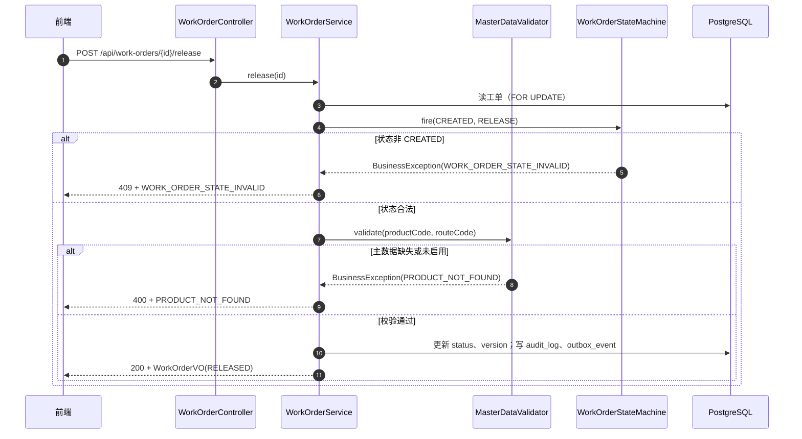

### 9.2 SEQ-02 投料绑定与开工（FR-010 → ST-003）

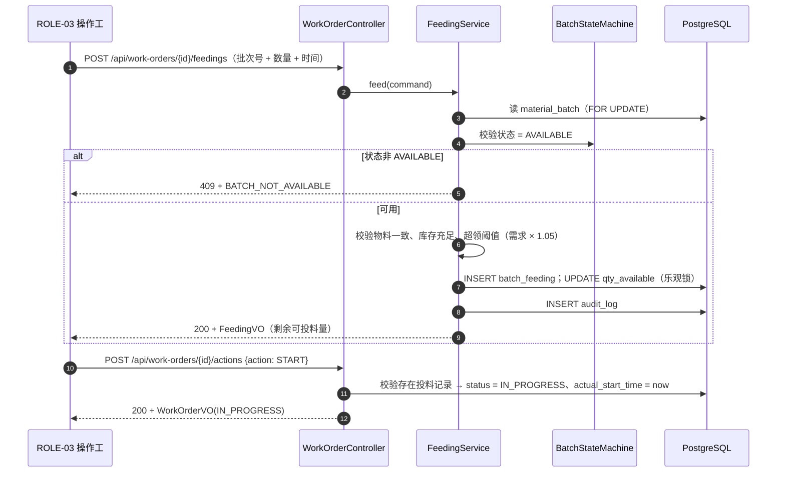

### 9.3 SEQ-03 报工报满与检验联动（ST-006 → ST-009）

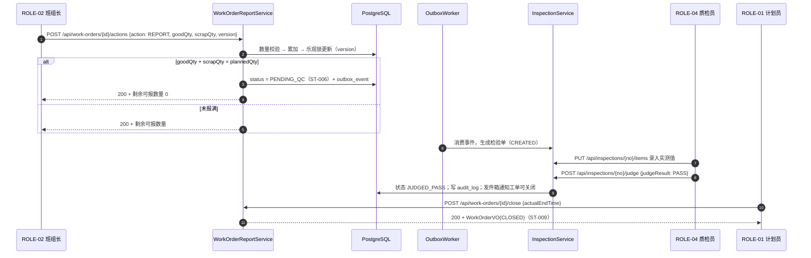

### 9.4 SEQ-04 反向追溯查询（FR-011）

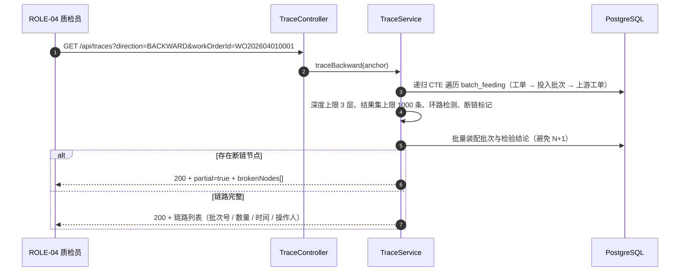

### 9.5 SEQ-05 设备状态上报与告警（FR-007 → FR-008）

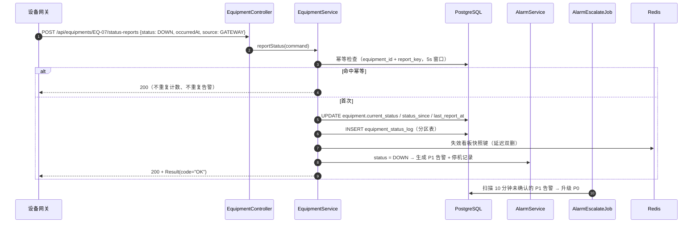

---

## 10. 状态机设计

### 10.1 工单生命周期状态机（BR-002）

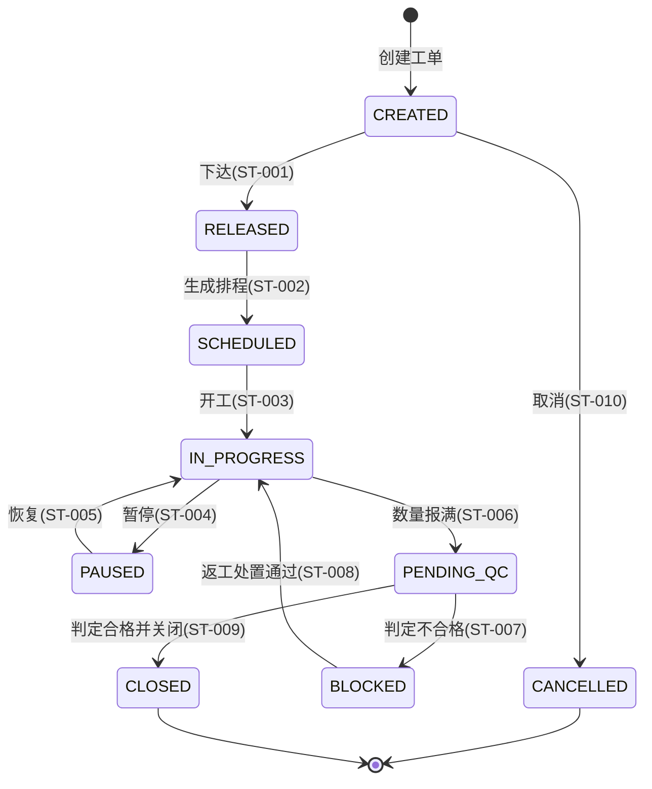

| 状态 | 语义 | 可迁移至 | 是否可编辑计划 | 是否只读 |
| --- | --- | --- | --- | --- |
| `CREATED` | 已创建未下达 | `RELEASED`、`CANCELLED` | 可编辑 | 否 |
| `RELEASED` | 已下达待排程 | `SCHEDULED` | 可改优先级 | 否 |
| `SCHEDULED` | 已排程待开工 | `IN_PROGRESS` | 不可改数量 | 否 |
| `IN_PROGRESS` | 生产中 | `PAUSED`、`PENDING_QC` | 不可编辑 | 否 |
| `PAUSED` | 已暂停 | `IN_PROGRESS` | 不可编辑 | 否 |
| `PENDING_QC` | 数量报满待检 | `BLOCKED`、`CLOSED` | 不可编辑 | 否 |
| `BLOCKED` | 检验不合格被拦截 | `IN_PROGRESS`（返工） | 不可编辑 | 否 |
| `CLOSED` | 终态，已归档 | — | 不可编辑 | 是（AC-008） |
| `CANCELLED` | 终态，取消 | — | 不可编辑 | 是 |

实现约定：迁移表以 `Map<Status, Map<Event, Status>>` 常量维护；非法迁移统一抛 `WORK_ORDER_STATE_INVALID`（HTTP 409），语义为「任意状态收到非法事件时状态保持不变，ST-001 ~ ST-010 之外的迁移一律拒绝」；`work_order.status` 加 `CHECK` 约束限定取值集合，防止绕过服务层写入非法值。

### 10.2 设备状态机（BR-006）

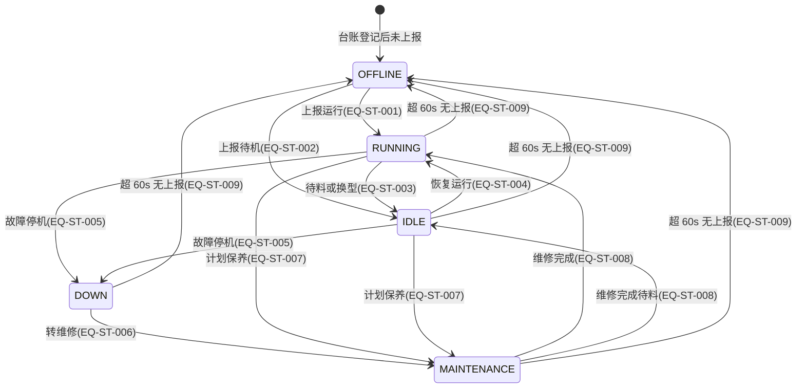

| 迁移 ID | 前置状态 | 事件 | 后置状态 | 触发方 | 副作用 |
| --- | --- | --- | --- | --- | --- |
| EQ-ST-001 | OFFLINE | 上报 RUNNING | RUNNING | 网关 / ROLE-02 | 清除数据延迟标记 |
| EQ-ST-002 | OFFLINE | 上报 IDLE | IDLE | 网关 / ROLE-02 | 清除数据延迟标记 |
| EQ-ST-003 | RUNNING | 待料 / 换型 | IDLE | 网关 | 累计运行时长 |
| EQ-ST-004 | IDLE | 恢复运行 | RUNNING | 网关 | 重置运行起始时刻 |
| EQ-ST-005 | RUNNING / IDLE | 故障停机 | DOWN | 网关 / ROLE-02 | 生成 P1 告警（BR-007）+ 开停机记录 |
| EQ-ST-006 | DOWN | 转维修 | MAINTENANCE | ROLE-05 | 告警保持未关闭；停机时长继续累计 |
| EQ-ST-007 | RUNNING / IDLE | 计划保养 | MAINTENANCE | ROLE-05 | 生成 P2 告警；停机标记 `planned = 1` |
| EQ-ST-008 | MAINTENANCE | 维修完成 | RUNNING / IDLE | ROLE-05 | 闭环停机记录；不计入非计划停机（BR-006 例外） |
| EQ-ST-009 | 任意非 OFFLINE | 超 60s 无上报 | OFFLINE | `OfflineDetectJob` | 看板加数据延迟标记；OFFLINE 不计入 OEE 分母 |

幂等与去抖：同一设备同一状态在 5s 窗口内重复上报视为抖动，`report_key` 唯一索引短路，不写状态历史、不重复告警（FR-007 E2、BR-007 例外、AC-014）。

### 10.3 物料批次状态机（BR-008）

| 迁移 ID | 前置状态 | 事件 | 后置状态 | 前置条件 | 异常处理 |
| --- | --- | --- | --- | --- | --- |
| BAT-ST-001 | — | 收货入库 | PENDING_QC | 物料主数据启用、批次号唯一 | 重复 → 409 `BATCH_DUPLICATED` |
| BAT-ST-002 | PENDING_QC | 来料检验判定 PASS | AVAILABLE | 检验项全部录入并判定（FR-013） | 未判定 → 批次保持 PENDING_QC |
| BAT-ST-003 | AVAILABLE | 冻结 | FROZEN | ROLE-04 权限 | 越权 → 403 `ROLE_NOT_ALLOWED` |
| BAT-ST-004 | FROZEN | 解冻 | AVAILABLE | ROLE-04 权限 + 原因 | 原因缺失 → 400 `PARAM_INVALID` |
| BAT-ST-005 | AVAILABLE | 投料扣减至 0 | CONSUMED | 全部数量已投料 | 仍有余量则保持 AVAILABLE |
| BAT-ST-006 | AVAILABLE | 退回供应商 | RETURNED | 未被任何工单引用 | 已被引用 → 409 `BATCH_NOT_AVAILABLE` |
| BAT-ST-007 | AVAILABLE | 报废处置 | SCRAPPED | 处置单 SCRAP 双人审批通过（FR-014） | 审批缺失 → 409 `SCRAP_APPROVAL_REQUIRED` |

终态约束：`CONSUMED` / `RETURNED` / `SCRAPPED` 为终态；`FROZEN` 批次不得被投料引用（AC-020）。

### 10.4 检验单状态机

| 迁移 ID | 前置状态 | 事件 | 后置状态 | 前置条件 |
| --- | --- | --- | --- | --- |
| INSP-ST-001 | — | 报工报满 / 批次收货 / 工序完成 | CREATED | 触发事件消费成功（BR-011 的 2 小时窗口从触发时刻起算） |
| INSP-ST-002 | CREATED | 录入检验项 | INSPECTING | 至少录入 1 项，实测值为数值 |
| INSP-ST-003 | INSPECTING | 提交判定 PASS | JUDGED_PASS | 检验项全部录入且无超限项（`INSPECTION_ITEM_INCOMPLETE`、`JUDGE_CONFLICT_WITH_DATA`） |
| INSP-ST-004 | INSPECTING | 提交判定 FAIL | JUDGED_FAIL | 填写 `judgeRemark`（10-200 字）；生成不合格记录；下游工单置 BLOCKED |
| INSP-ST-005 | JUDGED_PASS / JUDGED_FAIL | 归档 | ARCHIVED | 工单 CLOSED 后归档为只读（BR-011 超期未判定的不得进入 CLOSED） |

### 10.5 状态机防绕过约定

1. 所有状态变更必须经对应 `StateMachine.fire(current, event)`；禁止在 Service 中直接 `setStatus`。
2. 迁移表回答「能否迁移」，业务校验回答「是否允许」，两者都必须通过（例如 `PENDING_QC → CLOSED` 可迁移，但 BR-005 未满足时仍拒绝）。
3. 唯一入口约定：`status` 字段只允许由 `updateStatusWithVersion` 更新；SQL 扫描用例校验其他更新语句不含 `status` 字段。
4. 终态保护：`CLOSED` / `CANCELLED` / `CONSUMED` / `RETURNED` / `SCRAPPED` 的变更请求一律 409，并记 `*.terminal.rejected` 日志。
5. 迁移留痕：工单状态迁移写审计日志（BR-015）；`equipment_status_log` 即设备状态迁移日志（FR-007），缺失即视为一致性缺陷，由对账用例检出。

---

## 11. 错误与异常模型

### 11.1 异常分类

| 分类 | 典型异常 | 处理策略 | HTTP |
| --- | --- | --- | --- |
| 入参异常 | `MethodArgumentNotValidException`、`BindException`、`HttpMessageNotReadableException` | 汇总字段级校验错误 | 400 |
| 业务异常 | `BusinessException`（携带 `ErrorCode`） | 按错误码映射表返回 | 400 / 403 / 404 / 409 / 429 |
| 认证异常 | `AuthenticationException`、令牌过期 | 401 + 前端跳登录 | 401 |
| 授权异常 | `AccessDeniedException` | 403 + 越权尝试日志 | 403 |
| 数据访问异常 | `DuplicateKeyException`、`OptimisticLockingFailureException`、`ExclusionViolationException`、`QueryTimeoutException` | 翻译为业务错误码（唯一键 → `BATCH_DUPLICATED` 等；排他约束 → `SCHEDULE_CONFLICT`；乐观锁 → `VERSION_CONFLICT`） | 409 / 500 |
| 限流异常 | `RateLimitExceededException` | 429 + `retryAfter`（FR-001 E4） | 429 |
| 未知异常 | `Exception` | 记录 `traceId` 与堆栈，返回通用错误，禁止回传堆栈 | 500 |

### 11.2 错误码清单（与需求规格书 FR 章节一致）

| 错误码 | HTTP | 所属能力 | 触发条件 | 关联 AC |
| --- | --- | --- | --- | --- |
| `PRODUCT_NOT_FOUND` | 400 | CAP-001 | productCode 不存在或未启用 | AC-001 |
| `TIME_RANGE_INVALID` | 400 | CAP-001 | plannedEndTime ≤ plannedStartTime，或 actualEndTime 早于实际开始时间 | AC-001、AC-008 |
| `START_TOO_SOON` | 400 | CAP-001 | plannedStartTime < 当前时间 + 2h | AC-002 |
| `DAILY_WO_LIMIT_EXCEEDED` | 429 | CAP-001 | 当日创建工单数 ≥ 200 | AC-002 |
| `MATERIAL_NOT_FED` | 409 | CAP-001 | 未完成投料即开工 | AC-003 |
| `QC_BLOCKED` | 409 | CAP-001 / CAP-005 | 上游检验不合格且未处置闭环 | AC-025 |
| `QTY_EXCEEDED` | 400 | CAP-001 | goodQty + scrapQty > 剩余可报数量 | AC-004 |
| `SCRAP_REASON_REQUIRED` | 400 | CAP-001 | scrapQty > 0 但无 scrapReasonCode | AC-004 |
| `VERSION_CONFLICT` | 409 | 通用 | 乐观锁 version 不匹配 | AC-006 |
| `QC_NOT_PASSED` | 409 | CAP-001 | 检验未判定或判定不合格即关闭 | AC-007 |
| `WORK_ORDER_STATE_INVALID` | 409 | CAP-001 | 状态非预期或工单已关闭 | AC-008 |
| `NO_ELIGIBLE_EQUIPMENT` | 400 | CAP-002 | 工序未匹配到设备（附工序清单） | AC-010 |
| `SCHEDULE_CONFLICT` | 409 | CAP-002 | 同设备时段重叠（附冲突明细） | AC-011 |
| `EQUIPMENT_UNAVAILABLE` | 400 | CAP-002 | 设备处于停机或维修状态 | AC-009 |
| `OUTSIDE_SHIFT_CALENDAR` | 400 | CAP-002 | 候选时段超出班次日历 | AC-009 |
| `REASON_REQUIRED` | 400 | CAP-002 / CAP-005 | 调整原因缺失或不足 10 字 | AC-012 |
| `EQUIPMENT_NOT_FOUND` | 404 | CAP-003 | 设备未登记 | AC-013 |
| `ALARM_ALREADY_ACKED` | 409 | CAP-003 | 重复确认已确认的告警 | AC-015 |
| `HANDLE_RESULT_REQUIRED` | 400 | CAP-003 | 关闭告警未填 handleResult | AC-015 |
| `MATERIAL_NOT_FOUND` | 400 | CAP-004 | materialCode 未启用 | AC-017 |
| `BATCH_DUPLICATED` | 409 | CAP-004 | materialBatchNo 已存在 | AC-017 |
| `QUANTITY_INVALID` | 400 | CAP-004 | 数量 ≤ 0 或小数位 > 3 | AC-017 |
| `BATCH_NOT_AVAILABLE` | 409 | CAP-004 | 批次状态非 AVAILABLE | AC-020 |
| `INSUFFICIENT_STOCK` | 400 | CAP-004 | 投料量超过批次剩余数量 | AC-020 |
| `OVER_ISSUE_REQUIRES_APPROVAL` | 409 | CAP-004 | 超领（> 需求量 × 1.05） | AC-020 |
| `MATERIAL_MISMATCH` | 400 | CAP-004 | 批次物料与工单物料不一致 | AC-019 |
| `TRACE_KEY_REQUIRED` | 400 | CAP-004 | 未提供任何追溯锚点 | AC-022 |
| `TRACE_KEY_AMBIGUOUS` | 400 | CAP-004 | 同时提供多个锚点 | AC-022 |
| `TIME_RANGE_TOO_LARGE` | 400 | CAP-004 / CAP-005 | 查询区间超过 365 天 | AC-022 |
| `INSPECTION_ITEM_INCOMPLETE` | 400 | CAP-005 | 检验项未全部录入即提交 | AC-023 |
| `MEASURED_VALUE_INVALID` | 400 | CAP-005 | 实测值非数值或超量程 | AC-023 |
| `LIMIT_RANGE_INVALID` | 400 | CAP-005 | upperLimit ≤ lowerLimit | AC-024 |
| `INSPECTION_ALREADY_JUDGED` | 409 | CAP-005 | 已判定后再次录入 | AC-023 |
| `JUDGE_CONFLICT_WITH_DATA` | 409 | CAP-005 | 存在超限项却提交 PASS | AC-023 |
| `JUDGE_REMARK_REQUIRED` | 400 | CAP-005 | FAIL 未填写 judgeRemark | AC-023 |
| `DISPOSAL_QTY_EXCEEDED` | 400 | CAP-005 | 处置数量 > 不合格数量 | AC-027 |
| `DISPOSAL_ALREADY_OPEN` | 409 | CAP-005 | 同一不合格记录重复发起未关闭处置单 | AC-027 |
| `SCRAP_APPROVAL_REQUIRED` | 409 | CAP-005 | SCRAP 缺少 ROLE-01 与 ROLE-05 双方审批 | AC-026 |
| `APPROVAL_FORBIDDEN` | 403 | CAP-005 | 审批人无审批权限 | AC-026 |
| `DATA_SCOPE_FORBIDDEN` | 403 | FR-015 | 越权访问他人数据 | AC-028 |
| `ROLE_NOT_ALLOWED` | 403 | FR-015 | 越权变更工单或检验数据 | AC-028 |
| `AUDIT_LOG_IMMUTABLE` | 403 | FR-015 | 尝试修改或删除审计日志 | AC-029 |
| `AUDIT_RANGE_TOO_LARGE` | 400 | FR-015 | 审计查询区间超过 365 天 | AC-029 |
| `PARAM_INVALID` | 400 | 通用 | 其他参数校验失败（含暂停 / 取消原因缺失） | — |
| `SYSTEM_ERROR` | 500 | 通用 | 未捕获异常 | — |

错误码冲突检测约定（S3-2）：错误码在 `ErrorCode` 枚举中单一定义，字段为 `code`（符号）、`httpStatus`、`module`、`message`；启动自检要求符号全局唯一且 `httpStatus` 与本节一致，重复定义在编译期与启动期双重失败。分段约定按能力域：CAP-001 前缀 `WO_` 语义族、CAP-002 `SCH_`、CAP-003 `EQ_`、CAP-004 `BATCH_` / `TRACE_`、CAP-005 `INSP_` / `DISPOSAL_`、FR-015 `AUTH_` / `AUDIT_`；上表中未带前缀的通用码（`VERSION_CONFLICT`、`PARAM_INVALID`、`SYSTEM_ERROR`）为跨能力域共享码，需求规格书已固定其符号，不得重命名。

### 11.3 错误响应结构

```json
{
  "code": "QTY_EXCEEDED",
  "message": "reported quantity exceeds remaining quantity",
  "data": {
    "workOrderId": 100234,
    "plannedQty": 500,
    "reportedQty": 400,
    "remainingQty": 100,
    "requestedQty": 150
  },
  "traceId": "6f1c9b2a4d7e4f0b",
  "timestamp": "2026-04-01T10:12:03"
}
```

约定：`message` 为固定英文短句（便于检索），面向现场的中文文案由前端 `errorCode.ts` 按 `code` 映射；`data` 承载可操作上下文（剩余数量、冲突任务清单、缺失检验项、断链节点等），与需求规格书 Error Path 中「返回工序清单 / 冲突明细 / 断链清单」的要求对应。

### 11.4 全局异常处理矩阵

| 异常 / 场景 | 错误码 | HTTP | 审计 | 告警 |
| --- | --- | --- | --- | --- |
| DTO 校验失败 | `PARAM_INVALID` | 400 | 否 | 否 |
| 状态机非法迁移 | `WORK_ORDER_STATE_INVALID` | 409 | 是（状态冲突尝试） | 否 |
| 乐观锁冲突 | `VERSION_CONFLICT` | 409 | 否 | 否 |
| 数量 / 超领拦截 | `QTY_EXCEEDED`、`OVER_ISSUE_REQUIRES_APPROVAL` | 400 / 409 | 是 | 否 |
| 库存不足 | `INSUFFICIENT_STOCK` | 400 | 是 | 否 |
| 排程冲突（含数据库排他约束） | `SCHEDULE_CONFLICT` | 409 | 是（附冲突明细） | 否 |
| 检验不合格拦截下游 | `QC_BLOCKED`、`QC_NOT_PASSED` | 409 | 是 | 否 |
| SCRAP 处置审批缺失 | `SCRAP_APPROVAL_REQUIRED` | 409 | 是 | 是（质量高优先级） |
| 越权访问 | `DATA_SCOPE_FORBIDDEN`、`ROLE_NOT_ALLOWED` | 403 | 是 | 是 |
| 审计日志改删 | `AUDIT_LOG_IMMUTABLE` | 403 | 是 | 是 |
| 当日工单上限 | `DAILY_WO_LIMIT_EXCEEDED` | 429 | 否 | 是 |
| 查询超时 | `SYSTEM_ERROR` | 500 | 否 | 是 |
| 未捕获异常 | `SYSTEM_ERROR` | 500 | 是 | 是 |

### 11.5 重试与幂等

| 场景 | 重试策略 | 幂等保障 |
| --- | --- | --- |
| 前端提交（网络抖动） | 用户手动重试；GET 自动重试 1 次 | 状态变更携带 `version`，重复提交返回 `VERSION_CONFLICT` |
| 网关状态上报 | 网关本地队列指数退避（1s / 5s / 30s，最多 10 次） | `report_key`（5s 窗口归一化）+ 唯一索引（AC-014） |
| `outbox_event` 消费失败 | 3 次重试（5s / 30s / 120s），仍失败置 `DEAD` 并告警 | 事件 ID 唯一 + 消费方幂等（检验单按 `work_order_id + inspection_type` 唯一） |
| Excel 导入 | 不做自动重试，返回失败行清单由人工修正 | 以 `wo_no` 唯一索引去重 |
| 追溯导出 | 可重复触发，生成独立下载令牌 | 令牌一次性，导出行为重复写审计（可接受） |

---

## 12. 事务边界与并发设计

### 12.1 事务边界表

| 用例 | 事务边界 | 隔离级别 | 锁策略 | 事务内禁止 |
| --- | --- | --- | --- | --- |
| 创建工单 | `WorkOrderService.createWorkOrder` | READ_COMMITTED | 无显式锁（唯一索引兜底） | 外部 IO |
| 工单下达 / 取消 | `WorkOrderService.release` / `cancel` | READ_COMMITTED | `SELECT ... FOR UPDATE` 锁工单行 | 批量逐条独立事务 |
| 报工（含报满转待检） | `WorkOrderReportService.act` | READ_COMMITTED | 乐观锁 `version` | 事务内全表统计、远程调用 |
| 投料登记 | `FeedingService.feed` | READ_COMMITTED | 批次行锁 + 乐观锁扣减 | 多批次无序加锁（必须按 `material_batch_no` 升序） |
| 排程生成 / 调整 | `ScheduleService.generate` / `reschedule` | READ_COMMITTED | 排他约束 + 冲突预检 | 单事务排入超过 50 个工单 |
| 设备状态上报 | `EquipmentService.reportStatus` | READ_COMMITTED | 幂等唯一索引 | 事务内做看板聚合计算 |
| 检验录入 / 判定 | `InspectionService.saveItems` / `judge` | READ_COMMITTED | 乐观锁 `version` | 修改已判定检验单 |
| 处置审批 | `DisposalService.approve` | READ_COMMITTED | 乐观锁 + 审批状态校验 | 跨能力域直接写工单表（走服务方法） |
| 追溯 / 看板 / OEE 查询 | `*QueryService` | READ_COMMITTED（`readOnly = true`） | 无锁 | 写操作；查询超时 5s |

约定：`@Transactional` 只加在 Service 公开方法上；只读路径显式 `readOnly = true`；事务内禁止远程调用与消息发送，异步一律写 `outbox_event`。

### 12.2 乐观锁与悲观锁策略

| 数据 | 并发特征 | 选择 | 理由 |
| --- | --- | --- | --- |
| `work_order`（状态与累计数量） | 多终端同时报工 | 乐观锁 `version`（冲突重试 1 次后返回 409） | 冲突概率低（单工单并发 ≤ 3），避免锁等待影响现场节奏（AC-006） |
| `material_batch.qty_available` | 多工单同时投同一批次 | 行锁 + `CHECK (qty_available >= 0)` | 不允许超发与负库存，正确性优先于并发度（BR-012） |
| `production_schedule` 时段 | 多人同时排同一设备 | 排他约束 + 服务预检 | 约束是唯一可靠防线，预检只负责可读提示（BR-004） |
| `equipment.current_status` | 高频上报（5s/台） | 幂等键 + 事件时间戳判定 | 迟到事件（`occurredAt` 早于 `status_since`）只记录不改变当前状态 |
| `inspection_order` | 录入与判定并发 | 乐观锁 `version` | 判定为不可逆动作，必须防覆盖（FR-013 E3） |
| 幂等记录 | 重复提交 | 唯一索引插入 + 冲突后回放 | 无锁且天然幂等 |

### 12.3 并发场景清单

| 编号 | 场景 | 风险 | 设计对策 |
| --- | --- | --- | --- |
| RACE-001 | 两个班组长同时报工同一工单 | 合格数量重复累加 | 乐观锁 `version`；B 端返回 `VERSION_CONFLICT`（AC-006） |
| RACE-002 | 报工与关闭并发 | 关闭后仍接受报工 | 关闭事务内校验状态为 `PENDING_QC`；关闭后报工返回 `WORK_ORDER_STATE_INVALID`（AC-008） |
| RACE-003 | 两名计划员同时排同一设备同一时段 | 时段重叠 | GiST 排他约束拒绝第二条；返回 `SCHEDULE_CONFLICT` 与冲突明细（AC-011） |
| RACE-004 | 两张工单同时投同一批次 | 库存超发 / 负库存 | 批次行锁串行化 + `qty_available >= 0` 约束（AC-020） |
| RACE-005 | 重复点击下达 / 取消 | 状态被重复推进 | 状态前置校验 + `version`；第二次请求 409 |
| RACE-006 | 网关补传历史状态事件 | 已恢复的运行状态被旧事件改回 DOWN | 事件带 `occurredAt`；仅接受晚于 `status_since` 的事件，旧事件记录但不改变当前状态 |
| RACE-007 | 看板快照与实时更新竞争 | 看板显示过期状态 | 快照带 `snapshotAt`；状态变更时延迟双删缓存键；前端展示数据时刻 |
| RACE-008 | 检验判定与处置审批并发 | 同一不合格记录重复闭环 | `nonconformity.status` 乐观锁 + `DISPOSAL_ALREADY_OPEN` 校验 |
| RACE-009 | 批量排程（≤ 50 工单）中部分工序无设备 | 部分成功语义不清 | 返回 `NO_ELIGIBLE_EQUIPMENT` 与工序清单，不做部分落库（AC-010 要求工单保持 RELEASED） |

### 12.4 死锁预防

1. 加锁顺序统一：多行加锁按业务键升序（批次按 `material_batch_no`、工单按 `wo_no`）。
2. 事务短小：单事务 SQL 条数上限 20；批量排程按工单逐个短事务，不合并成长事务。
3. 索引先行：`FOR UPDATE` 查询必须命中索引，避免扫描升级为表锁。
4. 超时配置：`lock_timeout = 3s`、`statement_timeout = 5s`（定时任务 30s），超时计入告警指标 `db_lock_timeout_total`。
5. 死锁重试：捕获 PostgreSQL `40P01` 后整体重试 1 次，仍失败返回 409 并提示重试。

---

## 13. 性能架构

### 13.1 性能目标（对齐 NFR-001 ~ NFR-003）

| 指标 | 目标 | 来源 |
| --- | --- | --- |
| 查询类接口 P95 / P99 | 500ms / 1500ms | NFR-001 |
| 写入类接口 P95 / P99 | 800ms / 2000ms | NFR-001 |
| 设备单条上报处理 | ≤ 200ms | NFR-002 |
| 设备看板刷新 | ≤ 10s（设计缓存 TTL 5s） | NFR-002 |
| 设备上报吞吐 | 40 次/秒常态、120 次/秒峰值、≥ 200 台设备 | NFR-002 |
| 追溯单层查询 P95 / P99 | 2s / 5s；3 层链路 P95 ≤ 5s | NFR-003 |
| 并发用户 / 请求速率 | 500 并发、50 RPS、持续 30 分钟 | NFR-001 负载条件 |
| 错误率 | ≤ 0.1%（AC-030） | AC-030 |

### 13.2 关键性能路径识别

| 路径 | 频次 | 复杂度 | 主要风险 |
| --- | --- | --- | --- |
| 工单看板列表 | 高频 | 多条件过滤 + 排序 + `count` | 深分页、`count(*)` 全表 |
| 工单详情装配 | 高频 | 主表 + 工序 + 报工 + 投料 + 检验单（5 来源） | N+1 查询（CAP-001 与 CAP-004、CAP-005 交叉） |
| 设备看板刷新 | 极高频（10s 轮询 × 并发用户） | 40 ~ 200 台设备最新状态聚合 | 数据库压力；必须走缓存 |
| 设备状态上报 | 极高频（40/s，峰值 120/s） | 幂等检查 + 状态更新 + 历史插入 + 告警判定 | 单条处理超 200ms（NFR-002） |
| 追溯查询 | 低频（异常调查） | 递归 CTE 多层遍历 + 结果装配 | 结果集超 1000 条、断链处理（NFR-003） |
| OEE 日 / 周聚合 | 低频（定时 + 按需） | 停机时长、产量、合格数三源聚合 | 区间数据缺失时的 partial 计算 |
| Excel 导入 / 导出 | 低频 | 逐行校验 / 大批量写文件 | 单次导入行数过大导致超时 |

### 13.3 容量规划与瓶颈预判（EA8）

| 关键路径 | 预估 QPS（峰值 / 日常） | 单次数据量 | 单次资源消耗 | 瓶颈预判 | 缓解策略 |
| --- | --- | --- | --- | --- | --- |
| 工单看板列表 | 25 / 4 | 索引扫描 1 万 ~ 5 万项 | DB CPU 20ms + 网络 15ms | 深分页与精确 `count` | 覆盖索引 + `total` 估算保护 + 游标分页兜底 |
| 报工写入 | 6 / 1 | 写 2 表 + 审计 + 事件 | DB 写 30ms + 行锁 | 同一工单多终端热点 | 乐观锁 + 单工单 1s 内合并提交提示 |
| 设备状态上报 | 120 / 40 | 单条 1 行历史 + 1 行设备更新 | DB 写 12ms | 单条处理 200ms 目标（NFR-002） | 幂等短路 + 分区表插入 + 异步告警判定 |
| 设备看板刷新 | 40 / 10 | 40 ~ 200 台快照（约 20 KB） | Redis 读 2ms / Caffeine 命中 | 应用与 Redis 连接数 | Redis 快照 + Caffeine 一级缓存（TTL 5s） |
| 追溯查询 | 3 / 0.3 | 结果集 ≤ 1000 条、3 层 | DB CPU 300 ~ 1200ms | 递归 CTE 与结果装配 | `batch_feeding` 双向复合索引 + 结果集裁剪 + 60s 结果缓存 |
| OEE 聚合 | 1 / 0.2 | 单设备单日约 2 万条状态记录 | DB CPU 400ms | 状态记录扫描量 | 分区裁剪 + 日粒度预聚合表 `oee_daily` |
| Excel 导入 | 0.2 / 0.02 | 单次 ≤ 2000 行 | 内存 50 MB | 逐行校验与单事务过大 | 分批 500 行提交 + 行级错误汇总 |

### 13.4 缓存策略方向

| 缓存对象 | 层级 | TTL | 失效方式 | 理由 |
| --- | --- | --- | --- | --- |
| 字典（报废原因、停机原因、单位） | Caffeine | 10min | 定时刷新 + 管理端手动失效 | 读多写极少 |
| 设备看板快照 | Redis + Caffeine | 5s | 定时覆盖写 + 状态变更延迟双删 | 满足 NFR-002 的 10s 刷新且挡住高频读 |
| 设备台账与工作中心 | Caffeine | 5min | 台账变更主动失效 | 数据量小（40 行 / 数行） |
| 工单详情热点（当日活跃工单） | Redis | 60s | 报工 / 状态变更时删除 | 看板与详情页高频打开 |
| 追溯查询结果 | Redis | 60s | 键含锚点与方向；投料或处置变更时删除相关键 | 调查场景重复查询同一锚点 |
| OEE 日结果 | 数据库预聚合表 | — | 定时重算覆盖 | 避免每次查询重扫状态记录 |

明确不缓存的：工单列表分页结果（条件组合多、命中率低）、批次可用库存（必须实时，BR-012）、状态变更响应结果（幂等由 `version` 与唯一索引保证）。

### 13.5 异步化与削峰场景

| 场景 | 实现 | 异步 | 说明 |
| --- | --- | --- | --- |
| 检验单生成 | 发件箱事件 + 轮询（≤ 5s） | 是 | 报工报满需立刻返回剩余数量，检验单生成可延迟（BR-011 的 2 小时窗口从触发时刻起算） |
| 告警生成与升级 | 事件 + 定时任务 | 是 | 上报路径必须 ≤ 200ms（NFR-002），告警判定不能拖慢上报 |
| 审计日志写入 | 异步写入 + 失败重试 | 是 | 降低写入放大（RSK-06），失败率 ≤ 0.01%（NFR-006） |
| OEE 与负荷聚合 | 定时任务 | 是 | 派生数据，容忍小时级延迟 |
| 追溯报告导出 | 异步生成 + 下载令牌 | 是 | 大结果集导出不占用请求线程 |
| 报工写入 | 同步事务 | 否 | 现场需即时反馈剩余可报数量 |
| 状态变更（release / close / judge） | 同步事务 | 否 | 需立即返回新状态供前端展示与二次操作 |

### 13.6 交接 Performance Engineer

需压测路径与假设：
1. **工单看板列表（PERF-001）**：50 万行工单、多条件组合、含深分页与全量 `count`，验证 NFR-001 的 500ms P95。
2. **设备状态上报（PERF-004）**：200 台设备 × 5s（40/s，峰值 120/s）持续 24 小时，验证单条 ≤ 200ms 与幂等去重率。
3. **追溯查询（PERF-005）**：100 万条投料记录、3 层链路、结果集接近 1000 条上限，验证单层 P95 ≤ 2s。
4. **批量排程（PERF-006）**：50 个工单 × 2 道工序一次性排程，验证写入 P95 ≤ 800ms 与排他约束下的冲突拒绝率。
5. **待验证假设**：`idx_wo_status_plan_start` 在 50 万行下命中率；`equipment_status_log` 按年分区裁剪生效；Redis 看板快照命中率 ≥ 0.9；HikariCP 池大小在 50 RPS × 500 并发下无等待。

---

## 14. 可靠性与可维护性

### 14.1 失败模式与降级（FMEA-lite）

| 模块 / 路径 | 失败模式 | 影响 | 概率 | 检测手段 | 预防 | 降级动作 | 恢复 |
| --- | --- | --- | --- | --- | --- | --- | --- |
| PostgreSQL 主库 | 实例不可用 | 全部写操作失败 | 低 | 健康检查 + 连接池获取失败告警 | 每日备份 + 恢复演练 | 写入返回 503 提示稍后重试；看板继续读 Redis 快照 | 主库恢复后重连，发件箱补齐事件 |
| Redis | 不可用 | 看板缓存失效 | 中 | Redis 探针 | 连接超时 200ms + 短路 | 缓存读取失败直接回落数据库查询（`CacheFallbackTemplate`） | Redis 恢复后缓存自然重建 |
| `OutboxWorker` | 停止 / 积压 | 检验单生成延迟 | 中 | `outbox_pending_count` | 多线程消费 + 失败重试 | 积压 > 5000 告警并提示质检员手工建单 | 恢复后按 `next_retry_at` 追平 |
| 设备网关 | 断网 / 宕机 | 设备状态不更新 | 中 | `last_report_at` 超 60s | 网关本地缓存补传 | 看板显示 `OFFLINE` 与数据延迟标记；允许 ROLE-02 手工上报（NFR-004 降级策略） | 网关恢复后补传，服务端按事件时间取舍 |
| 审计异步写入 | 队列满 / 写入失败 | 审计缺失 | 中 | 失败率指标（阈值 0.01%） | 本地队列 + 重试 + 对账 | 降级为同步写入并告警（保证 100% 留痕优先于性能） | 恢复后回补差额并核对条数 |
| Excel 导出 | 内存不足 / 超时 | 导出失败 | 低 | 任务状态与超时监控 | 异步任务 + 行数上限 | 提示改用收窄条件导出 | 重试导出 |
| 应用实例 | 崩溃 | 该实例请求失败 | 低 | `/actuator/health` | 无状态设计、滚动升级 | 流量切至健康实例 | 重启后自动加入 |
| `btree_gist` 扩展缺失 | 迁移失败 | 排程冲突约束缺失 | 低 | 迁移脚本前置检查 | 部署前检查扩展可用性 | 拒绝启动并给出明确提示（不静默降级，排程正确性不可妥协） | 安装扩展后重跑迁移 |

降级实现要求：缓存回落（`CacheFallbackTemplate`）、手工上报兜底（`ManualStatusReportService`）、审计同步降级（`AuditWriteMode` 开关）三项必须在代码中有对应实现，不能仅停留在文档描述。

### 14.2 可观测性 LMT 三件套（EA10）

| 关键路径 | 必填日志关键字 | 必填指标 | TraceID 传递点 |
| --- | --- | --- | --- |
| 工单创建 / 下达 | `work_order.created`、`work_order.released`、`work_order.release.rejected` | `wo_create_total{result}`、`wo_release_duration_p95`、`wo_state_conflict_total` | HTTP 头 `X-Trace-Id` → Service → SQL 注释 → 审计记录 `trace_id` |
| 报工 | `work_order.reported`、`work_order.report.qty_exceeded`、`work_order.version_conflict` | `wo_report_total{result}`、`wo_report_duration_p95`、`wo_version_conflict_total` | HTTP 头 → 发件箱事件 payload → 消费方日志 |
| 设备状态上报 | `equipment.status.changed`、`equipment.status.idempotent_hit`、`equipment.offline.detected` | `eq_report_total{result}`、`eq_report_duration_p95`、`eq_offline_count` | HTTP 头 → `equipment_status_log.report_key` → Redis 快照元数据 |
| 告警与 OEE | `equipment.alarm.opened`、`equipment.alarm.escalated`、`oee.aggregated` | `eq_alarm_open_total{level}`、`eq_alarm_ack_latency_seconds`、`oee_partial_total` | 定时任务批次 ID → 聚合日志 |
| 追溯查询 | `trace.query.start`、`trace.query.partial`、`trace.query.slow` | `trace_query_duration_p95`、`trace_query_partial_total`、`trace_result_truncated_total` | HTTP 头 → 递归 CTE SQL 注释 |
| 检验判定与处置 | `inspection.judged`、`inspection.blocked_work_order`、`disposal.approved` | `inspection_judge_total{result}`、`qc_blocked_total`、`disposal_approval_latency_seconds` | HTTP 头 → 发件箱事件 ID → 消费日志 |
| 审计与权限 | `audit.written`、`audit.write.failed`、`auth.forbidden` | `audit_write_total{result}`、`audit_write_failure_ratio`、`auth_forbidden_total` | HTTP 头 → AOP 切面 → `audit_log.trace_id` |
| 缓存与连接池 | `cache.fallback.db`、`cache.board.snapshot` | `cache_hit_ratio{layer}`、`hikaricp_connections_pending`、`db_lock_timeout_total` | — |

统一约定：`MDC` 注入 `traceId`、`userId`、`module`；级别规范 ERROR（需人工介入）、WARN（拦截 / 降级 / 重试）、INFO（关键业务动作，不含明细数据）、DEBUG（仅开发环境）。

### 14.3 错误处理与回滚

- 业务失败：抛 `BusinessException`（携带错误码），事务回滚，返回结构化错误（11.3），禁止回传堆栈。
- 部分成功：Excel 导入与 OEE 缺数场景返回 200 + 明细清单（`partial = true`），不做整体回滚（AC-016、AC-022）。
- 数据修正：不做物理删除与直接改数；报工修正走「冲减 + 重报」，批次冻结走冻解流程，全程审计。
- 发布回滚：迁移脚本保持前向兼容（新增列可空带默认值、索引 `CONCURRENTLY`），应用回滚不需要回滚 DDL；`btree_gist` 与排他约束的创建单独成脚本，便于定位失败点。

### 14.4 扩展性关注点

| 关注点 | 首版设计 | 扩展路径 |
| --- | --- | --- |
| 应用水平扩展 | 无状态；定时任务需防重入 | 增加实例 + 分布式锁（数据库锁或 `shedlock`）后可直接扩容 |
| 设备规模（40 → 200 台） | 幂等键 + 分区表；上报为单条接口 | 增加批量上报端点（一次 ≤ 50 台）+ 写入缓冲表；看板快照按工作中心分片 |
| 数据库读扩展 | 查询与聚合已隔离为只读事务 | 增加只读副本承接看板、OEE、追溯查询 |
| 多工厂 | 表结构无 `factory_id` | 全表增加 `factory_id` 并纳入唯一索引前缀；数据范围解析扩展为工厂维度 |
| 事件机制 | 数据库发件箱 | 引入消息中间件后把 `OutboxWorker` 替换为生产者，事件契约不变 |
| 追溯深度 | 结果集与层数上限裁剪 | 引入闭包表或图数据库（ADR-006 的备选方案）以支持更深链路 |

---

## 15. 架构决策

| 决策 | 理由 | 备选方案 | 影响 |
| --- | --- | --- | --- |
| ADR-001 模块化单体 | 单工厂规模、单团队、单实例部署；模块边界为未来拆分预留 | 微服务、纯分层单体 | 跨模块调用靠依赖约束与评审保证 |
| ADR-002 状态机迁移表驱动 | 工单 10 条迁移可穷举测试，无引擎依赖 | Flowable / Camunda 工作流引擎 | 复杂流程编排能力弱，跨系统流程需自建 |
| ADR-003 乐观锁为主、库存悲观锁 | 报工冲突可重试，库存不允许超发 | 全悲观锁、全乐观锁 | 两套并发语义需分别覆盖测试与评审 |
| ADR-004 大表按年分区 + 归档表 | 满足 NFR-005 的 3 年保留与不可物理删除 | 单表 + 定期清理、专用时序库 | 需维护分区滚动与归档任务 |
| ADR-005 看板缓存两级（Caffeine + Redis） | 满足 NFR-002 的 10s 刷新并挡住高频读 | 仅 Redis、仅本地缓存 | 最长 5s 状态延迟，必须在 UI 明示数据时刻 |
| ADR-006 投料记录即追溯边（递归 CTE） | 100 万条投料记录规模下无需图数据库 | 图数据库、物化路径、闭包表 | 深链路查询依赖结果集裁剪 |
| ADR-007 状态变更使用动作子资源端点 | 动作即意图，权限与错误码可按动作精确映射 | 全量 `PUT`、部分 `PATCH` | 端点数量增加（31 个），非严格 REST |
| ADR-008 引入 springdoc-openapi 与 Playwright | 契约可视化并与实现对齐；E2E 需可回放证据 | 手写接口文档、手工 E2E | 新增构建与测试依赖 |

### ADR-001：采用模块化单体而非微服务

- **状态**：Accepted
- **背景**：单工厂单组织、40 台设备、5 万工单/年，团队规模小，部署形态为单实例 + 单主库（C-02）；但 CAP-001 ~ CAP-005 边界清晰，未来可能拆分。
- **备选方案**：
  - 方案 A 微服务：优点是边界强制、可独立扩容；缺点是 6 个服务的运维成本远超收益，且报工累计、库存扣减等强一致场景需要分布式事务或补偿。
  - 方案 B 纯分层单体：优点是起步快；缺点是能力域之间无边界，报工、追溯、检验逻辑会互相渗透，半年内难以维护。
  - 方案 C 模块化单体（Maven 模块 + 包边界）：单进程部署，边界可机械检查。
- **决策**：选择方案 C。理由是首版数据量与部署条件不支持微服务运维成本，而模块边界可通过 Maven 依赖与评审约束保证。
- **后果**：正面——单库本地事务即可保证强一致，部署与排障简单，模块可独立测试。负面——缺少网络层强隔离，需依赖检查脚本与评审；单实例扩容受单机资源限制（缓解见 14.4）。
- **验收信号**：`mvn dependency:tree` 无反向依赖（如 `meslite-traceability` 不依赖 `meslite-quality` 写路径）；跨模块调用仅出现在 `*QueryService` 只读方法或 `outbox_event` 事件中，由架构评审逐条核对。

### ADR-002：状态机使用迁移表驱动而非工作流引擎

- **状态**：Accepted
- **背景**：工单 10 条迁移（ST-001 ~ ST-010）、设备 9 条（EQ-ST-001 ~ 009）、批次 7 条（BAT-ST-001 ~ 007）、检验单 5 条（INSP-ST-001 ~ 005），合计 31 条确定性迁移。
- **备选方案**：
  - 方案 A Flowable / Camunda：优点是可视化流程与人工任务；缺点是为 31 条确定性迁移引入 BPMN 表结构与引擎升级风险。
  - 方案 B 迁移表驱动：零依赖、可穷举单测、代码即文档。
  - 方案 C 状态判断散落在 Service：规则发散，非法迁移无法统一拦截。
- **决策**：选择方案 B。理由是全部迁移均为确定性有限状态迁移，无并行分支与人工任务编排需求。
- **后果**：正面——`状态 × 事件` 组合可穷举断言，非法迁移统一返回 `WORK_ORDER_STATE_INVALID`。负面——若未来出现跨系统长流程（如工单与采购联动），需引入引擎并迁移数据。
- **验收信号**：`WorkOrderStateMachineTest` 覆盖 9 状态 × 全部事件组合；代码评审确认无 `setStatus` 直接调用；SQL 扫描用例确认仅 `updateStatusWithVersion` 更新 `status` 字段。

### ADR-003：并发控制以乐观锁为主、库存场景用悲观锁

- **状态**：Accepted
- **背景**：同一工单可被多终端同时报工（AC-006）；同一批次可被多张工单同时投料（AC-020）。
- **备选方案**：
  - 方案 A 全悲观锁：实现简单，但报工热点行锁等待会影响现场节奏（NFR-001 写入 P95 ≤ 800ms 有风险）。
  - 方案 B 全乐观锁：并发度高，但库存可能超发，质量与成本风险不可接受。
  - 方案 C 混合：工单与检验单用乐观锁，批次库存用行锁 + `CHECK qty_available >= 0`。
- **决策**：选择方案 C。理由是报工冲突可重试且用户可感知，库存超发属正确性问题，不能依赖重试。
- **后果**：正面——热点工单无锁等待，库存严格不超发。负面——两套并发语义需要分别测试；必须遵守加锁顺序（按 `material_batch_no` 升序）避免死锁（12.4）。
- **验收信号**：RACE-001 ~ RACE-009 均有自动化用例；压测中 `db_lock_timeout_total = 0`；`qty_available` 无负值记录。

### ADR-004：设备状态历史与审计日志按年分区并归档

- **状态**：Accepted
- **背景**：设备状态变更 200 万条/年（40 台 × 5s 上报上限），审计日志约 150 万条/年；NFR-005 要求保留 ≥ 3 年且保留期内不可物理删除。
- **备选方案**：
  - 方案 A 单表 + 定期清理：简单，但与「保留期内不可物理删除」冲突。
  - 方案 B 按年分区 + `DETACH` 归档：归档即分区摘除，在线表保持轻量。
  - 方案 C 专用时序数据库 / 数仓：能力更强，但新增组件与同步链路，规模不匹配。
- **决策**：选择方案 B。
- **后果**：正面——归档不影响在线性能，保留期可机械验证。负面——必须提前创建下一年度分区（提前 2 个月），漏建会导致插入失败，需分区存在性告警。
- **验收信号**：`EXPLAIN` 显示分区裁剪命中目标分区；分区存在性检查任务告警为 0；归档任务报告含分区名与行数。

### ADR-005：设备看板采用 Caffeine + Redis 两级缓存

- **状态**：Accepted
- **背景**：设备看板按 10s 轮询（NFR-002），500 并发用户会产生数十 QPS 的重复读；单条上报处理必须 ≤ 200ms，不能在上报路径做聚合计算。
- **备选方案**：
  - 方案 A 仅本地缓存：无网络开销，但多实例 / 多终端数据时刻不一致。
  - 方案 B 仅 Redis：全局一致，但每次请求都有网络往返，且高频读放大 Redis 压力。
  - 方案 C 两级：L1 Caffeine（TTL 5s）+ L2 Redis 快照（5s 覆盖写）。
- **决策**：选择方案 C。
- **后果**：正面——看板响应进入毫秒级，上报路径不受聚合影响。负面——最长 5s 状态延迟，UI 必须展示 `snapshotAt` 数据时刻（AC-013 要求 10s 内可见，5s 满足要求且留有余量）。
- **验收信号**：`cache_hit_ratio{layer="l1"} ≥ 0.9`；看板接口 P95 ≤ 500ms；快照含 `snapshotAt` 且前端展示。

### ADR-006：投料记录同时作为追溯边，用递归 CTE 查询

- **状态**：Accepted
- **背景**：FR-011 要求支持正向（批次 → 工单 / 成品）与反向（工单 / 成品 → 批次）追溯；投料记录 100 万条/年，单次结果集 ≤ 1000 条（NFR-003）。
- **备选方案**：
  - 方案 A 图数据库：图遍历与可视化强，但新增组件与同步链路，规模不匹配。
  - 方案 B 物化路径：查询无需递归，但返工与拆分导致路径频繁变更，维护复杂。
  - 方案 C 闭包表：查询快，但边数为节点数平方级，写入放大明显（100 万投料记录不可接受）。
  - 方案 D 投料记录即边 + 递归 CTE：模型最简、写入最轻、查询可加深度与结果集限制。
- **决策**：选择方案 D。
- **后果**：正面——无新增组件，正向与反向共用一张表与一套索引。负面——链路深度与结果集必须裁剪，超限返回 `partial` 与断链清单（AC-022）。
- **验收信号**：3 层链路、结果集接近 1000 条时 P95 ≤ 2s（NFR-003）；`trace_query_partial_total` 有监控；断链用例返回 200 + `partial=true`。

### ADR-007：状态变更使用动作子资源端点

- **状态**：Accepted
- **背景**：状态变更需携带上下文（暂停原因、判定结果、处置类型、审批人），且必须防重复提交（AC-006、AC-008）。
- **备选方案**：
  - 方案 A `PUT` 全量覆盖：并发覆盖语义模糊，易连带覆盖状态字段。
  - 方案 B `PATCH` 局部更新：状态迁移与普通字段更新混在同一端点，权限难以细分。
  - 方案 C 动作子资源（`/release`、`/actions`、`/close`、`/judge`、`/approve`）：动作即意图。
- **决策**：选择方案 C，与需求规格书 FR-002 的 `action` 枚举输入要素天然一致。
- **后果**：正面——权限与错误码可按动作精确映射（如 ROLE-01 才能 `/close`）。负面——端点数量达到 31 个，契约文档必须完整覆盖；非严格 REST 风格。
- **验收信号**：`docs/07-接口数据契约.md` 中每个动作端点均含前置条件、错误码与正反例；越权用例覆盖到动作级（AC-028）。

### ADR-008：引入 springdoc-openapi 与 Playwright

- **状态**：Accepted
- **背景**：31 个端点需要与实现保持一致的契约；E2E 需为用户旅程验收提供可回放证据（`docs/17-E2E测试报告.md`）。
- **备选方案**：
  - 方案 A 手写契约文档：零依赖，但必然漂移。
  - 方案 B springdoc-openapi：注解即文档，可导出 OpenAPI 供契约对账；生产可通过配置关闭。
  - 方案 C 手工 E2E：初期快，但不可重复、无证据。
  - 方案 D Playwright：可产出 trace、截图与运行日志三类证据。
- **决策**：选择方案 B + 方案 D。
- **后果**：正面——契约可视化、E2E 有可回放证据。负面——新增构建依赖；注解需与 DTO 同步维护，否则产生误导性文档（缓解：契约漂移检查脚本纳入 CI）。
- **验收信号**：`/v3/api-docs` 导出覆盖 6 个 API 族；E2E 运行产出 trace、截图与 stdout 日志；`contract_drift_check` 无新增漂移。

---

## 16. 风险、假设与开放问题

| 编号 | 类别 | 内容 | 概率 | 影响 | 缓解措施 |
| --- | --- | --- | --- | --- | --- |
| R-01 | 集成 | 设备网关上报协议与频率可能在开发期变更（对应 RSK-01） | M | H | 先按本设计冻结 `report_key` 与状态枚举契约，用模拟网关做集成测试；变更走变更流程 |
| R-02 | 数据 | 历史纸质流转卡未电子化，追溯链路存在断点（对应 RSK-02） | H | M | 上线前补录近 3 个月数据；追溯返回 `partial` 与断链清单（AC-022） |
| R-03 | 排程 | 规则化排程（EARLIEST_DUE / LEAST_LOAD）可能导致计划员仍需大量人工调整（对应 RSK-03） | M | H | 迭代 2 起统计调整原因分布；`production_schedule.reason` 已为分析预留字段 |
| R-04 | 录入负担 | 操作工录入负担偏高导致报工不及时（对应 RSK-04） | M | M | 工单看板按设备维度聚合；报工表单字段 ≤ 6 个；支持键盘扫码输入 |
| R-05 | 超期拦截 | 检验超期拦截影响交付节奏（对应 RSK-05） | L | M | 超期看板提醒 + 48 小时延长审批通道（BR-011 例外），延长记录留痕 |
| R-06 | 写入放大 | 审计日志与业务写入同库造成写入放大（对应 RSK-06） | M | M | 审计异步写入 + 失败率告警（0.01% 阈值）+ 按月条数对账（NFR-006） |
| R-07 | 依赖扩展 | `btree_gist` 扩展在目标数据库可能不可用，导致排程排他约束无法创建 | L | H | 迁移脚本前置检查并拒绝启动（14.1）；不可用时需上游批准降级为「预检 + 唯一约束」方案并记入部署说明 |
| R-08 | 性能 | 追溯查询结果集接近 1000 条上限时可能超出 NFR-003 的 2s 目标 | M | M | 结果集裁剪 + 60s 结果缓存 + `EXPLAIN` 复核；压测在 PERF-005 中验证并据实调整上限 |
| R-09 | 权限 | 数据范围（SELF_TEAM）依赖班组归属数据质量，归属错误会导致越权可见 | M | H | 班组归属由 ROLE-06 维护并纳入审计；上线前完成归属数据核对；越权用例覆盖 AC-028 |
| R-10 | 口径 | OEE 分母是否含计划保养尚未确认（Q-03），影响统计口径 | M | M | 按「含计划保养但单独展示」实现并配置化（`meslite.oee.include-planned-maintenance`） |

假设清单：单工厂单组织、单时区；设备由网关上报为主、人工上报为兜底；班次日历在上线前完成初始化；工单来源为界面录入或 Excel 导入（无 ERP 在线对接）；操作工使用桌面浏览器而非移动端。

开放问题（需上游或用户澄清，不阻塞本设计的结构部分）：

| 编号 | 问题 | 当前处理 | 澄清责任方 |
| --- | --- | --- | --- |
| Q-01 | 排程是否考虑换型时间矩阵（对应需求 Q-01） | 按固定 10 分钟换型间隔实现（BR-004 例外），间隔值配置化 | 制造运营部 |
| Q-02 | 来料检验是否全部检验项必检（对应需求 Q-02） | 按检验项模板标记的必检项执行 | 质量部 |
| Q-03 | OEE 时间开动率分母是否含计划保养（对应需求 Q-03） | 含计划保养但单独展示，配置可切换 | 设备动力部 |
| Q-04 | 追溯报告导出格式（对应需求 Q-04） | 采用 xlsx，字段与页面列一致 | 质量部 |
| Q-05 | 工单日均 200 上限按全厂还是按计划员统计（对应需求 Q-05） | 按全厂统计（`DAILY_WO_LIMIT_EXCEEDED` 判定口径） | 制造运营部 |

---

## 17. 下游交接

### 17.1 Data Contract Designer

- 依据 6.1 ~ 6.3、11.2、11.3 与需求规格书 FR 章节产出 `docs/07-接口数据契约.md`：6 个 API 族、31 个端点的路径、方法、角色、请求字段（类型 / 必填 / 默认值 / 边界）、响应字段、错误码、分页与排序规则、正反例。
- 必须完成错误码冲突检测（11.2 清单为唯一来源）与破坏性变更检测（首版作为基线，标记 `breakingChanges: []`）。
- 枚举取值以需求规格书 FR 章节为准，不得新增近义值（如工单状态不得出现 `WORKING`）。

### 17.2 Data Engineer

- 产出 `docs/05-数据设计说明书.md` 与迁移脚本：`V1__baseline.sql`（24 张表 + 表 / 列注释 + 基础索引）、`V2__index_and_partition.sql`（覆盖索引、部分唯一索引、年分区、`CHECK` 约束）、`V3__extensions.sql`（`btree_gist` 与排他约束）。
- 大表索引使用 `CREATE INDEX CONCURRENTLY`；脚本必须注明前后兼容性与回滚方式；分区需提前创建次年（ADR-004）。
- 沉淀归档任务（工单 1 年、审计 3 年）、`idempotency_record` 与 `outbox_event` 清理任务。

### 17.3 Performance Engineer

- 压测 PERF-001 ~ PERF-006（见 13.6），验证 NFR-001 ~ NFR-003 与 AC-030。
- 验证索引命中率、看板缓存命中率、HikariCP 池配置与追溯结果集上限，产出 `docs/06-性能优化说明.md`。

### 17.4 UI Designer 与 Frontend Engineer

- UI Designer 产出 `docs/08-UI设计说明.md`：6 个页面说明、状态色板（工单 9 / 设备 5 / 批次 6 / 检验 5 状态）、看板信息密度、扫码输入焦点规范、报工表单 ≤ 6 字段（RSK-04）。
- Frontend Engineer 按 7.1 实现 8 个路由页面；接口路径与错误码只允许来自 `src/api/` 与 `src/utils/errorCode.ts`；分页、状态标签、甘特与图表复用公共组件。

### 17.5 Backend Engineer

- 按 4.1 的模块边界实现，复用 `meslite-common` 既有封装（`Result`、`PageResult`、`BusinessException`、`ErrorCode`、`BaseEntity`、`GlobalExceptionHandler`），禁止重复创建同名类。
- 状态变更只允许经状态机；`@Transactional` 只加在 Service 层；所有关键写操作必须写审计（BR-015）并做数据范围校验（BR-014）。
- 实现顺序建议：迁移脚本 → common / security → 工单（含状态机与报工）→ 批次与投料 → 检验与处置 → 设备与告警 → 排程 → 导出与审计查询。

### 17.6 Quality Gate Engineer

- 验证重点（需求规格书已指明）：AC-006 并发乐观锁、AC-011 排程冲突、AC-020 库存拦截、AC-023 / AC-024 检验边界值与容差、AC-025 拦截链路。
- 另需覆盖：AC-014 幂等去抖、AC-015 告警升级、AC-022 断链 partial、AC-028 数据范围越权、AC-029 审计不可改删、AC-030 性能与吞吐。
- 覆盖率门槛按 NFR-008（单元测试行 ≥ 80%、分支 ≥ 70%）；重点断言错误码与 HTTP 状态映射与 11.2 表逐行一致。
- 安全评审重点见 8.6。

### 17.7 DevOps and Release Engineer

- 部署前置检查：`btree_gist` 扩展可用性、次年分区已创建、迁移脚本执行顺序、JWT 密钥与数据库连接串经环境变量注入、定时任务单实例防重入。
- 上线前准备告警规则：NFR-001 ~ NFR-003 指标、`outbox_pending_count`、`eq_offline_count`、`audit_write_failure_ratio`、`db_lock_timeout_total`、分区存在性与归档任务结果。
- 提供归档任务、设备网关健康检查与试运行（1 个完整班次）执行方案（需求规格书 时间约束）。

<!-- END-OF-DOC -->
