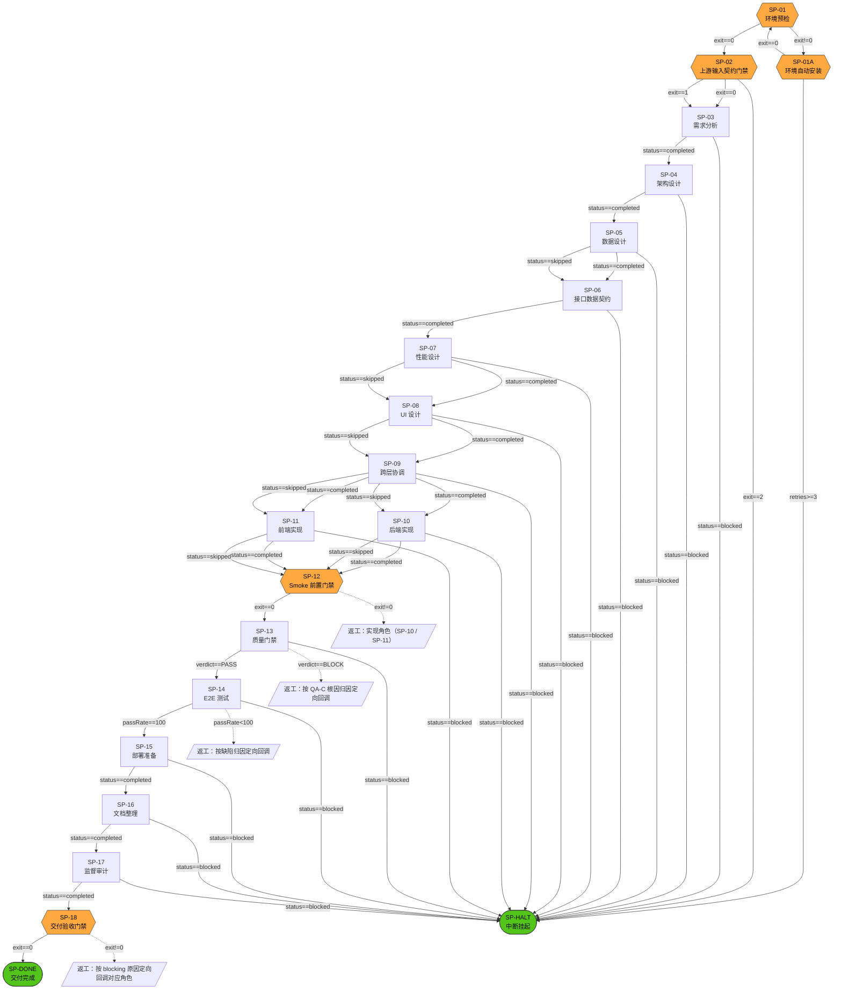

# Skill Delivery Process — Flowchart(派生视图）

> 🔴 本文件由 `python scripts/next_step.py --mermaid-out` 自动生成，**禁止手工维护**。
> 流程真理源：`assets/config/skill-process.json`（人类编辑孪生：`assets/config/skill-process.yaml`）。
> 改流程请改真理源后重新生成本文件。

图形语义：六边形 = 门禁节点（跑脚本），矩形 = 角色派发节点，圆角 = 终止节点，虚线 = 返工边。

